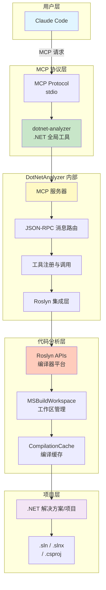
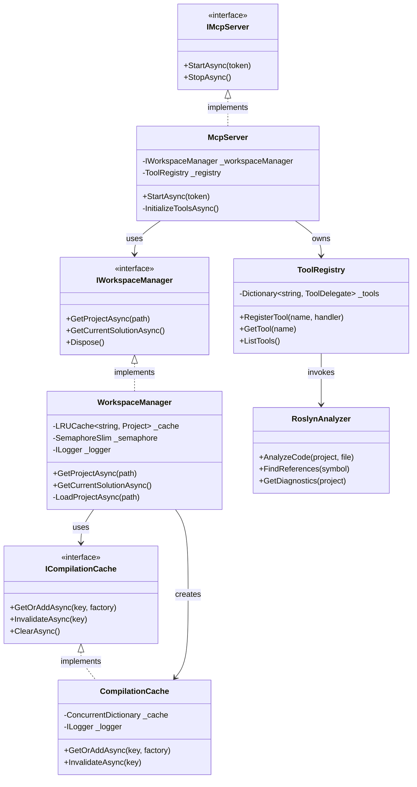
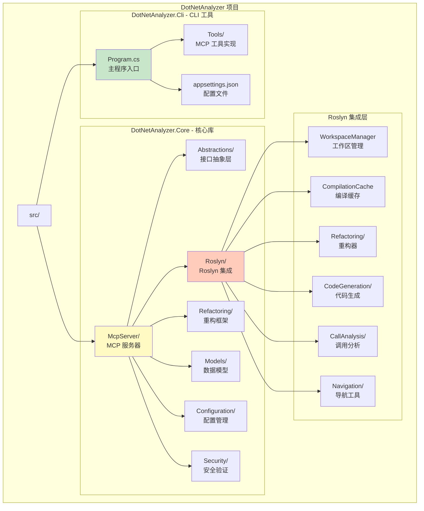
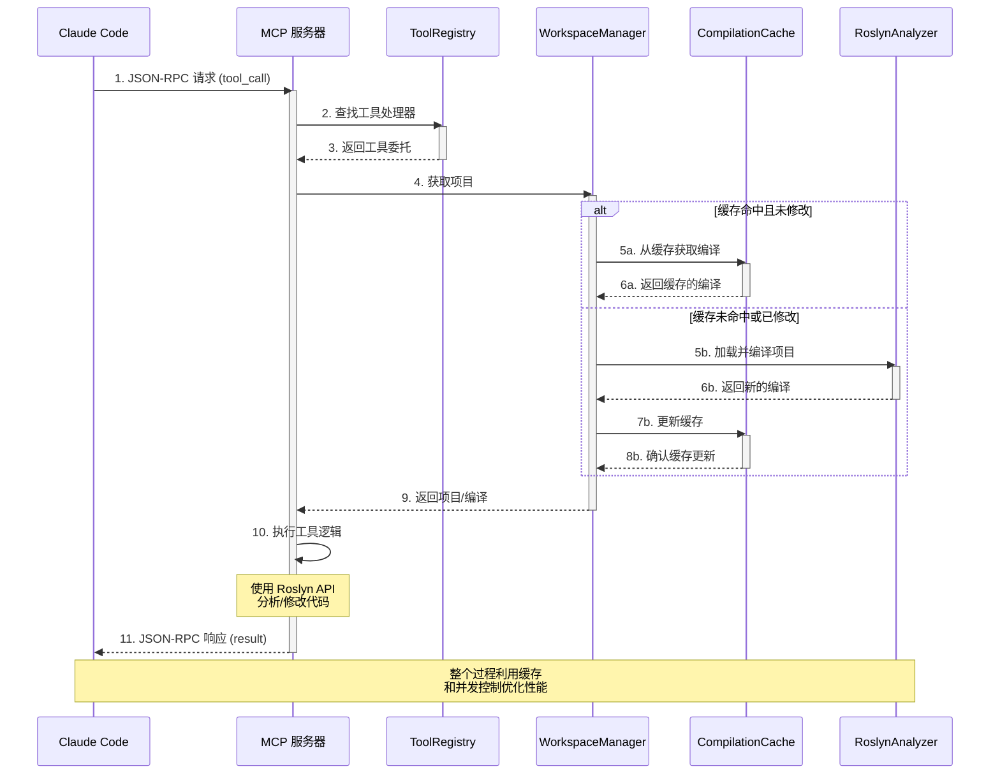

# DotNetAnalyzer 架构文档

本文档详细说明 DotNetAnalyzer 的系统架构、核心组件和项目结构。

## 系统架构图



## 核心组件关系图



## 项目结构



## MCP 工具分类层次图

```mermaid
graph TB
    subgraph "DotNetAnalyzer MCP 工具集 (74 个工具)"
        A[代码诊断<br/>1 个工具]
        B[项目管理<br/>3 个工具]
        C[代码分析<br/>1 个工具]
        D[符号查询<br/>3 个工具]
        E[导航工具<br/>7 个工具]
        F[重构工具<br/>15 个工具]
        G[代码生成<br/>11 个工具]
        H[高级分析<br/>7 个工具]
        I[代码质量<br/>4 个工具]
        J[代码操作<br/>3 个工具]
        K[高级查询<br/>5 个工具]

        A1[get_diagnostics]
        B1[list_projects]
        B2[get_project_info]
        B3[get_solution_info]
        C1[analyze_code]
        D1[find_references]
        D2[find_declarations]
        D3[get_symbol_info]
        E1[go_to_definition]
        E2[get_type_hierarchy]
        E3[get_member_hierarchy]
        E4[get_semantic_model]
        E5[get_syntax_tree]
        E6[get_code_metrics]
        E7[get_document_list]
        F1[extract_method]
        F2[rename_symbol]
        F3[introduce_variable]
        F4[encapsulate_field]
        F5[extract_interface]
        F6[change_signature]
        F7[add_parameter]
        F8[inline_temporary]
        F9[safely_remove_as]
        F10[remove_unnecessary_code]
        F11[convert_for_to_foreach]
        F12[convert_foreach_to_for]
        F13[convert_if_to_switch]
        F14[reverse_for_statement]
        F15[list_refactorers]
        G1[generate_interface_impl]
        G2[generate_constructor]
        G3[generate_property]
        G4[generate_deconstructor]
        G5[generate_from_usage]
        G6[remove_unused_usings]
        G7[sort_usings]
        G8[add_missing_imports]
        G9[organize_imports]
        G10[format_document]
        G11[format_selection]
        H1[get_caller_info]
        H2[get_callee_info]
        H3[get_call_graph]
        H4[compare_syntax_trees]
        H5[get_code_diff]
        H6[apply_code_change]
        H7[resolve_symbol]
        I1[get_test_coverage]
        I2[find_dead_code]
        I3[analyze_performance]
        I4[generate_documentation]
        J1[get_code_actions]
        J2[get_refactorings]
        J3[get_completion_list]
        K1[get_definition_and_references]
        K2[resolve_symbol]
        K3[get_document_list]
        K4[get_completion_list]
        K5[get_refactorings]

        A --> A1
        B --> B1
        B --> B2
        B --> B3
        C --> C1
        D --> D1
        D --> D2
        D --> D3
        E --> E1
        E --> E2
        E --> E3
        E --> E4
        E --> E5
        E --> E6
        E --> E7
        F --> F1
        F --> F2
        F --> F3
        F --> F4
        F --> F5
        F --> F6
        F --> F7
        F --> F8
        F --> F9
        F --> F10
        F --> F11
        F --> F12
        F --> F13
        F --> F14
        F --> F15
        G --> G1
        G --> G2
        G --> G3
        G --> G4
        G --> G5
        G --> G6
        G --> G7
        G --> G8
        G --> G9
        G --> G10
        G --> G11
        H --> H1
        H --> H2
        H --> H3
        H --> H4
        H --> H5
        H --> H6
        H --> H7
        I --> I1
        I --> I2
        I --> I3
        I --> I4
        J --> J1
        J --> J2
        J --> J3
        K --> K1
        K --> K2
        K --> K3
        K --> K4
        K --> K5

        style A fill:#ffcdd2
        style B fill:#f8bbd0
        style C fill:#e1bee7
        style D fill:#d1c4e9
        style E fill:#c5cae9
        style F fill:#bbdefb
        style G fill:#b3e5fc
        style H fill:#b2ebf2
        style I fill:#b2dfdb
        style J fill:#c8e6c9
        style K fill:#dcedc8
    end
```



## MCP 工具调用流程图



## 核心架构原则

### 1. 单一真实来源 (SSOT) 原则
- 版本号从程序集获取，不在代码中硬编码
- 配置使用 `appsettings.json` + `IOptions<T>` 模式
- 不重复定义常量

### 2. 依赖注入 (DI) 模式
```csharp
public class MyService(IOptions<MyOptions> options, ILogger<MyService> logger)
{
    private readonly int _cacheCapacity = options.Value.CacheCapacity;
}
```

### 3. MCP 工具模式
```csharp
[McpServerToolType]
public static class MyTools
{
    [McpServerTool, Description("工具描述")]
    public static async Task<string> MyTool(
        IWorkspaceManager workspaceManager,
        [Description("参数描述")] string param)
    {
        // 实现代码
        return JsonSerializer.Serialize(result, JsonOptions.Default);
    }
}
```

### 4. WorkspaceManager 核心组件
- 使用 MSBuildWorkspace 加载 .csproj、.sln、.slnx
- LRU 缓存已加载项目（容量 50，可配置）
- 文件修改时间检测实现缓存失效
- 双重检查模式实现高效并发加载
- 信号量限制并发加载数（默认 4）

## 代码目录结构

```
DotNetAnalyzer/
├── src/
│   ├── DotNetAnalyzer.Cli/          # CLI 工具入口（.NET 全局工具）
│   │   ├── Program.cs               # 主程序入口，配置 MCP 服务器
│   │   ├── Tools/                   # MCP 工具实现（74 个工具）
│   │   │   ├── DiagnosticsTools.cs
│   │   │   ├── ProjectTools.cs
│   │   │   ├── AnalysisTools.cs
│   │   │   ├── SymbolTools.cs
│   │   │   ├── NavigationTools.cs
│   │   │   ├── RefactoringTools.cs
│   │   │   ├── CodeGenerationTools.cs
│   │   │   ├── CallAnalysisTools.cs
│   │   │   ├── ComparisonTools.cs
│   │   │   ├── CodeQualityTools.cs
│   │   │   ├── CodeActionsTools.cs
│   │   │   ├── AdvancedQueryTools.cs
│   │   │   └── BaseTool.cs          # 工具基类
│   │   └── appsettings.json         # 配置文件（可选）
│   │
│   └── DotNetAnalyzer.Core/         # 核心库
│       ├── Abstractions/            # IWorkspaceManager, ICompilationCache
│       ├── Roslyn/                  # Roslyn 集成层
│       │   ├── WorkspaceManager.cs  # 工作区管理器（LRU 缓存）
│       │   ├── CompilationCache.cs  # 编译缓存
│       │   ├── DependencyAnalyzer.cs # 依赖分析
│       │   ├── Refactoring/         # 重构器（15 个）
│       │   ├── CodeGeneration/      # 代码生成器
│       │   ├── CallAnalysis/        # 调用分析
│       │   └── Navigation/          # 导航工具
│       ├── Refactoring/             # 重构框架
│       │   ├── Core/                # RefactoringEngine, Validator
│       │   ├── Abstractions/        # 接口定义
│       │   └── Refactorers/         # 具体重构器实现
│       ├── Models/                  # 数据模型
│       ├── Configuration/           # 配置选项（IOptions<T> 模式）
│       └── Security/                # PathValidator（路径验证）
│
└── tests/
    └── DotNetAnalyzer.Tests/        # 单元测试（xUnit + Moq）
        └── TestAssets/              # 测试资产
```

## 技术栈

### 核心技术
- **.NET 8.0/9.0/10.0** - 跨平台开发框架
- **.NET CLI Tools** - 全局工具框架
- **MCP SDK** - Model Context Protocol 官方实现
- **Roslyn** - 微软官方 C# 编译器平台

### 主要依赖
```xml
<!-- MCP 协议 -->
<PackageReference Include="ModelContextProtocol" Version="*" />

<!-- Roslyn 分析 -->
<PackageReference Include="Microsoft.CodeAnalysis" Version="5.*" />
<PackageReference Include="Microsoft.CodeAnalysis.CSharp" Version="5.*" />
<PackageReference Include="Microsoft.CodeAnalysis.Workspaces.MSBuild" Version="5.*" />

<!-- CLI 框架 -->
<PackageReference Include="System.CommandLine" Version="2.*" />

<!-- 测试 -->
<PackageReference Include="xUnit" Version="2.*" />
<PackageReference Include="Moq" Version="4.*" />
<PackageReference Include="FluentAssertions" Version="6.*" />
```

## 相关文档

- [README.md](../README.md) - 项目概述和快速开始
- [开发工作流](development-workflow.md) - 开发流程指南
- [编码规范](CODING_STANDARDS.md) - 代码规范（必读）
- [API 使用指南](api-guide.md) - MCP 工具 API 参考文档
