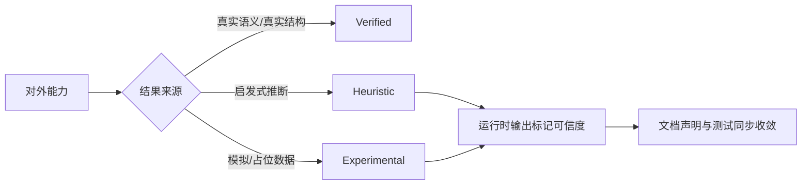

[English](en/analysis-credibility.md) | 中文版

# 分析能力可信度矩阵

本文档记录 DotNetAnalyzer 当前对外暴露的分析/可视化能力中，哪些结果已经可以视为稳定行为，哪些仍属于启发式或实验性结果。

## 分级定义

| 级别 | 含义 | 当前要求 |
|------|------|----------|
| `verified` | 关键结果来自真实语义模型、真实结构分析或真实项目加载 | 可在 README / API 文档中按稳定能力描述 |
| `heuristic` | 结果依赖规则推断、近似估算或不完整图谱 | 运行时必须附带可信度标记，文档不得表述为精确结果 |
| `experimental` | 结果仍依赖模拟数据、占位逻辑或未接入真实数据源 | 运行时和文档都必须明确声明为实验性 |

## 当前能力矩阵

| 能力 / 工具 | 当前级别 | 原因 | 后续收敛方向 |
|-------------|----------|------|--------------|
| `detect_code_smells` | `verified` | 基于真实语法树、语义模型和检测器执行 | 持续补充端到端测试 |
| `generate_dependency_graph` | `verified` | 基于项目文档、类型声明、继承和接口关系生成结构 | 继续增强图裁剪与大图简化 |
| `generate_heatmap` (`complexity`) | `verified` | 基于代码异味分析结果汇总复杂度热点 | 增加更多真实语义指标 |
| `get_test_coverage` | `verified` | 优先从 coverage.cobertura.xml 解析真实覆盖率数据；无覆盖文件时回退到启发式估算 | 持续补充端到端测试与更多覆盖率格式支持 |
| `analyze_change_impact` | `verified` | 基于 BFS 传递依赖分析、跨项目传播和精确测试映射，结果来自真实语义模型和 SymbolFinder | 持续补充跨文档复杂场景的端到端测试 |
| `get_callee_info` | `verified` | 基于真实语义模型的跨文档调用树解析，支持接口/实现分派、虚方法/重写分派、循环检测和深度限制 | 持续补充跨文档复杂场景的端到端测试 |
| `generate_heatmap` (`change-frequency`) | `verified` | 基于 GitHistoryProvider 调用真实 git log 获取变更历史，输出真实的文件变更频率数据 | 持续补充端到端测试 |
| `scan_security_vulnerabilities` | `verified` | 基于 Roslyn 语法树和语义模型的 6 个 OWASP 检测器（SEC001-SEC006），结果来自真实语法分析 | 持续补充端到端测试与更多模式覆盖 |
| `check_license_compliance` | `verified` | 基于 NuGet.org REST API v3 获取真实许可证信息，与用户白名单比对 | 持续补充更多许可证格式支持 |
| `scan_nuget_vulnerabilities` | `verified` | 基于 NuGet.org REST API v3 查询真实 CVE 数据库 | 持续补充漏洞数据库覆盖率 |
| `scan_dependencies_health` | `verified` | 基于 NuGet API 真实版本数据、漏洞数据和 project.assets.json 实际依赖树解析 | 持续补充健康度评分模型 |
| `detect_dependency_conflicts` | `verified` | 基于 project.assets.json 解析实际解析版本，跨项目比较 | 持续补充传递依赖冲突检测 |
| `analyze_xaml` | `verified` | 基于 System.Xml.Linq 解析 XAML 文件结构，结果确定 | 持续补充更多 XAML 方言支持 |
| `validate_bindings` | `verified` | 基于 Roslyn SemanticModel 精确匹配 Binding Path 与 ViewModel 属性 | 持续补充复杂绑定场景测试 |
| `analyze_xaml_resources` | `verified` | 基于 XML 解析 ResourceDictionary 结构和资源键引用 | 持续补充跨文件资源追踪 |
| `map_view_viewmodel` | `verified` | 基于 Roslyn SyntaxWalker 精确追踪 DataContext 赋值链，支持泛型参数、工厂方法和 DI 注入 | 持续补充 DataTemplate 和隐式 DataContext 场景 |
| `detect_mvvm_violations` | `verified` | 基于高/低置信度关键词分级 + SyntaxWalker 精确定位 + ViewModelMapper 语义集成 | 持续补充 WpfAnalyzers 规则覆盖 |
| `detect_async_antipatterns` | `verified` | async void/.Result/.Wait() 等模式可精确定位 | 持续补充更多异步反模式 |
| `analyze_di_registration` / `find_missing_di_registrations` | `verified` | 支持 lambda 工厂注册、开放泛型注册、Captive Dependency 和循环依赖检测 | 持续补充 Autofac/SimpleInjector 等容器支持 |
| `detect_memory_leaks` | `verified` | 基于 Roslyn 语法树和语义模型，支持 IAsyncDisposable、Timer/DispatcherTimer 检测 | 持续补充更多泄漏模式检测 |
| `add_project_reference` / `add_nuget_package` / `update_project_property` | `verified` | 基于 Microsoft.Build API 操作 .csproj，结果确定 | 持续补充更多 MSBuild 属性操作 |

## 使用原则

- 对 `heuristic` 和 `experimental` 能力，优先信任返回结果中的 `credibility` 字段，而不是把结果当作精确事实。
- 对外文档只把 `verified` 能力表述为“稳定行为”。
- 新增分析能力时，必须先在本文档中声明可信度级别，再决定 README 和 API 文档中的对外口径。
