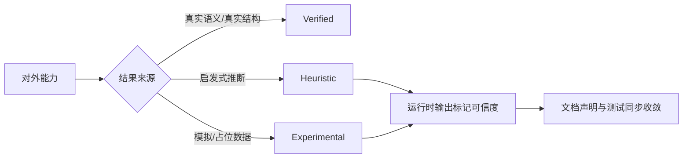

# 分析能力可信度矩阵

本文档记录 DotNetAnalyzer 当前对外暴露的分析/可视化能力中，哪些结果已经可以视为稳定行为，哪些仍属于启发式或实验性结果。

## 分级定义

| 级别 | 含义 | 当前要求 |
|------|------|----------|
| `verified` | 关键结果来自真实语义模型、真实结构分析或真实项目加载 | 可在 README / API 文档中按稳定能力描述 |
| `heuristic` | 结果依赖规则推断、近似估算或不完整图谱 | 运行时必须附带可信度标记，文档不得表述为精确结果 |
| `experimental` | 结果仍依赖模拟数据、占位逻辑或未接入真实数据源 | 运行时和文档都必须明确声明为实验性 |

## 当前能力矩阵

| 能力 / 工具 | 当前级别 | 原因 | 后续收敛方向 |
|-------------|----------|------|--------------|
| `detect_code_smells` | `verified` | 基于真实语法树、语义模型和检测器执行 | 持续补充端到端测试 |
| `generate_dependency_graph` | `verified` | 基于项目文档、类型声明、继承和接口关系生成结构 | 继续增强图裁剪与大图简化 |
| `generate_heatmap` (`complexity`) | `verified` | 基于代码异味分析结果汇总复杂度热点 | 增加更多真实语义指标 |
| `get_test_coverage` | `heuristic` | 当前依据测试文件命名与估算比例生成覆盖率结果 | 后续接入真实覆盖率产物或测试映射 |
| `analyze_change_impact` | `heuristic` | 目前只覆盖直接公共符号引用，未完成传递依赖和精确测试映射 | 后续补齐依赖图与测试引用分析 |
| `get_callee_info` | `heuristic` | 当前递归调用树对复杂跨文档场景覆盖不完整 | 后续扩展为跨文档符号解析 |
| `generate_heatmap` (`change-frequency`) | `experimental` | 尚未接入真实变更历史，当前仅输出实验性占位结果 | 后续接入 git / 历史记录数据源 |

## 使用原则

- 对 `heuristic` 和 `experimental` 能力，优先信任返回结果中的 `credibility` 字段，而不是把结果当作精确事实。
- 对外文档只把 `verified` 能力表述为“稳定行为”。
- 新增分析能力时，必须先在本文档中声明可信度级别，再决定 README 和 API 文档中的对外口径。
