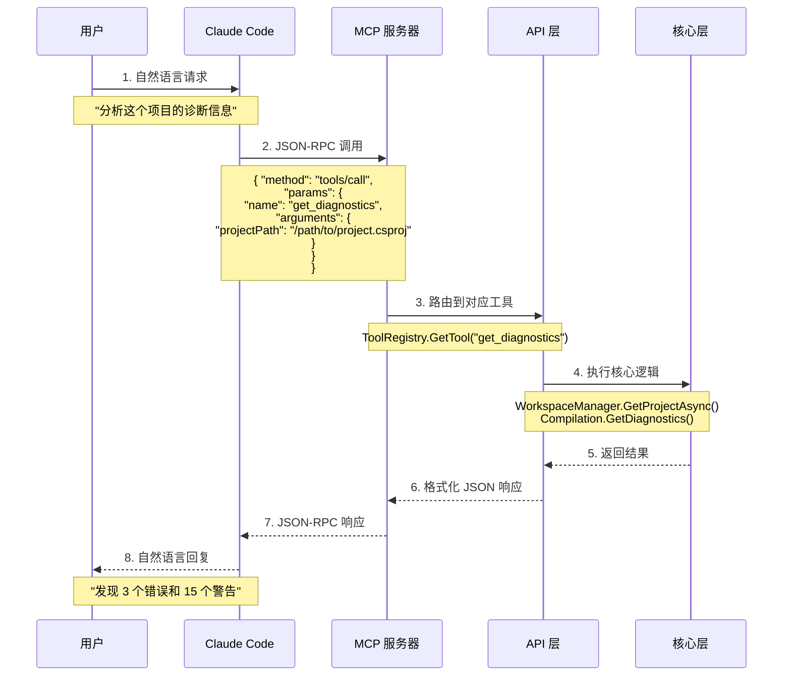
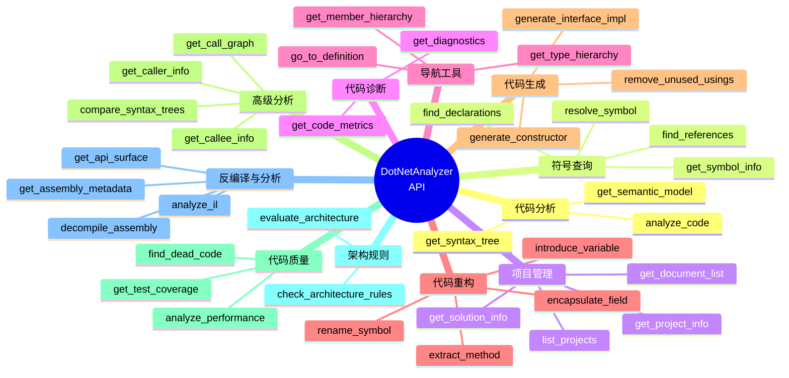

[English](en/api-guide.md) | 中文版

# DotNetAnalyzer API 使用指南

本文档提供 DotNetAnalyzer MCP 服务器的完整 API 参考，帮助开发者了解和使用所有可用的工具。

## API 调用流程



## API 工具分类



## 目录

- [快速开始](#快速开始)
- [MCP 工具概览](#mcp-工具概览)
- [代码分析工具](#代码分析工具)
- [符号查询工具](#符号查询工具)
- [项目管理工具](#项目管理工具)
- [代码诊断工具](#代码诊断工具)
- [导航增强工具 (Phase 2)](#导航增强工具-phase-2) ✨
- [架构规则检查工具](#架构规则检查工具) ✨
- [反编译与分析工具](#反编译与分析工具) ✨
- [安全检测工具](#安全检测工具) ✨
- [依赖健康度工具](#依赖健康度工具) ✨
- [性能优化工具](#性能优化工具) ✨
- [配置选项](#配置选项)
- [最佳实践](#最佳实践)
- [故障排除](#故障排除)

---

## 快速开始

### 前置要求

> **提示**: 也可以通过 Claude Code Plugin 一键安装。详见 [DotNetAnalyzer Plugin](https://github.com/CartapenaBark/DotNetAnalyzer/tree/develop/plugin)。

1. **安装 DotNetAnalyzer**:
   ```bash
   dotnet tool install --global DotNetAnalyzer
   ```

2. **配置 Claude Code**:
   在项目根目录创建 `.mcp.json`:
   ```json
   {
     "mcpServers": {
       "dotnet-analyzer": {
         "type": "stdio",
         "command": "dotnet-analyzer",
         "args": []
       }
     }
   }
   ```

3. **验证安装**:
   ```bash
   dotnet-analyzer --version
   ```

### 基本使用

在 Claude Code 中，你可以通过自然语言与 DotNetAnalyzer 交互：

```
你: "分析当前项目的诊断信息"
Claude: [调用 get_diagnostics] ...
     "发现 3 个错误和 15 个警告..."
```

---

## MCP 工具概览

DotNetAnalyzer v1.7.0 提供 **93 个 MCP 工具**，覆盖代码分析、导航、重构、质量分析、架构规则检查、反编译、安全检测、依赖健康度分析、性能优化、XAML 分析、桌面模式检测、项目文件操作和可视化能力。

> 当前文档中的能力说明以 `eng/product-metadata.json` 与源码扫描得到的工具清单为准；对启发式或实验性结果，请同步参考 [分析能力可信度矩阵](analysis-credibility.md)。

### 核心工具 (Phase 1) - 22 个

| 工具名称 | 类别 | 描述 | 状态 |
|---------|------|------|------|
| `analyze_code` | 代码分析 | 分析代码的语法和语义结构 | ✅ 完整实现 |
| `get_symbol_info` | 符号查询 | 获取符号的详细信息 | ✅ 完整实现 |
| `find_references` | 符号查询 | 查找符号的所有引用 | ✅ 完整实现 |
| `find_declarations` | 符号查询 | 查找符号的声明位置 | ✅ 完整实现 |
| `list_projects` | 项目管理 | 列出解决方案中的所有项目 | ✅ 完整实现 |
| `get_project_info` | 项目管理 | 获取项目的详细信息 | ✅ 完整实现 |
| `get_solution_info` | 项目管理 | 获取解决方案的详细信息 | ✅ 完整实现 |
| `get_diagnostics` | 代码诊断 | 获取编译器诊断信息 | ✅ 完整实现 |
| ... (其他 14 个工具) | | | |

### 导航增强工具 (Phase 2) - 7 个 ✨

| 工具名称 | 类别 | 描述 | 状态 |
|---------|------|------|------|
| `go_to_definition` | 导航 | 跳转到符号定义位置 | ✅ 完整实现 |
| `get_type_hierarchy` | 类型分析 | 获取类型的完整继承层次 | ✅ 完整实现 |
| `get_member_hierarchy` | 成员分析 | 获取成员的重写和实现层次 | ✅ 完整实现 |
| `get_semantic_model` | 语义分析 | 获取位置的语义模型信息 | ✅ 完整实现 |
| `get_syntax_tree` | 语法分析 | 获取语法树的详细信息 | ✅ 完整实现 |
| `get_code_metrics` | 代码度量 | 计算代码复杂度和质量指标 | ✅ 完整实现 |

详细的 Phase 2 工具文档请参见 [导航增强工具 (Phase 2)](#导航增强工具-phase-2) 章节。

---

## 代码分析工具

### analyze_code

分析代码的语法和语义结构，包括语法树、类型信息、命名空间、类、方法等。

#### 参数

| 参数名 | 类型 | 必需 | 描述 |
|--------|------|------|------|
| `projectPath` | string | ✅ | 项目路径 (.csproj) |
| `filePath` | string | ✅ | 要分析的文件路径 |

#### 返回值

```json
{
  "success": true,
  "fileInfo": {
    "filePath": "path/to/file.cs",
    "totalLines": 150,
    "extension": ".cs",
    "size": 4500
  },
  "syntaxTree": {
    "rootNodeKind": "CompilationUnit",
    "hasCompilationUnit": true,
    "nodeCount": 542,
    "usingsCount": 8,
    "namespacesCount": 2,
    "typeDeclarationsCount": 3,
    "methodDeclarationsCount": 12
  },
  "hierarchy": {
    "namespaces": [
      {
        "name": "MyApp.Services",
        "startLine": 10,
        "typeCount": 2
      }
    ],
    "totalNamespaces": 2,
    "totalTypes": 3
  },
  "namespaces": [
    {
      "name": "MyApp.Services",
      "startLine": 10,
      "endLine": 150,
      "isGlobal": false
    }
  ],
  "usings": [
    {
      "name": "System",
      "isStatic": false,
      "isAlias": false,
      "alias": null
    },
    {
      "name": "System.Threading.Tasks",
      "isStatic": false,
      "isAlias": false,
      "alias": null
    }
  ],
  "typeDeclarations": [
    {
      "name": "UserService",
      "kind": "ClassDeclaration",
      "accessibility": "Public",
      "isStatic": false,
      "isAbstract": false,
      "isSealed": false,
      "baseType": "object",
      "interfaces": ["IService"],
      "startLine": 15,
      "endLine": 80,
      "memberCount": 8
    }
  ],
  "methodDeclarations": [
    {
      "name": "GetUserAsync",
      "containingType": "UserService",
      "returnType": "Task<User>",
      "accessibility": "Public",
      "isStatic": false,
      "isAsync": true,
      "isVirtual": false,
      "isOverride": false,
      "isExtensionMethod": false,
      "parameters": [
        {
          "name": "userId",
          "type": "int",
          "isOptional": false
        }
      ],
      "startLine": 25,
      "endLine": 30
    }
  ],
  "summary": {
    "namespaceCount": 2,
    "typeCount": 3,
    "methodCount": 12,
    "usingCount": 8
  }
}
```

#### 使用示例

```
你: "分析 UserService.cs 文件的代码结构"
Claude: [调用 analyze_code]
```

#### 注意事项

- 文件必须存在于项目中
- 项目必须能够成功编译
- 返回的行号从 1 开始计数

---

## 符号查询工具

### get_symbol_info

获取符号的详细信息，包括类型、修饰符、参数、XML 文档注释等。

#### 参数

| 参数名 | 类型 | 必需 | 描述 |
|--------|------|------|------|
| `projectPath` | string | ✅ | 项目或解决方案路径 |
| `filePath` | string | ✅ | 文件路径 |
| `line` | int | ✅ | 行号（从 0 开始） |
| `column` | int | ✅ | 列号（从 0 开始） |

#### 返回值

```json
{
  "success": true,
  "symbol": {
    "name": "GetUserAsync",
    "kind": "Method",
    "containingType": "UserService",
    "containingNamespace": "MyApp.Services",
    "accessibility": "Public",
    "isStatic": false,
    "isVirtual": false,
    "isAbstract": false,
    "isOverride": false,
    "isSealed": false
  },
  "location": {
    "file": "path/to/UserService.cs",
    "line": 25,
    "column": 8
  },
  "methodInfo": {
    "returnType": "Task<User>",
    "parameters": [
      {
        "name": "userId",
        "type": "int",
        "isOptional": false,
        "hasDefaultValue": false
      }
    ],
    "typeParameters": [],
    "isAsync": true,
    "isExtensionMethod": false
  },
  "documentation": {
    "summary": "根据用户 ID 获取用户信息",
    "returns": "用户对象",
    "parameters": [
      {
        "name": "userId",
        "description": "用户 ID"
      }
    ]
  }
}
```

#### 使用示例

```
你: "告诉我第 25 行第 8 列的方法的详细信息"
Claude: [调用 get_symbol_info]
```

### find_references

查找符号的所有引用位置，包括跨文件引用。

#### 参数

| 参数名 | 类型 | 必需 | 描述 |
|--------|------|------|------|
| `projectPath` | string | ✅ | 项目或解决方案路径 |
| `filePath` | string | ✅ | 文件路径 |
| `line` | int | ✅ | 行号（从 0 开始） |
| `column` | int | ✅ | 列号（从 0 开始） |

#### 返回值

```json
{
  "success": true,
  "symbol": {
    "name": "GetUserAsync",
    "kind": "Method",
    "containingType": "UserService",
    "containingNamespace": "MyApp.Services"
  },
  "definition": {
    "file": "path/to/UserService.cs",
    "line": 25,
    "column": 8
  },
  "references": [
    {
      "file": "path/to/UserController.cs",
      "line": 15,
      "column": 20,
      "endLine": 15,
      "endColumn": 32,
      "isDefinition": false,
      "context": "var user = await _userService.GetUserAsync(userId);"
    },
    {
      "file": "path/to/UserService.cs",
      "line": 25,
      "column": 8,
      "endLine": 25,
      "endColumn": 20,
      "isDefinition": true,
      "context": "public async Task<User> GetUserAsync(int userId)"
    }
  ],
  "summary": {
    "totalReferences": 5,
    "definitionLocation": 1
  }
}
```

#### 使用示例

```
你: "查找 GetUserAsync 方法的所有引用"
Claude: [调用 find_references]
```

### find_declarations

查找符号的声明位置，包括基类成员和接口成员的声明。

#### 参数

| 参数名 | 类型 | 必需 | 描述 |
|--------|------|------|------|
| `projectPath` | string | ✅ | 项目或解决方案路径 |
| `filePath` | string | ✅ | 文件路径 |
| `line` | int | ✅ | 行号（从 0 开始） |
| `column` | int | ✅ | 列号（从 0 开始） |

#### 返回值

```json
{
  "success": true,
  "symbol": {
    "name": "ExecuteAsync",
    "kind": "Method",
    "originalDefinition": "ExecuteAsync"
  },
  "declarations": [
    {
      "name": "ExecuteAsync",
      "kind": "Method",
      "file": "path/to/BackgroundTask.cs",
      "line": 20,
      "column": 8,
      "relationship": "current",
      "containingType": "BackgroundTask",
      "containingNamespace": "MyApp.Tasks"
    },
    {
      "name": "ExecuteAsync",
      "kind": "Method",
      "file": "path/to/IJob.cs",
      "line": 10,
      "column": 8,
      "relationship": "implements",
      "containingType": "IJob",
      "containingNamespace": "MyApp.Interfaces"
    }
  ],
  "summary": {
    "totalDeclarations": 2,
    "isOverride": false,
    "isVirtual": false,
    "isExtensionMethod": false
  }
}
```

#### 使用示例

```
你: "这个方法在哪里定义的？是否实现了接口？"
Claude: [调用 find_declarations]
```

---

## 项目管理工具

### list_projects

列出解决方案中的所有项目，包括依赖关系分析。

#### 参数

| 参数名 | 类型 | 必需 | 描述 |
|--------|------|------|------|
| `solutionPath` | string | ✅ | 解决方案路径 (.sln 或 .slnx) |

#### 返回值

```json
{
  "success": true,
  "solutionPath": "path/to/MySolution.sln",
  "projectCount": 5,
  "projects": [
    {
      "name": "MyApp.Core",
      "filePath": "src/MyApp.Core/MyApp.Core.csproj",
      "assemblyName": "MyApp.Core",
      "hasDocuments": true,
      "projectId": "...",
      "dependencies": {
        "projectReferences": [],
        "packageReferencesCount": 3,
        "hasCircularReference": false
      }
    },
    {
      "name": "MyApp.Api",
      "filePath": "src/MyApp.Api/MyApp.Api.csproj",
      "assemblyName": "MyApp.Api",
      "hasDocuments": true,
      "projectId": "...",
      "dependencies": {
        "projectReferences": ["MyApp.Core", "MyApp.Services"],
        "packageReferencesCount": 8,
        "hasCircularReference": false
      }
    }
  ]
}
```

#### 使用示例

```
你: "列出当前解决方案的所有项目"
Claude: [调用 list_projects]
```

### get_project_info

获取项目的详细信息。

#### 参数

| 参数名 | 类型 | 必需 | 描述 |
|--------|------|------|------|
| `projectPath` | string | ✅ | 项目路径 (.csproj) |

#### 返回值

```json
{
  "success": true,
  "project": {
    "name": "MyApp.Api",
    "filePath": "src/MyApp.Api/MyApp.Api.csproj",
    "assemblyName": "MyApp.Api",
    "outputType": "Exe",
    "language": "Visual Basic",
    "targetFramework": "net8.0",
    "documentCount": 15,
    "sourceFiles": [
      {
        "name": "Program.cs",
        "filePath": "src/MyApp.Api/Program.cs"
      }
    ],
    "diagnostics": {
      "errorCount": 0,
      "warningCount": 2
    },
    "dependencies": {
      "projectReferences": ["MyApp.Core", "MyApp.Services"],
      "packageReferences": [
        {
          "name": "Microsoft.AspNetCore.OpenApi",
          "version": "8.0.0"
        }
      ],
      "transitiveDependencies": ["Newtonsoft.Json", "System.Text.Json"],
      "hasCircularReference": false
    }
  }
}
```

#### 使用示例

```
你: "显示 MyApp.Api 项目的详细信息"
Claude: [调用 get_project_info]
```

### get_solution_info

获取解决方案的详细信息，包括构建顺序和启动项目。

#### 参数

| 参数名 | 类型 | 必需 | 描述 |
|--------|------|------|------|
| `solutionPath` | string | ✅ | 解决方案路径 (.sln 或 .slnx) |

#### 返回值

```json
{
  "success": true,
  "solution": {
    "filePath": "path/to/MySolution.sln",
    "name": "MySolution",
    "projectCount": 5,
    "projects": [
      {
        "name": "MyApp.Core",
        "filePath": "src/MyApp.Core/MyApp.Core.csproj",
        "projectId": "...",
        "isExecutable": false,
        "dependencyCount": 0
      },
      {
        "name": "MyApp.Api",
        "filePath": "src/MyApp.Api/MyApp.Api.csproj",
        "projectId": "...",
        "isExecutable": true,
        "dependencyCount": 2
      }
    ],
    "buildOrder": [
      "MyApp.Core",
      "MyApp.Services",
      "MyApp.Data",
      "MyApp.Api",
      "MyApp.Tests"
    ],
    "startupProjects": ["MyApp.Api"]
  }
}
```

#### 使用示例

```
你: "分析解决方案结构，告诉我构建顺序和启动项目"
Claude: [调用 get_solution_info]
```

### analyze_dependencies

分析项目的依赖关系，包括项目引用、包依赖、传递依赖和循环依赖检测。

#### 参数

| 参数名 | 类型 | 必需 | 描述 |
|--------|------|------|------|
| `projectPath` | string | ✅ | 项目路径 (.csproj) |

#### 返回值

```json
{
  "success": true,
  "dependencies": {
    "targetFramework": "net8.0",
    "projectReferences": ["MyApp.Core", "MyApp.Services"],
    "packageReferences": [
      {
        "name": "Microsoft.AspNetCore.OpenApi",
        "version": "8.0.0"
      }
    ],
    "transitiveDependencies": [
      "Newtonsoft.Json",
      "System.Text.Json",
      "Microsoft.Extensions.DependencyInjection"
    ],
    "hasCircularReference": false,
    "circularReferencePath": null
  }
}
```

#### 使用示例

```
你: "分析 MyApp.Api 的依赖关系"
Claude: [调用 analyze_dependencies]
```

---

## 代码诊断工具

### get_diagnostics

获取 C# 代码的编译器诊断信息（错误、警告、信息）。

#### 参数

| 参数名 | 类型 | 必需 | 描述 |
|--------|------|------|------|
| `projectPath` | string | ✅ | 项目或解决方案路径 |
| `filePath` | string | ❌ | 可选：特定文件的诊断 |

#### 返回值

```json
{
  "success": true,
  "diagnostics": [
    {
      "id": "CS0219",
      "severity": "Warning",
      "message": "变量 'unusedVar' 已赋值，但从未使用过其值",
      "location": {
        "file": "path/to/Program.cs",
        "startLine": 15,
        "startColumn": 13,
        "endLine": 15,
        "endColumn": 22
      },
      "warningLevel": 2,
      "isWarningAsError": false
    },
    {
      "id": "CS0103",
      "severity": "Error",
      "message": "名称 'UndefinedType' 在当前上下文中不存在",
      "location": {
        "file": "path/to/Service.cs",
        "startLine": 25,
        "startColumn": 20,
        "endLine": 25,
        "endColumn": 33
      },
      "warningLevel": 0,
      "isWarningAsError": false
    }
  ],
  "count": 2
}
```

#### 使用示例

```
你: "检查当前项目的所有错误和警告"
Claude: [调用 get_diagnostics]

你: "Program.cs 文件有什么问题？"
Claude: [调用 get_diagnostics，指定 filePath]
```

#### 诊断级别

| 级别 | 描述 |
|------|------|
| `Error` | 编译错误，必须修复才能编译成功 |
| `Warning` | 警告，建议修复但不影响编译 |
| `Info` | 信息性提示 |
| `Hidden` | 隐藏的警告（默认不返回） |

---

## 导航增强工具 (Phase 2)

导航工具目前仍提供 7 个核心能力，用于支持符号定位、类型层次和语义分析。

### 工具概览

| 工具名称 | 描述 | 主要用途 |
|---------|------|----------|
| `go_to_definition` | 跳转到符号定义 | 快速定位符号定义位置 |
| `get_type_hierarchy` | 类型继承层次 | 理解类的继承关系 |
| `get_member_hierarchy` | 成员层次结构 | 查看重写和接口实现 |
| `get_semantic_model` | 语义模型信息 | 获取符号和类型详情 |
| `get_syntax_tree` | 语法树结构 | 深入分析代码语法 |
| `get_code_metrics` | 代码度量指标 | 评估代码质量 |

### go_to_definition

跳转到指定位置符号的定义位置。

#### 参数

| 参数名 | 类型 | 必需 | 描述 |
|--------|------|------|------|
| `filePath` | string | ✅ | 文件路径 |
| `line` | integer | ✅ | 行号（从 0 开始） |
| `column` | integer | ✅ | 列号（从 0 开始） |

#### 返回值

```json
{
  "success": true,
  "data": {
    "definition": {
      "filePath": "path/to/definition.cs",
      "line": 42,
      "column": 10,
      "symbolInfo": {
        "name": "MyMethod",
        "kind": "Method",
        "containingType": "MyClass"
      }
    }
  }
}
```

#### 使用示例

```csharp
// 用户询问
"Show me where ILogger is defined"

// Claude 调用
go_to_definition(filePath="Program.cs", line=15, column=25)
```

#### 特性

- ✅ 支持所有符号类型（类、方法、属性、字段等）
- ✅ 跨文件定义跳转
- ✅ 处理隐式定义（如扩展方法）
- ✅ 返回符号的详细信息

---

### get_type_hierarchy

获取类型的完整继承层次结构，包括基类型链、派生类型和实现的接口。

#### 参数

| 参数名 | 类型 | 必需 | 描述 |
|--------|------|------|------|
| `projectPath` | string | ✅ | 项目路径 (.csproj) |
| `typeName` | string | ✅ | 类型名称（完全限定名或简单名称） |

#### 返回值

```json
{
  "success": true,
  "data": {
    "typeName": "MyClass",
    "hierarchy": {
      "baseTypes": [
        {
          "name": "BaseClass",
          "namespace": "MyNamespace",
          "filePath": "path/to/BaseClass.cs",
          "line": 5,
          "typeParameters": [],
          "kind": "Class"
        },
        {
          "name": "Object",
          "namespace": "System",
          "kind": "Class"
        }
      ],
      "derivedTypes": [
        {
          "name": "DerivedClass",
          "namespace": "MyNamespace",
          "filePath": "path/to/DerivedClass.cs",
          "line": 10
        }
      ],
      "interfaces": [
        {
          "name": "IEnumerable",
          "namespace": "System.Collections",
          "implementedMembers": ["GetEnumerator"]
        }
      ],
      "members": [
        {
          "name": "MyMethod",
          "kind": "Method",
          "type": "void",
          "accessibility": "Public",
          "isStatic": false,
          "isVirtual": false,
          "isAbstract": false,
          "isOverride": false
        }
      ]
    }
  }
}
```

#### 使用示例

```csharp
// 用户询问
"Show me the inheritance hierarchy of DbSet<TEntity>"

// Claude 调用
get_type_hierarchy(
  projectPath="src/MyProject/MyProject.csproj",
  typeName="Microsoft.EntityFrameworkCore.DbSet`1"
)
```

#### 特性

- ✅ 完整的基类型链（直到 object）
- ✅ 查找所有派生类型（跨项目）
- ✅ 接口实现详情
- ✅ 接口成员映射
- ✅ 支持泛型类型
- ✅ 类型成员信息

#### 性能说明

- 小型项目（< 10 个类型）: < 100ms
- 中型项目（10-100 个类型）: < 500ms
- 大型项目（> 100 个类型）: < 2s

---

### get_member_hierarchy

获取成员的重写、隐藏和接口实现层次结构。

#### 参数

| 参数名 | 类型 | 必需 | 描述 |
|--------|------|------|------|
| `projectPath` | string | ✅ | 项目路径 |
| `memberName` | string | ✅ | 成员名称 |
| `containingType` | string | ✅ | 所属类型名称 |

#### 返回值

```json
{
  "success": true,
  "data": {
    "memberName": "ToString",
    "containingType": "MyClass",
    "hierarchy": {
      "overriddenMembers": [
        {
          "name": "ToString",
          "containingType": "Object",
          "declarationLocation": {
            "filePath": "mscorlib.cs",
            "line": 123
          }
        }
      ],
      "hidingMembers": [],
      "implementedInterfaceMembers": [
        {
          "interfaceName": "IFormattable",
          "memberName": "ToString",
          "declarationLocation": {
            "filePath": "mscorlib.cs",
            "line": 456
          }
        }
      ]
    }
  }
}
```

#### 使用示例

```csharp
// 用户询问
"Does this method override anything?"

// Claude 调用
get_member_hierarchy(
  projectPath="src/MyProject/MyProject.csproj",
  memberName="Execute",
  containingType="MyCommand"
)
```

#### 特性

- ✅ 重写链追踪
- ✅ 方法隐藏检测
- ✅ 显式接口实现识别
- ✅ 跨项目层次分析

---

### get_semantic_model

获取指定位置的详细语义模型信息，包括符号、类型、常量值等。

#### 参数

| 参数名 | 类型 | 必需 | 描述 |
|--------|------|------|------|
| `filePath` | string | ✅ | 文件路径 |
| `line` | integer | ✅ | 行号（从 0 开始） |
| `column` | integer | ✅ | 列号（从 0 开始） |

#### 返回值

```json
{
  "success": true,
  "data": {
    "position": {
      "filePath": "Program.cs",
      "line": 15,
      "column": 20
    },
    "symbol": {
      "name": "myVariable",
      "kind": "Variable",
      "type": "System.String",
      "containingSymbol": "Main"
    },
    "type": {
      "name": "string",
      "kind": "Structure",
      "members": ["Length", "ToLower", "ToUpper", ...]
    },
    "constantValue": "Hello World",
    "allSymbolsInScope": [
      {"name": "myVariable", "kind": "Variable"},
      {"name": "Console", "kind": "Class"}
    ]
  }
}
```

#### 使用示例

```csharp
// 用户询问
"What's the type of this variable?"

// Claude 调用
get_semantic_model(filePath="Program.cs", line=15, column=20)
```

#### 特性

- ✅ 符号信息（名称、类型、可访问性）
- ✅ 类型详细信息（成员、基类、接口）
- ✅ 常量值提取（编译时常量）
- ✅ 作用域内所有符号
- ✅ 推断类型信息

---

### get_syntax_tree

获取文件的语法树结构，以 JSON 格式返回。

#### 参数

| 参数名 | 类型 | 必需 | 描述 |
|--------|------|------|------|
| `filePath` | string | ✅ | 文件路径 |
| `range` | string | ❌ | 可选的范围限制（格式："startLine,startCol,endLine,endCol"） |
| `maxDepth` | integer | ❌ | 最大深度（默认 100） |
| `includeTrivia` | boolean | ❌ | 是否包含 trivia（注释、空白） |

#### 返回值

```json
{
  "success": true,
  "data": {
    "filePath": "Program.cs",
    "rootNodeKind": "CompilationUnit",
    "structure": {
      "kind": "CompilationUnit",
      "children": [
        {
          "kind": "UsingDirective",
          "name": "System",
          "startLine": 1,
          "endLine": 1
        },
        {
          "kind": "NamespaceDeclaration",
          "name": "MyApp",
          "startLine": 3,
          "endLine": 20,
          "children": [...]
        }
      ]
    },
    "trivia": {
      "leadingTrivia": "...",
      "trailingTrivia": "..."
    },
    "spans": [
      {
        "start": 0,
        "length": 450,
        "kind": "FullText"
      }
    ]
  }
}
```

#### 使用示例

```csharp
// 用户询问
"Show me the syntax tree structure of this file"

// Claude 调用
get_syntax_tree(filePath="Program.cs", maxDepth=50, includeTrivia=false)
```

#### 特性

- ✅ JSON 格式化语法树
- ✅ 可配置深度
- ✅ 范围限制支持
- ✅ 可选的 trivia 包含
- ✅ 位置信息（spans）

#### 性能说明

- 小文件（< 100 行）: < 50ms
- 中等文件（100-500 行）: < 200ms
- 大文件（> 500 行）: < 1s

---

### get_code_metrics

计算代码的复杂度和质量指标。

#### 参数

| 参数名 | 类型 | 必需 | 描述 |
|--------|------|------|------|
| `projectPath` | string | ✅ | 项目路径 |
| `filePath` | string | ✅ | 文件路径 |

#### 返回值

```json
{
  "success": true,
  "data": {
    "filePath": "MyClass.cs",
    "totalLinesOfCode": 150,
    "totalComplexity": 45,
    "maintainabilityIndex": 72,
    "namespaceMetrics": [
      {
        "namespaceName": "MyApp",
        "totalComplexity": 45,
        "typeMetrics": [
          {
            "typeName": "MyClass",
            "kind": "Class",
            "inheritanceDepth": 2,
            "classCoupling": 8,
            "linesOfCode": 150,
            "complexity": 45,
            "methodMetrics": [
              {
                "methodName": "ProcessData",
                "returnType": "void",
                "isAsync": true,
                "linesOfCode": 35,
                "cyclomaticComplexity": 8,
                "parameters": 3
              }
            ],
            "propertyMetrics": [
              {
                "propertyName": "Count",
                "type": "int",
                "linesOfCode": 5,
                "cyclomaticComplexity": 1
              }
            ]
          }
        ]
      }
    ],
    "statistics": {
      "min": 1,
      "max": 15,
      "average": 6.5,
      "median": 5.0,
      "standardDeviation": 3.2,
      "count": 10,
      "outliers": [
        {
          "target": "ComplexMethod",
          "value": 15,
          "deviation": 2.5
        }
      ]
    }
  }
}
```

#### 使用示例

```csharp
// 用户询问
"Which methods have high complexity?"

// Claude 调用（遍历所有文件）
get_code_metrics(
  projectPath="src/MyProject/MyProject.csproj",
  filePath="src/MyProject/ComplexClass.cs"
)
```

#### 度量指标说明

| 指标 | 描述 | 健康范围 |
|------|------|----------|
| **Cyclomatic Complexity** | 圈复杂度 | < 10 (良好), 10-20 (中等), > 20 (高) |
| **Lines of Code** | 代码行数 | 方法 < 50, 类 < 500 |
| **Depth of Inheritance** | 继承深度 | < 6 |
| **Class Coupling** | 类耦合度 | < 20 (良好), 20-30 (中等), > 30 (高) |
| **Maintainability Index** | 可维护性指数 | > 70 (良好), 50-70 (中等), < 50 (差) |

#### 特性

- ✅ 多层次分析（项目 → 命名空间 → 类型 → 方法）
- ✅ 统计信息（最小、最大、平均、标准差）
- ✅ 异常值识别（标准差方法）
- ✅ 复杂度级别评估
- ✅ 建议生成

#### 复杂度级别

```csharp
public enum ComplexityLevel
{
    Simple,      // 圈复杂度 < 10
    Moderate,    // 圈复杂度 10-15
    High,        // 圈复杂度 15-20
    VeryHigh     // 圈复杂度 > 20（建议重构）
}
```

#### 使用场景

1. **代码审查**: 识别复杂方法
2. **重构规划**: 找出技术债务
3. **质量监控**: 跟踪代码质量趋势
4. **性能分析**: 定位性能瓶颈

---

### Phase 2 工具最佳实践

#### 1. 类型层次分析

```csharp
// ❌ 不好：每次调用都重新加载
for (var type in types)
{
  get_type_hierarchy(type.Name);
}

// ✅ 好：批量分析，并行处理
var tasks = types.Select(t =>
  get_type_hierarchy(t.Name, projectPath)
);
await Task.WhenAll(tasks);
```

#### 2. 代码度量

```csharp
// ✅ 定期检查复杂度
get_code_metrics(projectPath, filePath);

// 如果发现高复杂度方法
if (metrics.cyclomaticComplexity > 15)
{
  // 建议重构或拆分
  SuggestRefactoring(method);
}
```

#### 3. 语义模型查询

```csharp
// ✅ 使用语义模型进行类型推断
var semanticInfo = get_semantic_model(filePath, line, column);

// 检查类型是否实现特定接口
if (semanticInfo.type.interfaces.Contains("IEnumerable"))
{
  // 可以使用 LINQ 方法
  SuggestLinqMethods(semanticInfo.type.members);
}
```

---

## 架构规则检查工具

架构规则检查工具用于验证项目的架构约束，包括依赖方向、层级命名约定等，支持 SARIF v2.1.0 格式报告输出。

### 工具概览

| 工具名称 | 描述 | 主要用途 |
|---------|------|----------|
| `check_architecture_rules` | 检查架构规则 | 使用内置规则检查架构约束，输出 SARIF 报告 |
| `evaluate_architecture` | 评估架构 | 使用自定义规则文件评估架构 |

### check_architecture_rules

使用内置规则检查项目架构约束，包括依赖方向、层级层次和命名约定。

#### 参数

| 参数名 | 类型 | 必需 | 描述 |
|--------|------|------|------|
| `projectPath` | string | ✅ | 项目路径 (.csproj) |

#### 返回值

```json
{
  "success": true,
  "report": {
    "$schema": "https://raw.githubusercontent.com/oasis-tcs/sarif-spec/master/Schemata/sarif-schema-2.1.0.json",
    "version": "2.1.0",
    "runs": [
      {
        "tool": {
          "driver": {
            "name": "DotNetAnalyzer.Architecture",
            "rules": [
              {
                "id": "AR001",
                "shortDescription": { "text": "依赖方向违规" }
              }
            ]
          }
        },
        "results": [
          {
            "ruleId": "AR001",
            "level": "error",
            "message": { "text": "..." },
            "locations": [{ "physicalLocation": { "artifactLocation": { "uri": "..." } } }]
          }
        ]
      }
    ]
  },
  "summary": {
    "totalViolations": 2,
    "rulesChecked": 3
  }
}
```

#### 内置规则

| 规则 ID | 规则名称 | 描述 |
|---------|----------|------|
| `AR001` | 依赖方向 | 检查命名空间之间的依赖方向是否违反约束 |
| `AR002` | 层级层次 | 检查类型声明是否违反层级层次规则 |
| `AR003` | 命名约定 | 检查命名空间和类型名称是否符合约定 |

#### 使用示例

```
你: "检查这个项目的架构规则"
Claude: [调用 check_architecture_rules]
```

### evaluate_architecture

使用自定义规则文件评估项目架构。

#### 参数

| 参数名 | 类型 | 必需 | 描述 |
|--------|------|------|------|
| `projectPath` | string | ✅ | 项目路径 (.csproj) |
| `rulesFilePath` | string? | ❌ | 自定义规则文件路径（JSON 格式），省略时使用内置规则 |

#### 返回值

与 `check_architecture_rules` 相同格式的 SARIF 报告。

#### 自定义规则文件格式

```json
{
  "rules": [
    {
      "id": "CUSTOM001",
      "name": "自定义规则名称",
      "type": "DependencyDirection",
      "fromNamespace": "MyApp.Core",
      "toNamespace": "MyApp.Infrastructure",
      "severity": "error"
    }
  ]
}
```

#### 使用示例

```
你: "使用自定义规则文件评估架构"
Claude: [调用 evaluate_architecture]
```

---

## 反编译与分析工具

反编译与分析工具基于 ILSpy 集成，支持对 .NET 程序集进行反编译、IL 分析、元数据读取和 API Surface 提取。

### 工具概览

| 工具名称 | 描述 | 主要用途 |
|---------|------|----------|
| `decompile_assembly` | 反编译程序集 | 将 .NET 程序集反编译为 C# 源代码 |
| `analyze_il` | 分析 IL 指令 | 分析程序集的 IL 中间语言指令 |
| `get_assembly_metadata` | 读取程序集元数据 | 获取程序集的详细信息 |
| `get_api_surface` | 提取 API Surface | 提取程序集的公开 API 列表 |

### decompile_assembly

将 .NET 程序集反编译为可读的 C# 源代码。

#### 参数

| 参数名 | 类型 | 必需 | 描述 |
|--------|------|------|------|
| `assemblyPath` | string | ✅ | 程序集文件路径 (.dll / .exe) |
| `typeName` | string? | ❌ | 可选：指定类型名称，仅反编译该类型 |

#### 返回值

```json
{
  "success": true,
  "assemblyPath": "path/to/assembly.dll",
  "sourceCode": "using System;\n\nnamespace MyNamespace\n{\n    public class MyClass\n    {\n        // ...\n    }\n}",
  "decompiledTypes": ["MyNamespace.MyClass", "MyNamespace.MyStruct"],
  "language": "C#"
}
```

#### 使用示例

```
你: "反编译这个 DLL 文件"
Claude: [调用 decompile_assembly]

你: "只反编译 MyClass 这个类型"
Claude: [调用 decompile_assembly，指定 typeName="MyClass"]
```

### analyze_il

分析 .NET 程序集的 IL（中间语言）指令。

#### 参数

| 参数名 | 类型 | 必需 | 描述 |
|--------|------|------|------|
| `assemblyPath` | string | ✅ | 程序集文件路径 (.dll / .exe) |
| `typeName` | string? | ❌ | 可选：指定类型名称，仅分析该类型 |

#### 返回值

```json
{
  "success": true,
  "assemblyPath": "path/to/assembly.dll",
  "analysis": {
    "totalInstructions": 245,
    "methods": [
      {
        "name": "MyNamespace.MyClass.Calculate",
        "instructionCount": 32,
        "maxStack": 4,
        "localsCount": 3,
        "hasExceptionHandlers": false
      }
    ],
    "summary": {
      "totalMethods": 15,
      "totalInstructions": 245,
      "averageInstructionsPerMethod": 16.3
    }
  }
}
```

#### 使用示例

```
你: "分析这个程序集的 IL 指令"
Claude: [调用 analyze_il]
```

### get_assembly_metadata

读取 .NET 程序集的元数据信息。

#### 参数

| 参数名 | 类型 | 必需 | 描述 |
|--------|------|------|------|
| `assemblyPath` | string | ✅ | 程序集文件路径 (.dll / .exe) |

#### 返回值

```json
{
  "success": true,
  "metadata": {
    "assemblyName": "MyAssembly",
    "version": "1.0.0.0",
    "targetFramework": ".NET 8.0",
    "isDebug": false,
    "modules": [
      {
        "name": "MyAssembly.dll",
        "types": 25,
        "references": 8
      }
    ],
    "references": [
      "System.Runtime",
      "System.Collections",
      "Newtonsoft.Json"
    ],
    "attributes": [
      { "name": "AssemblyTitleAttribute", "value": "MyAssembly" },
      { "name": "AssemblyFileVersionAttribute", "value": "1.0.0.0" }
    ]
  }
}
```

#### 使用示例

```
你: "获取这个程序集的元数据"
Claude: [调用 get_assembly_metadata]
```

### get_api_surface

提取 .NET 程序集的 API Surface（公开 API 列表）。

#### 参数

| 参数名 | 类型 | 必需 | 描述 |
|--------|------|------|------|
| `assemblyPath` | string | ✅ | 程序集文件路径 (.dll / .exe) |
| `accessibility` | string? | ❌ | 可选：可访问性过滤器（`public`、`internal`、`all`），默认 `public` |

#### 返回值

```json
{
  "success": true,
  "assemblyPath": "path/to/assembly.dll",
  "apiSurface": {
    "namespaces": [
      {
        "name": "MyNamespace",
        "types": [
          {
            "name": "MyClass",
            "kind": "class",
            "accessibility": "public",
            "members": [
              {
                "name": "Calculate",
                "kind": "method",
                "returnType": "int",
                "parameters": ["int a", "int b"],
                "accessibility": "public"
              }
            ]
          }
        ]
      }
    ],
    "summary": {
      "totalNamespaces": 2,
      "totalTypes": 15,
      "totalMembers": 87
    }
  }
}
```

#### 使用示例

```
你: "提取这个 DLL 的公开 API"
Claude: [调用 get_api_surface]

你: "提取所有 internal 和 public 的 API"
Claude: [调用 get_api_surface，指定 accessibility="all"]
```

---

## 安全检测工具

安全检测工具基于 Roslyn 语法树和语义模型，提供 OWASP Top 10 代码级安全漏洞扫描能力。检测结果输出 SARIF v2.1.0 格式。

### 工具概览

| 工具名称 | 描述 | 主要用途 |
|---------|------|----------|
| `scan_security_vulnerabilities` | 扫描安全漏洞 | 对项目执行 6 种 OWASP 安全检测 |
| `generate_security_sarif` | 生成安全 SARIF 报告 | 输出 SARIF v2.1.0 格式的安全报告 |
| `get_security_rules` | 获取安全规则 | 查询已注册的安全检测规则列表 |
| `check_license_compliance` | 许可证合规检查 | 检查依赖的许可证是否合规 |

### scan_security_vulnerabilities

扫描项目的安全漏洞，包括硬编码凭据、SQL 注入、命令注入、不安全反序列化、路径遍历和 XSS。

#### 参数

| 参数名 | 类型 | 必需 | 描述 |
|--------|------|------|------|
| `projectPath` | string | ✅ | 项目文件路径（.csproj 或 .sln） |
| `severity` | string | ❌ | 最小报告严重程度（Critical/High/Medium/Low），默认 Medium |

#### 返回值

```json
{
  "success": true,
  "data": {
    "totalFindings": 5,
    "findingsBySeverity": {
      "Critical": 0,
      "High": 2,
      "Medium": 3,
      "Low": 0
    },
    "findings": [
      {
        "ruleId": "SEC002",
        "ruleName": "SQL 注入检测",
        "severity": "High",
        "message": "检测到潜在的 SQL 注入风险：字符串拼接构造 SQL 语句",
        "filePath": "src/Data/UserRepository.cs",
        "startLine": 42,
        "startColumn": 20,
        "owaspCategory": "A03:2021 - Injection",
        "cweId": "CWE-89",
        "remediation": "使用参数化查询替代字符串拼接"
      }
    ]
  }
}
```

#### 安全检测规则

| 规则 ID | 规则名称 | OWASP 类别 | CWE | 描述 |
|---------|----------|-----------|-----|------|
| `SEC001` | 硬编码凭据检测 | A02:2021 - Cryptographic Failures | CWE-798 | 检测密码、API 密钥、连接字符串中的硬编码敏感信息 |
| `SEC002` | SQL 注入检测 | A03:2021 - Injection | CWE-89 | 检测字符串拼接构造 SQL 语句 |
| `SEC003` | 命令注入检测 | A03:2021 - Injection | CWE-78 | 检测 Process.Start/ShellExecute 中的不安全输入 |
| `SEC004` | 不安全反序列化检测 | A08:2021 - Software and Data Integrity Failures | CWE-502 | 检测 BinaryFormatter/SoapFormatter/XmlSerializer 的不安全用法 |
| `SEC005` | 路径遍历检测 | A01:2021 - Broken Access Control | CWE-22 | 检测未验证的用户输入拼接文件路径 |
| `SEC006` | XSS 检测 | A03:2021 - Injection | CWE-79 | 检测 ASP.NET 中的不安全 HTML 输出 |

#### 使用示例

```
你: "扫描这个项目的安全漏洞"
Claude: [调用 scan_security_vulnerabilities]

你: "只显示高危和严重的安全问题"
Claude: [调用 scan_security_vulnerabilities，指定 severity="High"]
```

### generate_security_sarif

生成安全漏洞 SARIF v2.1.0 格式报告，可集成到 GitHub Code Scanning 等工具。

#### 参数

| 参数名 | 类型 | 必需 | 描述 |
|--------|------|------|------|
| `projectPath` | string | ✅ | 项目文件路径（.csproj 或 .sln） |

#### 返回值

标准的 SARIF v2.1.0 JSON 格式报告，包含安全检测结果的完整位置、规则和修复建议信息。

#### 使用示例

```
你: "生成安全扫描的 SARIF 报告"
Claude: [调用 generate_security_sarif]
```

### get_security_rules

获取所有已注册的安全检测规则列表，包括规则 ID、名称、描述和严重程度。

#### 参数

无参数。

#### 返回值

```json
{
  "success": true,
  "data": {
    "rules": [
      {
        "ruleId": "SEC001",
        "name": "硬编码凭据检测",
        "description": "检测代码中硬编码的密码、API 密钥和连接字符串",
        "owaspCategory": "A02:2021 - Cryptographic Failures",
        "cweId": "CWE-798",
        "defaultSeverity": "High"
      }
    ],
    "totalRules": 6
  }
}
```

#### 使用示例

```
你: "有哪些安全检测规则？"
Claude: [调用 get_security_rules]
```

### check_license_compliance

检查项目依赖的许可证合规性，支持白名单过滤。

#### 参数

| 参数名 | 类型 | 必需 | 描述 |
|--------|------|------|------|
| `projectPath` | string | ✅ | 项目文件路径（.csproj） |
| `allowedLicenses` | string | ❌ | 允许的许可证列表（逗号分隔，空表示全部允许） |

#### 返回值

```json
{
  "success": true,
  "data": {
    "totalPackages": 25,
    "compliantPackages": 23,
    "nonCompliantPackages": 2,
    "violations": [
      {
        "packageId": "SomePackage",
        "version": "2.1.0",
        "license": "GPL-3.0",
        "reason": "许可证不在允许列表中"
      }
    ]
  }
}
```

#### 使用示例

```
你: "检查这个项目的许可证合规性"
Claude: [调用 check_license_compliance]

你: "只允许 MIT 和 Apache-2.0 许可证"
Claude: [调用 check_license_compliance，指定 allowedLicenses="MIT,Apache-2.0"]
```

---

## 依赖健康度工具

依赖健康度工具通过 NuGet.org REST API v3 提供依赖安全扫描、版本健康度评估和跨项目版本冲突检测。

### 工具概览

| 工具名称 | 描述 | 主要用途 |
|---------|------|----------|
| `scan_nuget_vulnerabilities` | 扫描 NuGet 漏洞 | 检查依赖的已知 CVE 漏洞 |
| `scan_dependencies_health` | 扫描依赖健康度 | 综合评估依赖过时、弃用、漏洞和许可证 |
| `detect_dependency_conflicts` | 检测版本冲突 | 检测跨项目版本不一致 |

### scan_nuget_vulnerabilities

扫描项目 NuGet 依赖的已知漏洞，基于 NuGet.org API 查询 CVE 数据库。

#### 参数

| 参数名 | 类型 | 必需 | 描述 |
|--------|------|------|------|
| `projectPath` | string | ✅ | 项目文件路径（.csproj） |

#### 返回值

```json
{
  "success": true,
  "data": {
    "totalPackages": 25,
    "vulnerablePackages": 3,
    "vulnerabilities": [
      {
        "packageId": "Newtonsoft.Json",
        "installedVersion": "12.0.3",
        "latestVersion": "13.0.3",
        "vulnerabilityUrl": "https://nvd.nist.gov/vuln/detail/CVE-2024-xxxxx",
        "severity": "Medium",
        "recommendation": "升级到 13.0.3 或更高版本"
      }
    ]
  }
}
```

#### 使用示例

```
你: "扫描这个项目的 NuGet 依赖漏洞"
Claude: [调用 scan_nuget_vulnerabilities]
```

### scan_dependencies_health

扫描项目依赖健康度，综合评估过时包、弃用包、漏洞和许可证合规。

#### 参数

| 参数名 | 类型 | 必需 | 描述 |
|--------|------|------|------|
| `projectPath` | string | ✅ | 项目文件路径（.csproj） |

#### 返回值

```json
{
  "success": true,
  "data": {
    "healthScore": 82,
    "totalPackages": 25,
    "outdatedPackages": 5,
    "deprecatedPackages": 1,
    "vulnerablePackages": 2,
    "licenseIssues": 0,
    "summary": {
      "excellent": 18,
      "good": 4,
      "moderate": 2,
      "poor": 1
    }
  }
}
```

#### 使用示例

```
你: "分析这个项目的依赖健康度"
Claude: [调用 scan_dependencies_health]
```

### detect_dependency_conflicts

检测解决方案中多个项目对同一包使用不同版本的冲突。

#### 参数

| 参数名 | 类型 | 必需 | 描述 |
|--------|------|------|------|
| `solutionPath` | string | ✅ | 解决方案路径（.sln 或 .slnx） |

#### 返回值

```json
{
  "success": true,
  "data": {
    "totalConflicts": 3,
    "conflicts": [
      {
        "packageId": "Serilog",
        "versions": [
          { "version": "2.12.0", "projects": ["Api", "Web"] },
          { "version": "3.0.0", "projects": ["Worker"] }
        ],
        "recommendation": "统一升级到 3.0.0"
      }
    ]
  }
}
```

#### 使用示例

```
你: "检测解决方案中的版本冲突"
Claude: [调用 detect_dependency_conflicts]
```

---

## 性能优化工具

性能优化工具提供解决方案性能分析、工作区缓存优化和运行时统计能力。

### 工具概览

| 工具名称 | 描述 | 主要用途 |
|---------|------|----------|
| `analyze_solution_performance` | 分析解决方案性能 | 项目数、文档数、代码行数、缓存命中率、优化建议 |
| `optimize_workspace_cache` | 优化工作区缓存 | 释放不必要的缓存项 |
| `get_workspace_stats` | 获取运行时统计 | 缓存容量、使用量、命中率等 |

### analyze_solution_performance

分析解决方案的性能指标，包括项目数、文档数、代码行数、缓存命中率和优化建议。

#### 参数

| 参数名 | 类型 | 必需 | 描述 |
|--------|------|------|------|
| `solutionPath` | string | ✅ | 解决方案路径（.sln 或 .slnx） |

#### 返回值

```json
{
  "success": true,
  "data": {
    "solutionPath": "MySolution.slnx",
    "projectCount": 12,
    "totalDocuments": 245,
    "totalLinesOfCode": 52000,
    "cacheMetrics": {
      "workspaceCacheHitRate": 0.85,
      "compilationCacheHitRate": 0.92
    },
    "recommendations": [
      {
        "type": "cache",
        "message": "工作区缓存命中率低于 90%，建议增加缓存容量"
      }
    ]
  }
}
```

#### 使用示例

```
你: "分析这个解决方案的性能指标"
Claude: [调用 analyze_solution_performance]
```

### optimize_workspace_cache

优化工作区缓存，释放不必要的缓存项以减少内存占用。

#### 参数

| 参数名 | 类型 | 必需 | 描述 |
|--------|------|------|------|
| `solutionPath` | string | ❌ | 解决方案路径（可选，不指定则优化全部） |
| `strategy` | string | ❌ | 优化策略：`auto`（自动，默认）或 `aggressive`（激进清理） |

#### 返回值

```json
{
  "success": true,
  "data": {
    "strategy": "auto",
    "itemsRemoved": 15,
    "memoryFreedMb": 128,
    "remainingCacheSize": 35
  }
}
```

#### 使用示例

```
你: "优化工作区缓存"
Claude: [调用 optimize_workspace_cache]

你: "激进清理所有缓存"
Claude: [调用 optimize_workspace_cache，指定 strategy="aggressive"]
```

### get_workspace_stats

获取工作区运行时统计信息，包括缓存容量、使用量、命中率等。

#### 参数

无参数。

#### 返回值

```json
{
  "success": true,
  "data": {
    "workspaceCache": {
      "capacity": 200,
      "currentSize": 42,
      "hitRate": 0.85,
      "totalHits": 1250,
      "totalMisses": 220
    },
    "compilationCache": {
      "capacity": 50,
      "currentSize": 28,
      "hitRate": 0.92,
      "totalHits": 3500,
      "totalMisses": 300
    }
  }
}
```

#### 使用示例

```
你: "查看工作区缓存统计"
Claude: [调用 get_workspace_stats]
```

---

## XAML 分析工具

XAML 分析工具为 WPF/UWP/WinUI 应用提供 XAML 文件解析、绑定验证、资源分析和 View-ViewModel 映射能力。

### 工具概览

| 工具名称 | 描述 | 主要用途 |
|---------|------|----------|
| `analyze_xaml` | 分析 XAML 文件 | 解析 XAML 文档结构、元素树、绑定表达式和资源引用 |
| `validate_bindings` | 验证数据绑定 | 结合 Roslyn SemanticModel 验证 Binding Path 是否对应 ViewModel 属性 |
| `analyze_xaml_resources` | 分析 XAML 资源 | 分析 ResourceDictionary 合并关系和资源键引用完整性 |
| `map_view_viewmodel` | 映射 View-ViewModel | 通过 DataType/x:TypeArguments/DataContext 建立 View-ViewModel 映射关系 |

### analyze_xaml

解析 XAML 文件，提取元素树、命名空间、绑定表达式和资源引用信息。

#### 参数

| 参数名 | 类型 | 必需 | 描述 |
|--------|------|------|------|
| `projectPath` | string | ✅ | 项目路径 (.csproj) |
| `filePath` | string | ✅ | XAML 文件路径 |

#### 返回值

```json
{
  "success": true,
  "data": {
    "documentInfo": {
      "filePath": "Views/MainWindow.xaml",
      "namespaces": [...],
      "elements": [...],
      "bindings": [...],
      "resourceReferences": [...]
    }
  }
}
```

### validate_bindings

结合 Roslyn 语义模型验证 XAML 文件中的数据绑定路径是否正确对应 ViewModel 属性。

#### 参数

| 参数名 | 类型 | 必需 | 描述 |
|--------|------|------|------|
| `projectPath` | string | ✅ | 项目路径 (.csproj) |
| `xamlFilePath` | string | ✅ | XAML 文件路径 |

### analyze_xaml_resources

分析 XAML 文件中的 ResourceDictionary 合并关系和资源键引用。

#### 参数

| 参数名 | 类型 | 必需 | 描述 |
|--------|------|------|------|
| `projectPath` | string | ✅ | 项目路径 (.csproj) |
| `xamlFilePath` | string | ✅ | XAML 文件路径 |

### map_view_viewmodel

分析项目中所有 XAML 文件，通过 DataType、x:TypeArguments 或 DataContext 建立映射。

#### 参数

| 参数名 | 类型 | 必需 | 描述 |
|--------|------|------|------|
| `projectPath` | string | ✅ | 项目路径 (.csproj) |

---

## 桌面应用模式检测工具

桌面模式检测工具为 WPF/UWP/WinUI 应用提供 MVVM 违规检测、异步反模式分析、DI 注册完整性和内存泄漏模式检测。

### 工具概览

| 工具名称 | 描述 | 主要用途 |
|---------|------|----------|
| `detect_mvvm_violations` | 检测 MVVM 违规 | Code-behind 业务逻辑、ViewModel 引用 UI、Command 未实现 ICommand |
| `detect_async_antipatterns` | 检测异步反模式 | async void、.Result/.Wait() 死锁、fire-and-forget Task |
| `analyze_di_registration` | 分析 DI 注册 | 扫描 AddSingleton/AddScoped/AddTransient，检测缺少注册的依赖 |
| `find_missing_di_registrations` | 查找缺少 DI 注册 | 列出构造函数参数中未被 DI 容器注册的服务类型 |
| `detect_memory_leaks` | 检测内存泄漏 | 事件订阅未取消、IDisposable 未 Dispose、静态事件持有实例引用 |

### detect_mvvm_violations

检测项目中三种常见 MVVM 模式违规。

#### 参数

| 参数名 | 类型 | 必需 | 描述 |
|--------|------|------|------|
| `projectPath` | string | ✅ | 项目路径 (.csproj 或 .sln) |

#### 检测规则

| 规则 ID | 规则名称 | 严重程度 | 描述 |
|---------|----------|---------|------|
| `MVVM001` | Code-behind 业务逻辑 | Warning | code-behind 文件中包含业务逻辑 |
| `MVVM002` | ViewModel 引用 UI 命名空间 | Error | ViewModel 引用了 System.Windows 等 UI 命名空间 |
| `MVVM003` | Command 未实现 ICommand | Warning | 属性名以 Command 结尾但类型未实现 ICommand |

### detect_async_antipatterns

检测三种常见异步反模式。

#### 参数

| 参数名 | 类型 | 必需 | 描述 |
|--------|------|------|------|
| `projectPath` | string | ✅ | 项目路径 (.csproj 或 .sln) |

#### 检测规则

| 规则 ID | 规则名称 | 描述 |
|---------|----------|------|
| `ASYNC001` | async void | 非事件处理器的 async void 方法 |
| `ASYNC002` | 死锁风险 | async 方法中的 .Result/.Wait() 调用 |
| `ASYNC003` | fire-and-forget | 未等待的 Task 返回值调用 |

### detect_memory_leaks

检测三种常见内存泄漏模式。

#### 参数

| 参数名 | 类型 | 必需 | 描述 |
|--------|------|------|------|
| `projectPath` | string | ✅ | 项目路径 (.csproj 或 .sln) |

#### 检测规则

| 规则 ID | 规则名称 | 描述 |
|---------|----------|------|
| `MEM001` | 事件订阅未取消 | Dispose 方法中未取消已订阅的事件 |
| `MEM002` | IDisposable 未 Dispose | 未使用 using 或 Dispose() 的 IDisposable 实例 |
| `MEM003` | 静态事件持有实例引用 | 实例方法订阅静态事件阻止 GC 回收 |

---

## 项目文件操作工具

项目文件操作工具基于 Microsoft.Build API 和 NuGet.Protocol，提供类型安全的 .csproj 文件操作。

### 工具概览

| 工具名称 | 描述 | 主要用途 |
|---------|------|----------|
| `add_project_reference` | 添加项目引用 | 向 .csproj 添加 ProjectReference |
| `add_nuget_package` | 添加 NuGet 包 | 向 .csproj 添加 PackageReference 并可选查询最新版本 |
| `update_project_property` | 更新项目属性 | 修改 .csproj 中的 MSBuild 属性值 |

### add_project_reference

向 .csproj 文件添加项目引用（ProjectReference）。

#### 参数

| 参数名 | 类型 | 必需 | 描述 |
|--------|------|------|------|
| `projectPath` | string | ✅ | 目标 .csproj 文件路径 |
| `referencePath` | string | ✅ | 要引用的 .csproj 文件路径 |

### add_nuget_package

向 .csproj 文件添加 NuGet 包引用。

#### 参数

| 参数名 | 类型 | 必需 | 描述 |
|--------|------|------|------|
| `projectPath` | string | ✅ | 目标 .csproj 文件路径 |
| `packageName` | string | ✅ | NuGet 包名称 |
| `version` | string | ❌ | 指定版本号（省略则查询最新版本） |

### update_project_property

修改 .csproj 文件中的 MSBuild 属性值。

#### 参数

| 参数名 | 类型 | 必需 | 描述 |
|--------|------|------|------|
| `projectPath` | string | ✅ | 目标 .csproj 文件路径 |
| `propertyName` | string | ✅ | 属性名称（如 TargetFramework、Version） |
| `propertyValue` | string | ✅ | 新的属性值 |

---

## 配置选项

### 环境变量

#### DOTNET_ANALYZER_LOG_LEVEL

控制日志输出的详细程度。

**可用值**:
- `None` - 禁用所有日志（默认）
- `Error` - 仅显示错误
- `Warning` - 显示警告和错误
- `Information` - 显示信息性消息
- `Debug` - 显示详细的调试信息

**示例**:
```bash
# Windows PowerShell
$env:DOTNET_ANALYZER_LOG_LEVEL="Debug"

# Linux/macOS
export DOTNET_ANALYZER_LOG_LEVEL=Debug
```

#### DOTNET_ANALYZER_WORKSPACE_DIR

指定 Roslyn 工作区用于存储临时文件的目录。

**默认值**: 系统临时目录

**示例**:
```bash
# Windows
$env:DOTNET_ANALYZER_WORKSPACE_DIR="C:\temp\dotnet-analyzer"

# Linux/macOS
export DOTNET_ANALYZER_WORKSPACE_DIR=/tmp/dotnet-analyzer
```

### MCP 服务器配置

在 `.mcp.json` 中配置：

```json
{
  "mcpServers": {
    "dotnet-analyzer": {
      "type": "stdio",
      "command": "dotnet-analyzer",
      "args": [],
      "env": {
        "DOTNET_ANALYZER_LOG_LEVEL": "Error",
        "DOTNET_ANALYZER_WORKSPACE_DIR": "/tmp/dotnet-analyzer"
      }
    }
  }
}
```

---

## 最佳实践

### 1. 使用解决方案文件而非单个项目

**推荐**:
```
你: "分析 MySolution.sln 的所有项目"
```

**不推荐**:
```
你: "分别分析 MyApp.Core.csproj, MyApp.Api.csproj, ..."
```

**原因**: 解决方案级别的分析可以提供完整的依赖关系图。

### 2. 先获取诊断信息

在进行分析之前，先检查项目是否有编译错误：

```
你: "先检查一下项目有没有错误"
Claude: [调用 get_diagnostics]
你: "没有错误的话，分析一下代码结构"
Claude: [调用 analyze_code]
```

### 3. 利用符号信息

使用 `get_symbol_info` 了解符号详情后再进行其他操作：

```
你: "这个方法是什么？"
Claude: [调用 get_symbol_info]
你: "它在哪里被调用了？"
Claude: [调用 find_references]
```

### 4. 大型解决方案优化

对于包含 50+ 项目的大型解决方案：

1. **使用 .slnx 格式**（如果可用）
2. **增加超时时间**（通过 MCP 配置）
3. **分步分析**: 先用 `list_projects` 了解结构，再针对性分析

### 5. 错误处理

如果工具调用失败：

1. **检查路径是否正确**（必须是绝对路径）
2. **验证文件存在**
3. **确认项目可以编译**: `dotnet build <project>`
4. **启用调试日志** 查看详细错误信息

---

## 故障排除

### 问题 1: 工具无法调用

**症状**: Claude Code 中工具调用失败或超时

**解决方案**:
1. 检查 `.mcp.json` 配置是否正确
2. 验证 `dotnet-analyzer` 是否已安装：`dotnet tool list -g`
3. 启用调试日志查看错误信息
4. 重新加载 Claude Code 窗口

### 问题 2: 项目加载失败

**症状**: 工具返回"项目文件不存在"或"无法加载项目"

**解决方案**:
1. 确认项目路径是绝对路径
2. 验证文件存在：`Test-Path <project-path>` (PowerShell) 或 `ls <project-path>` (bash)
3. 确认文件扩展名正确（.csproj 或 .sln）
4. 检查文件权限

### 问题 3: 诊断信息为空

**症状**: `get_diagnostics` 工具返回空结果

**解决方案**:
1. 确认项目可以成功编译：`dotnet build <project-path>`
2. 检查项目是否有编译错误
3. 尝试清理并重新构建：`dotnet clean && dotnet build`

### 问题 4: 符号查找失败

**症状**: `find_references` 或 `get_symbol_info` 返回"找不到符号"

**解决方案**:
1. 确认行号和列号正确（从 0 开始计数）
2. 检查项目是否有编译错误
3. 确保项目能够成功编译以生成语义信息
4. 尝试使用解决方案路径而非项目路径

### 问题 5: 性能问题

**症状**: 大型解决方案响应慢

**解决方案**:
1. 使用解决方案文件（.sln 或 .slnx）
2. 避免频繁调用相同工具（结果会被缓存）
3. 增加 .NET 进程的内存限制
4. 考虑使用更快的本地驱动器（避免网络驱动器）

---

## API 版本历史

### v1.7.0 (当前版本)

- ✅ 当前公开工具总数: 92 个
- ✅ 新增 XAML 分析工具（XAML 解析、绑定验证、资源分析、View-ViewModel 映射）
- ✅ 新增桌面应用模式检测（MVVM 违规检测、异步反模式分析、DI 注册分析、内存泄漏检测）
- ✅ 新增项目文件操作工具（添加项目引用、添加 NuGet 包、更新项目属性）
- ✅ 基于 Microsoft.Build API 的类型安全 .csproj 操作
- ✅ 基于 NuGet.Protocol 的 NuGet.org API 集成
- ✅ LINQ 性能修复：CallGraphBuilder O(N×E) → O(N+E)、ChangeImpactAnalyzer BFS 优化

### v1.3.0

- ✅ 当前公开工具总数: 80 个
- ✅ 新增安全漏洞检测引擎（6 个 OWASP 检测器）+ SARIF v2.1.0 报告输出
- ✅ 新增依赖健康度分析（NuGet CVE 扫描、版本健康度、许可证合规、版本冲突检测）
- ✅ 新增性能优化工具（解决方案性能分析、缓存优化、运行时统计）
- ✅ 缓存增强：WorkspaceManager 50→200、CompilationCache 20→50、Solution 级缓存
- ✅ 所有分析能力均已达到 verified 级别

### v1.2.0

### v1.1.2

- ✅ 公开工具总数: 64 个
- ✅ 导航、重构、比较、质量分析和可视化工具已统一纳入同一 CLI 程序集
- ✅ 对 `get_test_coverage`、`analyze_change_impact`、`get_callee_info`、`generate_heatmap(change-frequency)` 等低可信能力增加了显式分级
- ✅ 关键重构链路已补充项目/文档解析端到端测试

### v0.6.0

- ✅ 新增 `.slnx` 格式支持
- ✅ 升级到 Roslyn 5.0
- ✅ 完整实现 8 个核心工具
- ✅ 添加依赖关系分析
- ✅ 添加构建顺序计算
- ✅ 添加启动项目识别

### v0.4.0

- ✅ LRU 缓存和性能优化
- ✅ 项目依赖关系分析
- ✅ 构建顺序计算
- ✅ 启动项目识别

### v0.1.0-alpha

- ✅ MCP 服务器基础实现
- ✅ 基本的代码分析功能
- ✅ 符号查询功能

---

## 更多资源

- [主 README](../README.md)
- [配置指南](../CONFIGURATION.md)
- [开发工作流](development-workflow.md)
- [分析能力可信度矩阵](analysis-credibility.md)
- [版本管理](VERSION_MANAGEMENT.md)
- [CHANGELOG](../CHANGELOG.md)

---

**版本**: v1.7.0
**最后更新**: 2026-03-28
