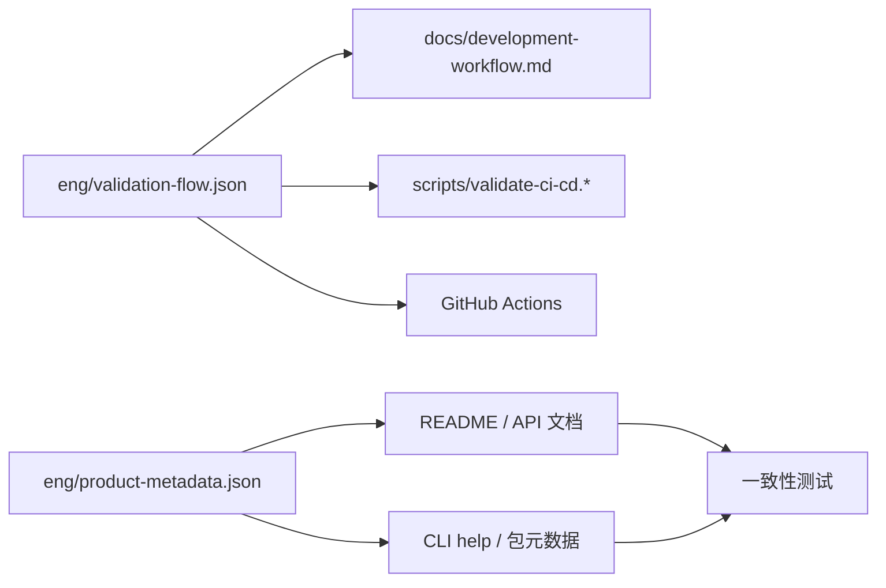

[English](en/development-workflow.md) | 中文版

# DotNetAnalyzer 开发工作流

本文档定义仓库唯一推荐的本地验证流程。脚本、CI 工作流和贡献者说明都必须与这里保持一致。



## 权威验证链路

仓库当前维护的权威验证参数如下：

- 解决方案：`DotNetAnalyzer.slnx`
- 配置：`Release`
- 测试目标框架：`net10.0`
- CI / 本地默认测试过滤器：`Category!=Performance`
- 本地包输出目录：`Bin/nupkg`

### Linux / macOS

```bash
bash scripts/validate-ci-cd.sh
```

### Windows PowerShell

```powershell
pwsh -File scripts/validate-ci-cd.ps1
```

### Windows CMD

```cmd
scripts\validate-ci-cd.bat
```

## 底层命令序列

如果你需要手动排查问题，请保持与权威脚本完全一致的顺序和参数：

```bash
dotnet restore DotNetAnalyzer.slnx -p:Configuration=Release --verbosity minimal
dotnet build DotNetAnalyzer.slnx -c Release --no-restore --verbosity minimal
dotnet test DotNetAnalyzer.slnx -c Release --framework net10.0 --no-build --verbosity normal --filter "Category!=Performance"
dotnet pack src/DotNetAnalyzer.Cli/DotNetAnalyzer.Cli.csproj -c Release --no-build --output ./Bin/nupkg
```

## MCP 连接冒烟验证

当你修改了 CLI 入口、MCP 配置或打包逻辑时，再额外执行一次 MCP 连接验证：

### Linux / macOS

```bash
bash scripts/verify-mcp.sh
```

### Windows PowerShell

```powershell
pwsh -File scripts/verify-mcp.ps1
```

## 贡献者日常流程

1. 修改代码与文档。
2. 运行 `scripts/validate-ci-cd.*` 完成本地验证。
3. 如果改动涉及 CLI/MCP 连接，再运行 `scripts/verify-mcp.*`。
4. 提交变更并发起 Pull Request。

## 常见问题

### 为什么 restore 必须显式传 `Configuration=Release`？

仓库使用集中式输出目录与中间产物目录，`obj` 路径依赖 `Configuration`。如果先用默认配置 restore，再用 `Release` 配置执行 `--no-restore` 的 build/test，会直接读取错误位置的还原产物。

### 为什么测试固定跑 `net10.0`？

当前 CI 主验证链路以 `net10.0` 作为统一测试目标框架，这样可以减少多目标框架与集中式输出目录叠加后的漂移风险，同时保证本地与 CI 的行为一致。

### 元数据漂移在哪里校验？

版本号、命令入口、仓库链接和工具数量由 `eng/product-metadata.json` 与源码扫描共同约束，相关一致性检查已经纳入测试项目，会随 `dotnet test` 一起执行。
