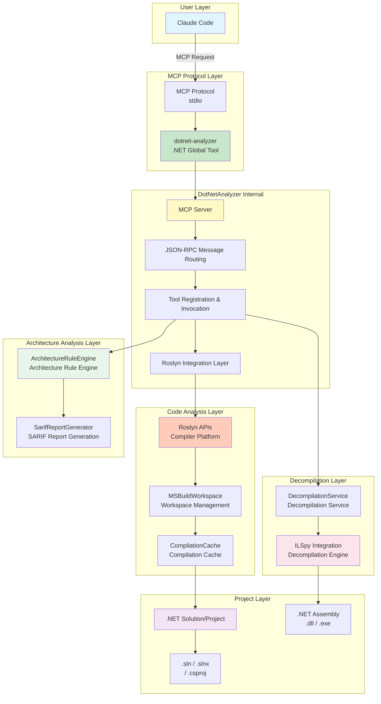
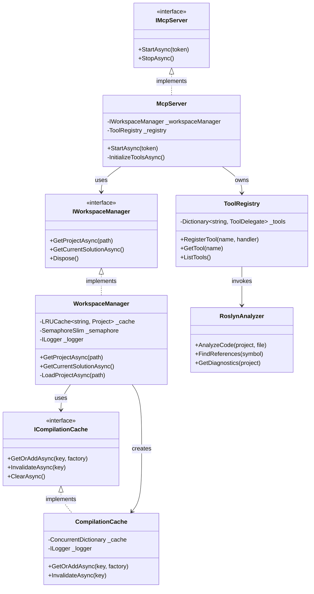
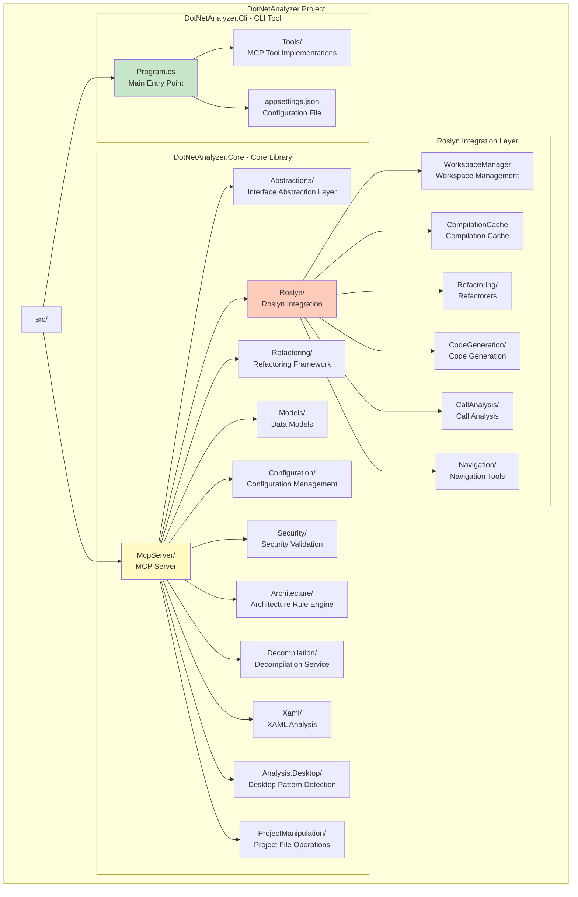
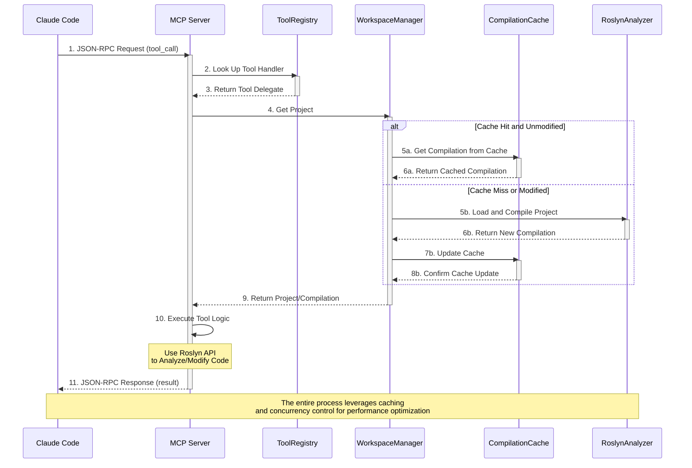

[中文版](../ARCHITECTURE.md) | English

# DotNetAnalyzer Architecture Documentation

This document provides a detailed description of DotNetAnalyzer's system architecture, core components, and project structure.

## System Architecture Diagram



## Core Component Relationship Diagram



## Project Structure



## MCP Tool Classification Hierarchy

```mermaid
graph TB
    subgraph "DotNetAnalyzer MCP Toolset (92 Tools)"
        A[Code Diagnostics<br/>2 Tools]
        B[Project Management<br/>5 Tools]
        C[Code Analysis<br/>6 Tools]
        D[Symbol Query<br/>4 Tools]
        E[Navigation Tools<br/>7 Tools]
        F[Refactoring Tools<br/>5 Tools]
        G[Code Generation<br/>6 Tools]
        H[Call/Comparison<br/>8 Tools]
        I[Code Quality<br/>4 Tools]
        J[Code Actions<br/>4 Tools]
        K[Advanced Query<br/>4 Tools]
        L[Architecture Rules<br/>2 Tools]
        M[Decompilation & Analysis<br/>4 Tools]
        N[Security Detection<br/>4 Tools]
        O[Dependency Health<br/>3 Tools]
        P[Performance Optimization<br/>3 Tools]
        Q[XAML Analysis<br/>4 Tools]
        R2[Desktop Pattern Detection<br/>5 Tools]
        S2[Project File Operations<br/>3 Tools]

        A1[get_diagnostics]
        B1[list_projects]
        B2[get_project_info]
        B3[get_solution_info]
        C1[analyze_code]
        D1[find_references]
        D2[find_declarations]
        D3[get_symbol_info]
        E1[go_to_definition]
        E2[get_type_hierarchy]
        E3[get_member_hierarchy]
        E4[get_semantic_model]
        E5[get_syntax_tree]
        E6[get_code_metrics]
        E7[get_document_list]
        F1[extract_method]
        F2[rename_symbol]
        F3[introduce_variable]
        F4[encapsulate_field]
        F5[extract_interface]
        F6[change_signature]
        F7[add_parameter]
        F8[inline_temporary]
        F9[safely_remove_as]
        F10[remove_unnecessary_code]
        F11[convert_for_to_foreach]
        F12[convert_foreach_to_for]
        F13[convert_if_to_switch]
        F14[reverse_for_statement]
        F15[list_refactorers]
        G1[generate_interface_impl]
        G2[generate_constructor]
        G3[generate_property]
        G4[generate_deconstructor]
        G5[generate_from_usage]
        G6[remove_unused_usings]
        G7[sort_usings]
        G8[add_missing_imports]
        G9[organize_imports]
        G10[format_document]
        G11[format_selection]
        H1[get_caller_info]
        H2[get_callee_info]
        H3[get_call_graph]
        H4[compare_syntax_trees]
        H5[get_code_diff]
        H6[apply_code_change]
        H7[resolve_symbol]
        I1[get_test_coverage]
        I2[find_dead_code]
        I3[analyze_performance]
        I4[generate_documentation]
        J1[get_code_actions]
        J2[get_refactorings]
        J3[get_completion_list]
        K1[get_definition_and_references]
        K2[resolve_symbol]
        K3[get_document_list]
        K4[get_completion_list]
        K5[get_refactorings]

        A --> A1
        B --> B1
        B --> B2
        B --> B3
        C --> C1
        D --> D1
        D --> D2
        D --> D3
        E --> E1
        E --> E2
        E --> E3
        E --> E4
        E --> E5
        E --> E6
        E --> E7
        F --> F1
        F --> F2
        F --> F3
        F --> F4
        F --> F5
        F --> F6
        F --> F7
        F --> F8
        F --> F9
        F --> F10
        F --> F11
        F --> F12
        F --> F13
        F --> F14
        F --> F15
        G --> G1
        G --> G2
        G --> G3
        G --> G4
        G --> G5
        G --> G6
        G --> G7
        G --> G8
        G --> G9
        G --> G10
        G --> G11
        H --> H1
        H --> H2
        H --> H3
        H --> H4
        H --> H5
        H --> H6
        H --> H7
        I --> I1
        I --> I2
        I --> I3
        I --> I4
        J --> J1
        J --> J2
        J --> J3
        K --> K1
        K --> K2
        K --> K3
        K --> K4
        K --> K5

        L1[check_architecture_rules]
        L2[evaluate_architecture]
        M1[decompile_assembly]
        M2[analyze_il]
        M3[get_assembly_metadata]
        M4[get_api_surface]

        L --> L1
        L --> L2
        M --> M1
        M --> M2
        M --> M3
        M --> M4

        style A fill:#ffcdd2
        style B fill:#f8bbd0
        style C fill:#e1bee7
        style D fill:#d1c4e9
        style E fill:#c5cae9
        style F fill:#bbdefb
        style G fill:#b3e5fc
        style H fill:#b2ebf2
        style I fill:#b2dfdb
        style J fill:#c8e6c9
        style K fill:#dcedc8
        style L fill:#fff3e0
        style M fill:#e8eaf6
    end
```



## MCP Tool Invocation Flow Diagram



## Core Architecture Principles

### 1. Single Source of Truth (SSOT) Principle
- Version numbers are retrieved from the assembly, never hardcoded in source code
- Configuration uses the `appsettings.json` + `IOptions<T>` pattern
- No duplicate constant definitions

### 2. Dependency Injection (DI) Pattern
```csharp
public class MyService(IOptions<MyOptions> options, ILogger<MyService> logger)
{
    private readonly int _cacheCapacity = options.Value.CacheCapacity;
}
```

### 3. MCP Tool Pattern
```csharp
[McpServerToolType]
public static class MyTools
{
    [McpServerTool, Description("Tool description")]
    public static async Task<string> MyTool(
        IWorkspaceManager workspaceManager,
        [Description("Parameter description")] string param)
    {
        // Implementation code
        return JsonSerializer.Serialize(result, JsonOptions.Default);
    }
}
```

### 4. WorkspaceManager Core Component
- Uses MSBuildWorkspace to load .csproj, .sln, and .slnx files
- LRU caching of loaded projects (capacity 50, configurable)
- File modification time detection for cache invalidation
- Double-checked locking pattern for efficient concurrent loading
- Semaphore to limit concurrent load count (default 4)

## Code Directory Structure

```
DotNetAnalyzer/
├── src/
│   ├── DotNetAnalyzer.Cli/          # CLI tool entry point (.NET global tool)
│   │   ├── Program.cs               # Main entry point, configures MCP server
│   │   ├── Tools/                   # MCP tool implementations (70 tools)
│   │   │   ├── DiagnosticsTools.cs
│   │   │   ├── ProjectTools.cs
│   │   │   ├── AnalysisTools.cs
│   │   │   ├── SymbolTools.cs
│   │   │   ├── NavigationTools.cs
│   │   │   ├── RefactoringTools.cs
│   │   │   ├── CodeGenerationTools.cs
│   │   │   ├── CallAnalysisTools.cs
│   │   │   ├── ComparisonTools.cs
│   │   │   ├── CodeQualityTools.cs
│   │   │   ├── CodeActionsTools.cs
│   │   │   ├── AdvancedQueryTools.cs
│   │   │   └── BaseTool.cs          # Tool base class
│   │   └── appsettings.json         # Configuration file (optional)
│   │
│   └── DotNetAnalyzer.Core/         # Core library
│       ├── Abstractions/            # IWorkspaceManager, ICompilationCache
│       ├── Roslyn/                  # Roslyn integration layer
│       │   ├── WorkspaceManager.cs  # Workspace manager (LRU cache)
│       │   ├── CompilationCache.cs  # Compilation cache
│       │   ├── DependencyAnalyzer.cs # Dependency analysis
│       │   ├── Refactoring/         # Refactorers (15)
│       │   ├── CodeGeneration/      # Code generators
│       │   ├── CallAnalysis/        # Call analysis
│       │   └── Navigation/          # Navigation tools
│       ├── Refactoring/             # Refactoring framework
│       │   ├── Core/                # RefactoringEngine, Validator
│       │   ├── Abstractions/        # Interface definitions
│       │   └── Refactorers/         # Concrete refactorer implementations
│       ├── Models/                  # Data models
│       ├── Configuration/           # Configuration options (IOptions<T> pattern)
│       ├── Architecture/            # Architecture rule checking engine
│       ├── Decompilation/           # ILSpy decompilation service
│       └── Security/                # PathValidator (path validation)
│
└── tests/
    └── DotNetAnalyzer.Tests/        # Unit tests (xUnit + Moq)
        └── TestAssets/              # Test assets
```

## Technology Stack

### Core Technologies
- **.NET 8.0/9.0/10.0** - Cross-platform development framework
- **.NET CLI Tools** - Global tool framework
- **MCP SDK** - Official Model Context Protocol implementation
- **Roslyn** - Microsoft's official C# compiler platform

### Key Dependencies
```xml
<!-- MCP Protocol -->
<PackageReference Include="ModelContextProtocol" Version="*" />

<!-- Roslyn Analysis -->
<PackageReference Include="Microsoft.CodeAnalysis" Version="5.*" />
<PackageReference Include="Microsoft.CodeAnalysis.CSharp" Version="5.*" />
<PackageReference Include="Microsoft.CodeAnalysis.Workspaces.MSBuild" Version="5.*" />

<!-- CLI Framework -->
<PackageReference Include="System.CommandLine" Version="2.*" />

<!-- Testing -->
<PackageReference Include="xUnit" Version="2.*" />
<PackageReference Include="Moq" Version="4.*" />
<PackageReference Include="FluentAssertions" Version="6.*" />
```

## Related Documentation

- [README.md](../README.md) - Project overview and quick start
- [CLAUDE.md](../CLAUDE.md) - Project instructions for Claude Code
- [Development Workflow](development-workflow.md) - Development process guide
- [Coding Standards](CODING_STANDARDS.md) - Code standards (required reading)
- [API Guide](api-guide.md) - MCP tool API reference documentation
