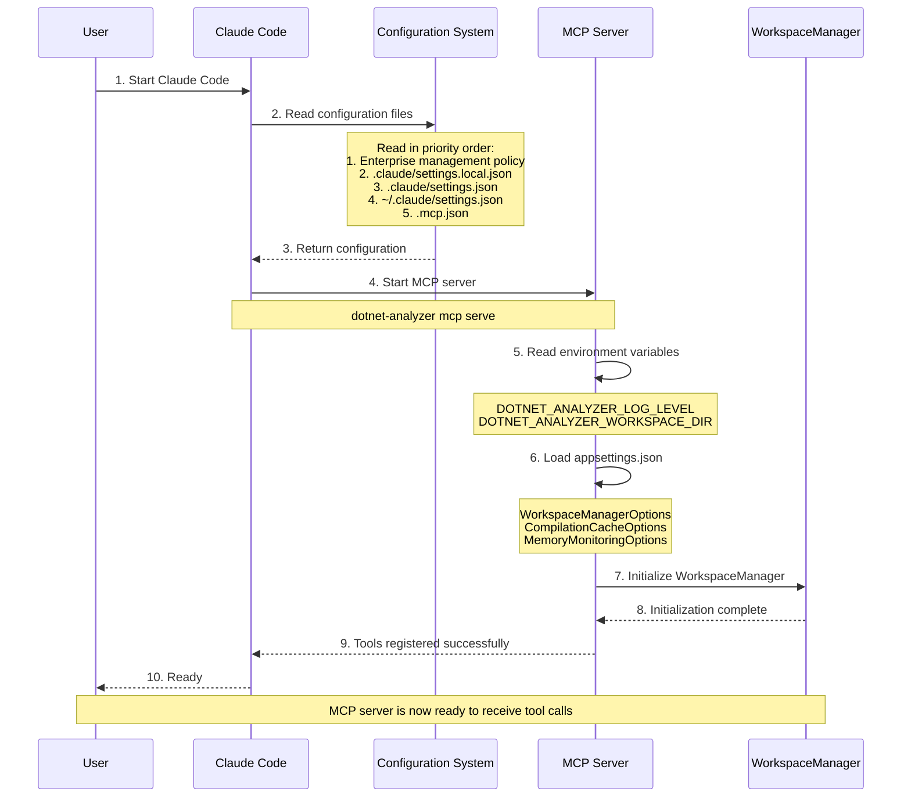

[中文版](../CONFIGURATION.md) | English

# DotNetAnalyzer Configuration Guide

This document describes how to obtain, install, and configure the DotNetAnalyzer MCP server.

## Configuration Architecture Overview

```mermaid
graph TB
    subgraph "Configuration Hierarchy"
        A[Enterprise Management Policy<br/>Highest Priority]
        B[Command-Line Arguments<br/>High Priority]
        C[.claude/settings.local.json<br/>Local Project]
        D[.claude/settings.json<br/>Shared Project]
        E[~/.claude/settings.json<br/>User Level<br/>Lowest Priority]
    end

    subgraph "MCP Server Configuration"
        F[.mcp.json<br/>Project Level]
        G[claude_desktop_config.json<br/>User Level]
    end

    subgraph "Environment Variables"
        H[DOTNET_ANALYZER_LOG_LEVEL]
        I[DOTNET_ANALYZER_WORKSPACE_DIR]
    end

    subgraph "Application Configuration"
        J[appsettings.json<br/>In-App Configuration]
        K[WorkspaceManagerOptions]
        L[CompilationCacheOptions]
        M[MemoryMonitoringOptions]
    end

    A --> Z[Final Configuration]
    B --> Z
    C --> Z
    D --> Z
    E --> Z
    F --> Z
    G --> Z
    H --> Z
    I --> Z
    J --> K
    J --> L
    J --> M
    K --> Z
    L --> Z
    M --> Z

    style A fill:#ffcdd2
    style B fill:#f8bbd0
    style C fill:#e1bee7
    style D fill:#d1c4e9
    style E fill:#c5cae9
    style F fill:#bbdefb
    style G fill:#b3e5fc
    style H fill:#b2ebf2
    style I fill:#b2dfdb
    style J fill:#c8e6c9
    style Z fill:#fff9c4
```



## MCP Server Connection Flow



## Configuration Options Hierarchy

```mermaid
graph TB
    subgraph "DotNetAnalyzer Configuration System"
        A[Configuration Root]

        subgraph "MCP Server Configuration"
            B1[type: stdio]
            B2[command: dotnet-analyzer]
            B3[args: []]
            B4[env: {}]
        end

        subgraph "Logging Configuration"
            C1[LogLevel: None/Error/<br/>Warning/Information/Debug]
            C2[LogOutput: stderr]
        end

        subgraph "Workspace Configuration"
            D1[CacheCapacity: 50]
            D2[MaxConcurrentLoads: 4]
            D3[WorkspaceDir: TEMP]
        end

        subgraph "Compilation Cache Configuration"
            E1[CacheSize: 100]
            E2[ExpirationMinutes: 30]
            E3[EnableCache: true]
        end

        subgraph "Memory Monitoring Configuration"
            F1[HighMemoryThreshold: 85%]
            F2[CriticalMemoryThreshold: 90%]
            F3[MonitorIntervalSeconds: 60]
        end

        A --> B1
        A --> B2
        A --> B3
        A --> B4
        A --> C1
        A --> C2
        A --> D1
        A --> D2
        A --> D3
        A --> E1
        A --> E2
        A --> E3
        A --> F1
        A --> F2
        A --> F3

        style A fill:#fff9c4
        style B1 fill:#c8e6c9
        style C1 fill:#ffcdd2
        style D1 fill:#ffccbc
        style E1 fill:#b2dfdb
        style F1 fill:#c5cae9
    end
```

## Table of Contents

- [Getting DotNetAnalyzer](#getting-dotnetanalyzer)
- [Environment Variables](#environment-variables)
- [MCP Server Configuration](#mcp-server-configuration)
- [Claude Code Integration](#claude-code-integration)
- [Logging and Debugging](#logging-and-debugging)
- [Advanced Configuration](#advanced-configuration)

---

## Getting DotNetAnalyzer

### Install from NuGet (Recommended)

DotNetAnalyzer has been published to [NuGet.org](https://www.nuget.org/packages/DotNetAnalyzer), which is the simplest way to install it.

**Install**:
```bash
dotnet tool install --global DotNetAnalyzer
```

**Update**:
```bash
dotnet tool update --global DotNetAnalyzer
```

**Uninstall**:
```bash
dotnet tool uninstall --global DotNetAnalyzer
```

### Build from Source

If you want to build or develop DotNetAnalyzer from source:

```bash
# Clone the repository
git clone https://github.com/CartapenaBark/DotNetAnalyzer.git
cd DotNetAnalyzer

# Restore dependencies
dotnet restore

# Build
dotnet build -c Release

# Run tests
dotnet test

# Pack
dotnet pack -c Release
```

---

## Environment Variables

DotNetAnalyzer supports the following environment variables to control its behavior:

### DOTNET_ANALYZER_LOG_LEVEL

Controls the verbosity of log output.

**Available values**:
- `None` - Disable all logging (default)
- `Error` - Show errors only
- `Warning` - Show warnings and errors
- `Information` - Show informational messages
- `Debug` - Show detailed debug information

**Examples**:
```bash
# Windows PowerShell
$env:DOTNET_ANALYZER_LOG_LEVEL="Debug"

# Linux/macOS
export DOTNET_ANALYZER_LOG_LEVEL=Debug
```

**Note**: In production environments, it is recommended to keep the default `None` level, as logs are output via stderr and may interfere with MCP communication.

### DOTNET_ANALYZER_WORKSPACE_DIR

Specifies the directory for the Roslyn workspace to store temporary files.

**Default**: System temporary directory (`%TEMP%` on Windows, `/tmp` on Linux/macOS)

**Examples**:
```bash
# Windows PowerShell
$env:DOTNET_ANALYZER_WORKSPACE_DIR="C:\temp\dotnet-analyzer"

# Linux/macOS
export DOTNET_ANALYZER_WORKSPACE_DIR=/tmp/dotnet-analyzer
```

## MCP Server Configuration

### Standard Input/Output (stdio) Transport

By default, DotNetAnalyzer uses the stdio transport protocol to communicate with Claude Code. This is implemented through the MCP standard protocol and requires no additional configuration.

### Claude Code Configuration File

Create a `.mcp.json` file in your project root directory to configure DotNetAnalyzer:

```json
{
  "mcpServers": {
    "dotnet-analyzer": {
      "type": "stdio",
      "command": "dotnet-analyzer",
      "args": []
    }
  }
}
```

### Configuration Options

#### command

Specifies the command to run.

**Default**: `dotnet-analyzer`

**Example**:
```json
{
  "command": "dotnet-analyzer"
}
```

#### args

An array of arguments to pass to the command.

**Default**: `[]`

**Example**:
```json
{
  "args": ["--verbose"]
}
```

#### env

An object of environment variables (optional).

**Example**:
```json
{
  "env": {
    "DOTNET_ANALYZER_LOG_LEVEL": "Error"
  }
}
```

#### Option 3: Claude Code Plugin (Auto-register)

Install the DotNetAnalyzer Plugin to automatically register the MCP server without manual `.mcp.json` configuration.

1. Install the global tool: `dotnet tool install --global DotNetAnalyzer`
2. Add the Marketplace in Claude Code: `/plugin marketplace add CartapenaBark/DotNetAnalyzer`

Plugin MCP declarations have lower priority than user project configurations. If a project already has `.mcp.json` declaring the same MCP server, the user configuration takes priority.

## Claude Code Integration

### Project-Level Configuration

Create `.mcp.json` in the project root directory:

```json
{
  "mcpServers": {
    "dotnet-analyzer": {
      "type": "stdio",
      "command": "dotnet-analyzer",
      "args": []
    }
  }
}
```

### User-Level Configuration

Create a global MCP configuration in the user configuration directory:

**Windows**: `%APPDATA%\Claude\claude_desktop_config.json`
**Linux/macOS**: `~/.config/Claude/claude_desktop_config.json`

```json
{
  "mcpServers": {
    "dotnet-analyzer": {
      "type": "stdio",
      "command": "dotnet-analyzer",
      "args": []
    }
  }
}
```

### Verifying the Configuration

After starting Claude Code, check whether the MCP server is correctly connected:

1. Open Claude Code
2. Try using a tool in the dialog, for example:
   ```
   List all projects in the current solution
   ```
3. If DotNetAnalyzer is correctly configured, you will see the project list

## Logging and Debugging

### Enabling Verbose Logging

To enable verbose logging for debugging:

```bash
# Windows PowerShell
$env:DOTNET_ANALYZER_LOG_LEVEL="Debug"; dotnet-analyzer

# Linux/macOS
DOTNET_ANALYZER_LOG_LEVEL=Debug dotnet-analyzer
```

### Log Output Locations

- **stdout**: JSON-RPC responses (MCP protocol messages)
- **stderr**: Log messages and error information

### Troubleshooting Common Issues

#### Issue 1: Tools Cannot Be Called

**Symptoms**: Tool calls fail or time out in Claude Code

**Solution**:
1. Check that the `.mcp.json` configuration is correct
2. Verify that `dotnet-analyzer` is installed: `dotnet tool list -g`
3. Enable debug logging to view error messages
4. Reload the Claude Code window

#### Issue 2: Project Loading Fails

**Symptoms**: The tool returns "project file does not exist" or "unable to load project"

**Solution**:
1. Confirm that the project path is an absolute path
2. Verify the file exists: `Test-Path <project-path>` (PowerShell) or `ls <project-path>` (bash)
3. Confirm the file extension is correct (.csproj or .sln)
4. Check file permissions

#### Issue 3: Diagnostics Are Empty

**Symptoms**: The `get_diagnostics` tool returns empty results

**Solution**:
1. Confirm that the project can be built successfully: `dotnet build <project-path>`
2. Check if the project has compilation errors
3. Try cleaning and rebuilding: `dotnet clean && dotnet build`

## Advanced Configuration

### Customizing Tool Behavior

The behavior of DotNetAnalyzer tools can be customized in the following ways:

#### Workspace Cache Control

WorkspaceManager caches loaded projects by default. To clear the cache, restart the MCP server (reload the Claude Code window).

### MSBuild Configuration

Roslyn's MSBuildWorkspace automatically detects and uses the following MSBuild configuration files:

- `Directory.Build.props`
- `Directory.Build.targets`
- Configuration in `.csproj` files
- `global.json` (for specifying the SDK version)

#### Example: Custom MSBuild Configuration

Create `Directory.Build.props` in the project root directory:

```xml
<Project>
  <PropertyGroup>
    <TreatWarningsAsErrors>false</TreatWarningsAsErrors>
    <WarningsAsErrors />
    <WarningsNotAsErrors />
  </PropertyGroup>
</Project>
```

### Multi-Target Framework Support

For multi-target framework projects (e.g., `net6.0;net8.0`), DotNetAnalyzer automatically selects the first target framework for analysis.

#### Specifying a Target Framework

If you need to analyze a specific target framework, you can specify it in the tool call:

```json
{
  "projectPath": "path/to/project.csproj",
  "targetFramework": "net8.0"
}
```

**Note**: In the current version, the target framework selection feature is under development.

## Performance Optimization

### Workspace Cache

WorkspaceManager automatically caches loaded projects to improve performance.

**Caching Strategy**:
- Cache based on project path
- Check file modification time
- Automatically invalidate and reload modified projects

### Large Solutions

For solutions containing a large number of projects (50+):

1. **Use a solution file** instead of individual project files
2. **Increase memory limits**: Roslyn may require more memory
   ```bash
   # Increase the memory limit for the dotnet process (Linux/macOS)
   export DOTNET_GCHeapHardLimit=0x80000000  # 2GB
   ```
3. **Disable parallel loading** (supported in future versions)

### Network Drives

If your project is stored on a network drive:

1. **Performance will be significantly degraded** - using a local drive is recommended
2. **Increase timeout** (configurable in future versions)

## Security Considerations

### Code Execution

DotNetAnalyzer **does not execute** your code. It only:
- Parses code structures
- Analyzes syntax and semantics
- Reads compiler diagnostics

### File Access

DotNetAnalyzer only accesses the project files you specify and their dependencies. It will not:
- Scan the entire file system
- Upload code to a remote server
- Modify your code files

### Sensitive Information

Results returned by tools may contain:
- File paths
- Code snippets
- Symbol names

Please ensure that you use DotNetAnalyzer in a trusted environment.

## Troubleshooting Commands

### Check Installation

```bash
# Check the global tools list
dotnet tool list -g | findstr dotnet-analyzer

# Verify version
dotnet-analyzer --version
```

### Test MCP Connection

```bash
# Windows PowerShell
echo '{"jsonrpc":"2.0","method":"tools/list","id":1}' | dotnet-analyzer

# Linux/macOS
echo '{"jsonrpc":"2.0","method":"tools/list","id":1}' | dotnet-analyzer
```

This should return a JSON object containing a `result` field, listing all available tools.

### Complete Uninstall

```bash
# Uninstall the global tool
dotnet tool uninstall -g DotNetAnalyzer

# Delete configuration files (optional)
Remove-Item $env:APPDATA\DotNetAnalyzer  # Windows
rm -rf ~/.config/DotNetAnalyzer           # Linux/macOS
```

## System Requirements and Dependencies

### .NET Runtime

- **Minimum version**: .NET 8.0 SDK
- **Recommended version**: .NET 8.0 SDK or higher
- **Installation**: [dotnet.microsoft.com/download](https://dotnet.microsoft.com/download)

### Main Dependencies

DotNetAnalyzer depends on the following NuGet packages:

#### Roslyn Code Analysis Platform
```xml
<PackageReference Include="Microsoft.CodeAnalysis" Version="5.0.0" />
<PackageReference Include="Microsoft.CodeAnalysis.CSharp" Version="5.0.0" />
<PackageReference Include="Microsoft.CodeAnalysis.Workspaces.MSBuild" Version="5.0.0" />
```

**Description**:
- Uses Roslyn 5.0.0 to provide code analysis and semantic understanding capabilities
- Supports the latest C# language features
- Supports Visual Studio 2022's .slnx XML format solutions

#### MCP Protocol Support
```xml
<PackageReference Include="ModelContextProtocol" Version="0.8.0-preview.1" />
```

#### Other Dependencies
```xml
<PackageReference Include="System.CommandLine" Version="2.*" />
<PackageReference Include="Newtonsoft.Json" Version="13.0.3" />
```

### Supported Solution Formats

DotNetAnalyzer supports the following Visual Studio solution formats:

- ✅ **Traditional .sln format** (text format)
  - Default format for Visual Studio 2010-2019
  - Fully backward compatible

- ✅ **Next-generation .slnx format** (XML format)
  - Introduced in Visual Studio 2022 17.8+
  - More concise XML syntax
  - Default format for .NET CLI 9.0.200+

**Note**: Both formats can coexist seamlessly; DotNetAnalyzer will automatically recognize and handle them.

## More Resources

- [Project README](../README.md)
- [Tools Testing Guide](docs/TOOLS_TESTING_GUIDE.md)
- [CLAUDE.md](../CLAUDE.md) - Project instructions for Claude Code
- [Troubleshooting](TROUBLESHOOTING.md) - (to be created)

## Configuration Examples

### Complete .mcp.json Example

```json
{
  "mcpServers": {
    "dotnet-analyzer": {
      "type": "stdio",
      "command": "dotnet-analyzer",
      "args": [],
      "env": {
        "DOTNET_ANALYZER_LOG_LEVEL": "Error"
      }
    }
  }
}
```

### Development Environment Configuration

```json
{
  "mcpServers": {
    "dotnet-analyzer": {
      "type": "stdio",
      "command": "dotnet-analyzer",
      "args": [],
      "env": {
        "DOTNET_ANALYZER_LOG_LEVEL": "Debug",
        "DOTNET_ANALYZER_WORKSPACE_DIR": "/tmp/dotnet-analyzer-debug"
      }
    }
  }
}
```

---

**Version**: v1.7.0
**Last Updated**: 2026-03-29
