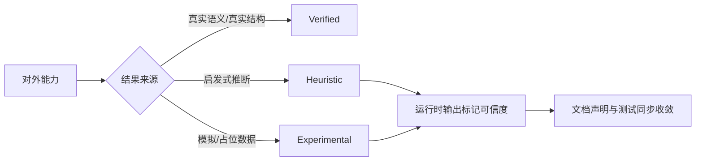

[中文版](../analysis-credibility.md) | English

# Analysis Capability Credibility Matrix

This document records which results from DotNetAnalyzer's currently exposed analysis/visualization capabilities can be considered stable behavior, and which still belong to heuristic or experimental results.

## Level Definitions

| Level | Meaning | Current Requirement |
|-------|---------|---------------------|
| `verified` | Key results come from real semantic models, real structural analysis, or real project loading | Can be described as a stable capability in README / API documentation |
| `heuristic` | Results rely on rule-based inference, approximate estimation, or incomplete graphs | Must include a credibility tag at runtime; documentation must not present results as precise |
| `experimental` | Results still rely on simulated data, placeholder logic, or have not been connected to real data sources | Both runtime output and documentation must explicitly declare as experimental |

## Current Capability Matrix

| Capability / Tool | Current Level | Reason | Convergence Direction |
|-------------------|---------------|--------|-----------------------|
| `detect_code_smells` | `verified` | Based on real syntax trees, semantic models, and detector execution | Continuously supplementing end-to-end tests |
| `generate_dependency_graph` | `verified` | Structure generated based on project documents, type declarations, inheritance, and interface relationships | Continuing to enhance graph pruning and large graph simplification |
| `generate_heatmap` (`complexity`) | `verified` | Complexity hotspots aggregated from code smell analysis results | Adding more real semantic indicators |
| `get_test_coverage` | `verified` | Prioritizes parsing real coverage data from coverage.cobertura.xml; falls back to heuristic estimation when no coverage file is available | Continuously supplementing end-to-end tests and more coverage format support |
| `analyze_change_impact` | `verified` | Based on BFS transitive dependency analysis, cross-project propagation, and precise test mapping; results come from real semantic models and SymbolFinder | Continuously supplementing end-to-end tests for cross-document complex scenarios |
| `get_callee_info` | `verified` | Cross-document call tree parsing based on real semantic models, supporting interface/implementation dispatch, virtual method/override dispatch, cycle detection, and depth limits | Continuously supplementing end-to-end tests for cross-document complex scenarios |
| `generate_heatmap` (`change-frequency`) | `verified` | Based on GitHistoryProvider calling real git log to obtain change history; outputs real file change frequency data | Continuously supplementing end-to-end tests |
| `scan_security_vulnerabilities` | `verified` | Based on 6 OWASP detectors (SEC001-SEC006) using Roslyn syntax trees and semantic models; results come from real syntax analysis | Continuously supplementing end-to-end tests and more pattern coverage |
| `check_license_compliance` | `verified` | Real license information obtained via NuGet.org REST API v3, compared against user whitelists | Continuously supplementing more license format support |
| `scan_nuget_vulnerabilities` | `verified` | Real CVE database queries via NuGet.org REST API v3 | Continuously supplementing vulnerability database coverage |
| `scan_dependencies_health` | `verified` | Based on real version data and vulnerability data from NuGet API, and actual dependency tree parsing of project.assets.json | Continuously supplementing health scoring models |
| `detect_dependency_conflicts` | `verified` | Actual resolved versions parsed from project.assets.json, compared across projects | Continuously supplementing transitive dependency conflict detection |
| `analyze_xaml` | `verified` | XAML file structure parsed via System.Xml.Linq; results are deterministic | Continuously supplementing more XAML dialect support |
| `validate_bindings` | `verified` | Precise matching of Binding Paths with ViewModel properties via Roslyn SemanticModel | Continuously supplementing complex binding scenario tests |
| `analyze_xaml_resources` | `verified` | ResourceDictionary structure and resource key references parsed via XML | Continuously supplementing cross-file resource tracking |
| `map_view_viewmodel` | `verified` | Precise DataContext tracking via Roslyn SyntaxWalker, supporting generic parameters, factory methods, and DI injection | Continuously supplementing DataTemplate and implicit DataContext scenarios |
| `detect_mvvm_violations` | `verified` | High/low confidence keyword classification + SyntaxWalker precise locating + ViewModelMapper semantic integration | Continuously supplementing WpfAnalyzers rule coverage |
| `detect_async_antipatterns` | `verified` | Patterns such as async void/.Result/.Wait() can be precisely located | Continuously supplementing more async anti-patterns |
| `analyze_di_registration` / `find_missing_di_registrations` | `verified` | Supports lambda factory registration, open generic registration, Captive Dependency and circular dependency detection | Continuously supplementing Autofac/SimpleInjector and other container support |
| `detect_memory_leaks` | `verified` | Based on Roslyn syntax trees and semantic models, supports IAsyncDisposable, Timer/DispatcherTimer detection | Continuously supplementing more leak pattern detection |
| `add_project_reference` / `add_nuget_package` / `update_project_property` | `verified` | .csproj operations via Microsoft.Build API; results are deterministic | Continuously supplementing more MSBuild property operations |

## Usage Principles

- For `heuristic` and `experimental` capabilities, prioritize trusting the `credibility` field in the returned results rather than treating the results as precise facts.
- External documentation should only describe `verified` capabilities as "stable behavior."
- When adding new analysis capabilities, the credibility level must first be declared in this document before determining the external messaging in the README and API documentation.
