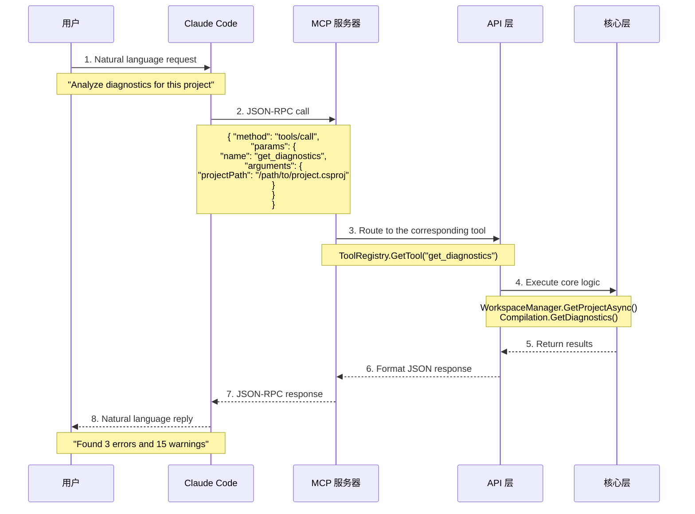
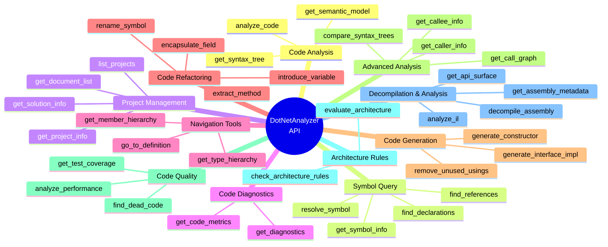

[中文版](../api-guide.md) | English

# DotNetAnalyzer API Guide

This document provides the complete API reference for the DotNetAnalyzer MCP server, helping developers understand and use all available tools.

## API Call Flow



## API Tool Categories



## Table of Contents

- [Quick Start](#quick-start)
- [MCP Tool Overview](#mcp-tool-overview)
- [Code Analysis Tools](#code-analysis-tools)
- [Symbol Query Tools](#symbol-query-tools)
- [Project Management Tools](#project-management-tools)
- [Code Diagnostics Tools](#code-diagnostics-tools)
- [Navigation Enhancement Tools (Phase 2)](#navigation-enhancement-tools-phase-2) ✨
- [Architecture Rule Checking Tools](#architecture-rule-checking-tools) ✨
- [Decompilation & Analysis Tools](#decompilation--analysis-tools) ✨
- [Security Detection Tools](#security-detection-tools) ✨
- [Dependency Health Tools](#dependency-health-tools) ✨
- [Performance Optimization Tools](#performance-optimization-tools) ✨
- [Configuration Options](#configuration-options)
- [Best Practices](#best-practices)
- [Troubleshooting](#troubleshooting)

---

## Quick Start

### Prerequisites

1. **Install DotNetAnalyzer**:
   ```bash
   dotnet tool install --global DotNetAnalyzer
   ```

2. **Configure Claude Code**:
   Create `.mcp.json` in your project root:
   ```json
   {
     "mcpServers": {
       "dotnet-analyzer": {
         "type": "stdio",
         "command": "dotnet-analyzer",
         "args": []
       }
     }
   }
   ```

3. **Verify installation**:
   ```bash
   dotnet-analyzer --version
   ```

### Basic Usage

In Claude Code, you can interact with DotNetAnalyzer using natural language:

```
You: "Analyze diagnostics for the current project"
Claude: [Calls get_diagnostics] ...
     "Found 3 errors and 15 warnings..."
```

---

## MCP Tool Overview

DotNetAnalyzer v1.6.0 provides **92 MCP tools** covering code analysis, navigation, refactoring, quality analysis, architecture rule checking, decompilation, security detection, dependency health analysis, performance optimization, XAML analysis, desktop pattern detection, project file operations, and visualization capabilities.

> The capability descriptions in this document are based on the tool list obtained from `eng/product-metadata.json` and source code scanning; for heuristic or experimental results, please refer to the [Analysis Capability Credibility Matrix](../analysis-credibility.md) as well.

### Core Tools (Phase 1) - 22

| Tool Name | Category | Description | Status |
|---------|------|------|------|
| `analyze_code` | Code Analysis | Analyzes syntax and semantic structure of code | ✅ Fully Implemented |
| `get_symbol_info` | Symbol Query | Retrieves detailed symbol information | ✅ Fully Implemented |
| `find_references` | Symbol Query | Finds all references to a symbol | ✅ Fully Implemented |
| `find_declarations` | Symbol Query | Finds declaration locations of a symbol | ✅ Fully Implemented |
| `list_projects` | Project Management | Lists all projects in a solution | ✅ Fully Implemented |
| `get_project_info` | Project Management | Retrieves detailed project information | ✅ Fully Implemented |
| `get_solution_info` | Project Management | Retrieves detailed solution information | ✅ Fully Implemented |
| `get_diagnostics` | Code Diagnostics | Retrieves compiler diagnostic information | ✅ Fully Implemented |
| ... (other 14 tools) | | | |

### Navigation Enhancement Tools (Phase 2) - 7 ✨

| Tool Name | Category | Description | Status |
|---------|------|------|------|
| `go_to_definition` | Navigation | Navigates to symbol definition | ✅ Fully Implemented |
| `get_type_hierarchy` | Type Analysis | Retrieves complete type inheritance hierarchy | ✅ Fully Implemented |
| `get_member_hierarchy` | Member Analysis | Retrieves member override and implementation hierarchy | ✅ Fully Implemented |
| `get_semantic_model` | Semantic Analysis | Retrieves semantic model information at a location | ✅ Fully Implemented |
| `get_syntax_tree` | Syntax Analysis | Retrieves detailed syntax tree information | ✅ Fully Implemented |
| `get_code_metrics` | Code Metrics | Calculates code complexity and quality metrics | ✅ Fully Implemented |

For detailed Phase 2 tool documentation, see the [Navigation Enhancement Tools (Phase 2)](#navigation-enhancement-tools-phase-2) section.

---

## Code Analysis Tools

### analyze_code

Analyzes the syntax and semantic structure of code, including the syntax tree, type information, namespaces, classes, methods, etc.

#### Parameters

| Parameter | Type | Required | Description |
|--------|------|------|------|
| `projectPath` | string | ✅ | Project path (.csproj) |
| `filePath` | string | ✅ | File path to analyze |

#### Return Value

```json
{
  "success": true,
  "fileInfo": {
    "filePath": "path/to/file.cs",
    "totalLines": 150,
    "extension": ".cs",
    "size": 4500
  },
  "syntaxTree": {
    "rootNodeKind": "CompilationUnit",
    "hasCompilationUnit": true,
    "nodeCount": 542,
    "usingsCount": 8,
    "namespacesCount": 2,
    "typeDeclarationsCount": 3,
    "methodDeclarationsCount": 12
  },
  "hierarchy": {
    "namespaces": [
      {
        "name": "MyApp.Services",
        "startLine": 10,
        "typeCount": 2
      }
    ],
    "totalNamespaces": 2,
    "totalTypes": 3
  },
  "namespaces": [
    {
      "name": "MyApp.Services",
      "startLine": 10,
      "endLine": 150,
      "isGlobal": false
    }
  ],
  "usings": [
    {
      "name": "System",
      "isStatic": false,
      "isAlias": false,
      "alias": null
    },
    {
      "name": "System.Threading.Tasks",
      "isStatic": false,
      "isAlias": false,
      "alias": null
    }
  ],
  "typeDeclarations": [
    {
      "name": "UserService",
      "kind": "ClassDeclaration",
      "accessibility": "Public",
      "isStatic": false,
      "isAbstract": false,
      "isSealed": false,
      "baseType": "object",
      "interfaces": ["IService"],
      "startLine": 15,
      "endLine": 80,
      "memberCount": 8
    }
  ],
  "methodDeclarations": [
    {
      "name": "GetUserAsync",
      "containingType": "UserService",
      "returnType": "Task<User>",
      "accessibility": "Public",
      "isStatic": false,
      "isAsync": true,
      "isVirtual": false,
      "isOverride": false,
      "isExtensionMethod": false,
      "parameters": [
        {
          "name": "userId",
          "type": "int",
          "isOptional": false
        }
      ],
      "startLine": 25,
      "endLine": 30
    }
  ],
  "summary": {
    "namespaceCount": 2,
    "typeCount": 3,
    "methodCount": 12,
    "usingCount": 8
  }
}
```

#### Usage Example

```
You: "Analyze the code structure of UserService.cs"
Claude: [Calls analyze_code]
```

#### Notes

- The file must exist in the project
- The project must compile successfully
- Line numbers in the return value start from 1

---

## Symbol Query Tools

### get_symbol_info

Retrieves detailed information about a symbol, including type, modifiers, parameters, XML documentation comments, etc.

#### Parameters

| Parameter | Type | Required | Description |
|--------|------|------|------|
| `projectPath` | string | ✅ | Project or solution path |
| `filePath` | string | ✅ | File path |
| `line` | int | ✅ | Line number (0-based) |
| `column` | int | ✅ | Column number (0-based) |

#### Return Value

```json
{
  "success": true,
  "symbol": {
    "name": "GetUserAsync",
    "kind": "Method",
    "containingType": "UserService",
    "containingNamespace": "MyApp.Services",
    "accessibility": "Public",
    "isStatic": false,
    "isVirtual": false,
    "isAbstract": false,
    "isOverride": false,
    "isSealed": false
  },
  "location": {
    "file": "path/to/UserService.cs",
    "line": 25,
    "column": 8
  },
  "methodInfo": {
    "returnType": "Task<User>",
    "parameters": [
      {
        "name": "userId",
        "type": "int",
        "isOptional": false,
        "hasDefaultValue": false
      }
    ],
    "typeParameters": [],
    "isAsync": true,
    "isExtensionMethod": false
  },
  "documentation": {
    "summary": "根据用户 ID 获取用户信息",
    "returns": "用户对象",
    "parameters": [
      {
        "name": "userId",
        "description": "用户 ID"
      }
    ]
  }
}
```

#### Usage Example

```
You: "Tell me the details of the method at line 25, column 8"
Claude: [Calls get_symbol_info]
```

### find_references

Finds all reference locations of a symbol, including cross-file references.

#### Parameters

| Parameter | Type | Required | Description |
|--------|------|------|------|
| `projectPath` | string | ✅ | Project or solution path |
| `filePath` | string | ✅ | File path |
| `line` | int | ✅ | Line number (0-based) |
| `column` | int | ✅ | Column number (0-based) |

#### Return Value

```json
{
  "success": true,
  "symbol": {
    "name": "GetUserAsync",
    "kind": "Method",
    "containingType": "UserService",
    "containingNamespace": "MyApp.Services"
  },
  "definition": {
    "file": "path/to/UserService.cs",
    "line": 25,
    "column": 8
  },
  "references": [
    {
      "file": "path/to/UserController.cs",
      "line": 15,
      "column": 20,
      "endLine": 15,
      "endColumn": 32,
      "isDefinition": false,
      "context": "var user = await _userService.GetUserAsync(userId);"
    },
    {
      "file": "path/to/UserService.cs",
      "line": 25,
      "column": 8,
      "endLine": 25,
      "endColumn": 20,
      "isDefinition": true,
      "context": "public async Task<User> GetUserAsync(int userId)"
    }
  ],
  "summary": {
    "totalReferences": 5,
    "definitionLocation": 1
  }
}
```

#### Usage Example

```
You: "Find all references to the GetUserAsync method"
Claude: [Calls find_references]
```

### find_declarations

Finds the declaration location of a symbol, including declarations of base class members and interface members.

#### Parameters

| Parameter | Type | Required | Description |
|--------|------|------|------|
| `projectPath` | string | ✅ | Project or solution path |
| `filePath` | string | ✅ | File path |
| `line` | int | ✅ | Line number (0-based) |
| `column` | int | ✅ | Column number (0-based) |

#### Return Value

```json
{
  "success": true,
  "symbol": {
    "name": "ExecuteAsync",
    "kind": "Method",
    "originalDefinition": "ExecuteAsync"
  },
  "declarations": [
    {
      "name": "ExecuteAsync",
      "kind": "Method",
      "file": "path/to/BackgroundTask.cs",
      "line": 20,
      "column": 8,
      "relationship": "current",
      "containingType": "BackgroundTask",
      "containingNamespace": "MyApp.Tasks"
    },
    {
      "name": "ExecuteAsync",
      "kind": "Method",
      "file": "path/to/IJob.cs",
      "line": 10,
      "column": 8,
      "relationship": "implements",
      "containingType": "IJob",
      "containingNamespace": "MyApp.Interfaces"
    }
  ],
  "summary": {
    "totalDeclarations": 2,
    "isOverride": false,
    "isVirtual": false,
    "isExtensionMethod": false
  }
}
```

#### Usage Example

```
You: "Where is this method defined? Does it implement an interface?"
Claude: [Calls find_declarations]
```

---

## Project Management Tools

### list_projects

Lists all projects in a solution, including dependency analysis.

#### Parameters

| Parameter | Type | Required | Description |
|--------|------|------|------|
| `solutionPath` | string | ✅ | Solution path (.sln or .slnx) |

#### Return Value

```json
{
  "success": true,
  "solutionPath": "path/to/MySolution.sln",
  "projectCount": 5,
  "projects": [
    {
      "name": "MyApp.Core",
      "filePath": "src/MyApp.Core/MyApp.Core.csproj",
      "assemblyName": "MyApp.Core",
      "hasDocuments": true,
      "projectId": "...",
      "dependencies": {
        "projectReferences": [],
        "packageReferencesCount": 3,
        "hasCircularReference": false
      }
    },
    {
      "name": "MyApp.Api",
      "filePath": "src/MyApp.Api/MyApp.Api.csproj",
      "assemblyName": "MyApp.Api",
      "hasDocuments": true,
      "projectId": "...",
      "dependencies": {
        "projectReferences": ["MyApp.Core", "MyApp.Services"],
        "packageReferencesCount": 8,
        "hasCircularReference": false
      }
    }
  ]
}
```

#### Usage Example

```
You: "List all projects in the current solution"
Claude: [Calls list_projects]
```

### get_project_info

Retrieves detailed project information.

#### Parameters

| Parameter | Type | Required | Description |
|--------|------|------|------|
| `projectPath` | string | ✅ | Project path (.csproj) |

#### Return Value

```json
{
  "success": true,
  "project": {
    "name": "MyApp.Api",
    "filePath": "src/MyApp.Api/MyApp.Api.csproj",
    "assemblyName": "MyApp.Api",
    "outputType": "Exe",
    "language": "Visual Basic",
    "targetFramework": "net8.0",
    "documentCount": 15,
    "sourceFiles": [
      {
        "name": "Program.cs",
        "filePath": "src/MyApp.Api/Program.cs"
      }
    ],
    "diagnostics": {
      "errorCount": 0,
      "warningCount": 2
    },
    "dependencies": {
      "projectReferences": ["MyApp.Core", "MyApp.Services"],
      "packageReferences": [
        {
          "name": "Microsoft.AspNetCore.OpenApi",
          "version": "8.0.0"
        }
      ],
      "transitiveDependencies": ["Newtonsoft.Json", "System.Text.Json"],
      "hasCircularReference": false
    }
  }
}
```

#### Usage Example

```
You: "Show detailed information for the MyApp.Api project"
Claude: [Calls get_project_info]
```

### get_solution_info

Retrieves detailed solution information, including build order and startup projects.

#### Parameters

| Parameter | Type | Required | Description |
|--------|------|------|------|
| `solutionPath` | string | ✅ | Solution path (.sln or .slnx) |

#### Return Value

```json
{
  "success": true,
  "solution": {
    "filePath": "path/to/MySolution.sln",
    "name": "MySolution",
    "projectCount": 5,
    "projects": [
      {
        "name": "MyApp.Core",
        "filePath": "src/MyApp.Core/MyApp.Core.csproj",
        "projectId": "...",
        "isExecutable": false,
        "dependencyCount": 0
      },
      {
        "name": "MyApp.Api",
        "filePath": "src/MyApp.Api/MyApp.Api.csproj",
        "projectId": "...",
        "isExecutable": true,
        "dependencyCount": 2
      }
    ],
    "buildOrder": [
      "MyApp.Core",
      "MyApp.Services",
      "MyApp.Data",
      "MyApp.Api",
      "MyApp.Tests"
    ],
    "startupProjects": ["MyApp.Api"]
  }
}
```

#### Usage Example

```
You: "Analyze the solution structure, tell me the build order and startup projects"
Claude: [Calls get_solution_info]
```

### analyze_dependencies

Analyzes project dependencies, including project references, package dependencies, transitive dependencies, and circular dependency detection.

#### Parameters

| Parameter | Type | Required | Description |
|--------|------|------|------|
| `projectPath` | string | ✅ | Project path (.csproj) |

#### Return Value

```json
{
  "success": true,
  "dependencies": {
    "targetFramework": "net8.0",
    "projectReferences": ["MyApp.Core", "MyApp.Services"],
    "packageReferences": [
      {
        "name": "Microsoft.AspNetCore.OpenApi",
        "version": "8.0.0"
      }
    ],
    "transitiveDependencies": [
      "Newtonsoft.Json",
      "System.Text.Json",
      "Microsoft.Extensions.DependencyInjection"
    ],
    "hasCircularReference": false,
    "circularReferencePath": null
  }
}
```

#### Usage Example

```
You: "Analyze the dependencies of MyApp.Api"
Claude: [Calls analyze_dependencies]
```

---

## Code Diagnostics Tools

### get_diagnostics

Retrieves compiler diagnostic information for C# code (errors, warnings, info).

#### Parameters

| Parameter | Type | Required | Description |
|--------|------|------|------|
| `projectPath` | string | ✅ | Project or solution path |
| `filePath` | string | ❌ | Optional: diagnostics for a specific file |

#### Return Value

```json
{
  "success": true,
  "diagnostics": [
    {
      "id": "CS0219",
      "severity": "Warning",
      "message": "变量 'unusedVar' 已赋值，但从未使用过其值",
      "location": {
        "file": "path/to/Program.cs",
        "startLine": 15,
        "startColumn": 13,
        "endLine": 15,
        "endColumn": 22
      },
      "warningLevel": 2,
      "isWarningAsError": false
    },
    {
      "id": "CS0103",
      "severity": "Error",
      "message": "名称 'UndefinedType' 在当前上下文中不存在",
      "location": {
        "file": "path/to/Service.cs",
        "startLine": 25,
        "startColumn": 20,
        "endLine": 25,
        "endColumn": 33
      },
      "warningLevel": 0,
      "isWarningAsError": false
    }
  ],
  "count": 2
}
```

#### Usage Example

```
You: "Check all errors and warnings in the current project"
Claude: [Calls get_diagnostics]

You: "What's wrong with Program.cs?"
Claude: [Calls get_diagnostics, specifying filePath]
```

#### Diagnostic Levels

| Level | Description |
|------|------|
| `Error` | Compilation error; must be fixed for successful compilation |
| `Warning` | Warning; recommended to fix but does not affect compilation |
| `Info` | Informational hint |
| `Hidden` | Hidden warning (not returned by default) |

---

## Navigation Enhancement Tools (Phase 2)

Navigation tools currently provide 7 core capabilities for symbol location, type hierarchy, and semantic analysis.

### Tool Overview

| Tool Name | Description | Primary Use |
|---------|------|----------|
| `go_to_definition` | Navigate to symbol definition | Quickly locate symbol definition positions |
| `get_type_hierarchy` | Type inheritance hierarchy | Understand class inheritance relationships |
| `get_member_hierarchy` | Member hierarchy | View overrides and interface implementations |
| `get_semantic_model` | Semantic model information | Get symbol and type details |
| `get_syntax_tree` | Syntax tree structure | Deep analysis of code syntax |
| `get_code_metrics` | Code metrics | Evaluate code quality |

### go_to_definition

Navigates to the definition location of a symbol at the specified position.

#### Parameters

| Parameter | Type | Required | Description |
|--------|------|------|------|
| `filePath` | string | ✅ | File path |
| `line` | integer | ✅ | Line number (0-based) |
| `column` | integer | ✅ | Column number (0-based) |

#### Return Value

```json
{
  "success": true,
  "data": {
    "definition": {
      "filePath": "path/to/definition.cs",
      "line": 42,
      "column": 10,
      "symbolInfo": {
        "name": "MyMethod",
        "kind": "Method",
        "containingType": "MyClass"
      }
    }
  }
}
```

#### Usage Example

```csharp
// User asks
"Show me where ILogger is defined"

// Claude calls
go_to_definition(filePath="Program.cs", line=15, column=25)
```

#### Features

- ✅ Supports all symbol types (classes, methods, properties, fields, etc.)
- ✅ Cross-file definition navigation
- ✅ Handles implicit definitions (e.g., extension methods)
- ✅ Returns detailed symbol information

---

### get_type_hierarchy

Retrieves the complete inheritance hierarchy of a type, including the base type chain, derived types, and implemented interfaces.

#### Parameters

| Parameter | Type | Required | Description |
|--------|------|------|------|
| `projectPath` | string | ✅ | Project path (.csproj) |
| `typeName` | string | ✅ | Type name (fully qualified or simple name) |

#### Return Value

```json
{
  "success": true,
  "data": {
    "typeName": "MyClass",
    "hierarchy": {
      "baseTypes": [
        {
          "name": "BaseClass",
          "namespace": "MyNamespace",
          "filePath": "path/to/BaseClass.cs",
          "line": 5,
          "typeParameters": [],
          "kind": "Class"
        },
        {
          "name": "Object",
          "namespace": "System",
          "kind": "Class"
        }
      ],
      "derivedTypes": [
        {
          "name": "DerivedClass",
          "namespace": "MyNamespace",
          "filePath": "path/to/DerivedClass.cs",
          "line": 10
        }
      ],
      "interfaces": [
        {
          "name": "IEnumerable",
          "namespace": "System.Collections",
          "implementedMembers": ["GetEnumerator"]
        }
      ],
      "members": [
        {
          "name": "MyMethod",
          "kind": "Method",
          "type": "void",
          "accessibility": "Public",
          "isStatic": false,
          "isVirtual": false,
          "isAbstract": false,
          "isOverride": false
        }
      ]
    }
  }
}
```

#### Usage Example

```csharp
// User asks
"Show me the inheritance hierarchy of DbSet<TEntity>"

// Claude calls
get_type_hierarchy(
  projectPath="src/MyProject/MyProject.csproj",
  typeName="Microsoft.EntityFrameworkCore.DbSet`1"
)
```

#### Features

- ✅ Complete base type chain (up to object)
- ✅ Finds all derived types (cross-project)
- ✅ Interface implementation details
- ✅ Interface member mapping
- ✅ Supports generic types
- ✅ Type member information

#### Performance Notes

- Small projects (< 10 types): < 100ms
- Medium projects (10-100 types): < 500ms
- Large projects (> 100 types): < 2s

---

### get_member_hierarchy

Retrieves the override, hiding, and interface implementation hierarchy of a member.

#### Parameters

| Parameter | Type | Required | Description |
|--------|------|------|------|
| `projectPath` | string | ✅ | Project path |
| `memberName` | string | ✅ | Member name |
| `containingType` | string | ✅ | Containing type name |

#### Return Value

```json
{
  "success": true,
  "data": {
    "memberName": "ToString",
    "containingType": "MyClass",
    "hierarchy": {
      "overriddenMembers": [
        {
          "name": "ToString",
          "containingType": "Object",
          "declarationLocation": {
            "filePath": "mscorlib.cs",
            "line": 123
          }
        }
      ],
      "hidingMembers": [],
      "implementedInterfaceMembers": [
        {
          "interfaceName": "IFormattable",
          "memberName": "ToString",
          "declarationLocation": {
            "filePath": "mscorlib.cs",
            "line": 456
          }
        }
      ]
    }
  }
}
```

#### Usage Example

```csharp
// User asks
"Does this method override anything?"

// Claude calls
get_member_hierarchy(
  projectPath="src/MyProject/MyProject.csproj",
  memberName="Execute",
  containingType="MyCommand"
)
```

#### Features

- ✅ Override chain tracking
- ✅ Method hiding detection
- ✅ Explicit interface implementation identification
- ✅ Cross-project hierarchy analysis

---

### get_semantic_model

Retrieves detailed semantic model information at a specified position, including symbols, types, constant values, etc.

#### Parameters

| Parameter | Type | Required | Description |
|--------|------|------|------|
| `filePath` | string | ✅ | File path |
| `line` | integer | ✅ | Line number (0-based) |
| `column` | integer | ✅ | Column number (0-based) |

#### Return Value

```json
{
  "success": true,
  "data": {
    "position": {
      "filePath": "Program.cs",
      "line": 15,
      "column": 20
    },
    "symbol": {
      "name": "myVariable",
      "kind": "Variable",
      "type": "System.String",
      "containingSymbol": "Main"
    },
    "type": {
      "name": "string",
      "kind": "Structure",
      "members": ["Length", "ToLower", "ToUpper", ...]
    },
    "constantValue": "Hello World",
    "allSymbolsInScope": [
      {"name": "myVariable", "kind": "Variable"},
      {"name": "Console", "kind": "Class"}
    ]
  }
}
```

#### Usage Example

```csharp
// User asks
"What's the type of this variable?"

// Claude calls
get_semantic_model(filePath="Program.cs", line=15, column=20)
```

#### Features

- ✅ Symbol information (name, type, accessibility)
- ✅ Detailed type information (members, base classes, interfaces)
- ✅ Constant value extraction (compile-time constants)
- ✅ All symbols in scope
- ✅ Inferred type information

---

### get_syntax_tree

Retrieves the syntax tree structure of a file, returned in JSON format.

#### Parameters

| Parameter | Type | Required | Description |
|--------|------|------|------|
| `filePath` | string | ✅ | File path |
| `range` | string | ❌ | Optional range limit (format: "startLine,startCol,endLine,endCol") |
| `maxDepth` | integer | ❌ | Maximum depth (default 100) |
| `includeTrivia` | boolean | ❌ | Whether to include trivia (comments, whitespace) |

#### Return Value

```json
{
  "success": true,
  "data": {
    "filePath": "Program.cs",
    "rootNodeKind": "CompilationUnit",
    "structure": {
      "kind": "CompilationUnit",
      "children": [
        {
          "kind": "UsingDirective",
          "name": "System",
          "startLine": 1,
          "endLine": 1
        },
        {
          "kind": "NamespaceDeclaration",
          "name": "MyApp",
          "startLine": 3,
          "endLine": 20,
          "children": [...]
        }
      ]
    },
    "trivia": {
      "leadingTrivia": "...",
      "trailingTrivia": "..."
    },
    "spans": [
      {
        "start": 0,
        "length": 450,
        "kind": "FullText"
      }
    ]
  }
}
```

#### Usage Example

```csharp
// User asks
"Show me the syntax tree structure of this file"

// Claude calls
get_syntax_tree(filePath="Program.cs", maxDepth=50, includeTrivia=false)
```

#### Features

- ✅ JSON-formatted syntax tree
- ✅ Configurable depth
- ✅ Range limit support
- ✅ Optional trivia inclusion
- ✅ Position information (spans)

#### Performance Notes

- Small files (< 100 lines): < 50ms
- Medium files (100-500 lines): < 200ms
- Large files (> 500 lines): < 1s

---

### get_code_metrics

Calculates code complexity and quality metrics.

#### Parameters

| Parameter | Type | Required | Description |
|--------|------|------|------|
| `projectPath` | string | ✅ | Project path |
| `filePath` | string | ✅ | File path |

#### Return Value

```json
{
  "success": true,
  "data": {
    "filePath": "MyClass.cs",
    "totalLinesOfCode": 150,
    "totalComplexity": 45,
    "maintainabilityIndex": 72,
    "namespaceMetrics": [
      {
        "namespaceName": "MyApp",
        "totalComplexity": 45,
        "typeMetrics": [
          {
            "typeName": "MyClass",
            "kind": "Class",
            "inheritanceDepth": 2,
            "classCoupling": 8,
            "linesOfCode": 150,
            "complexity": 45,
            "methodMetrics": [
              {
                "methodName": "ProcessData",
                "returnType": "void",
                "isAsync": true,
                "linesOfCode": 35,
                "cyclomaticComplexity": 8,
                "parameters": 3
              }
            ],
            "propertyMetrics": [
              {
                "propertyName": "Count",
                "type": "int",
                "linesOfCode": 5,
                "cyclomaticComplexity": 1
              }
            ]
          }
        ]
      }
    ],
    "statistics": {
      "min": 1,
      "max": 15,
      "average": 6.5,
      "median": 5.0,
      "standardDeviation": 3.2,
      "count": 10,
      "outliers": [
        {
          "target": "ComplexMethod",
          "value": 15,
          "deviation": 2.5
        }
      ]
    }
  }
}
```

#### Usage Example

```csharp
// User asks
"Which methods have high complexity?"

// Claude calls (iterating all files)
get_code_metrics(
  projectPath="src/MyProject/MyProject.csproj",
  filePath="src/MyProject/ComplexClass.cs"
)
```

#### Metric Descriptions

| Metric | Description | Healthy Range |
|------|------|----------|
| **Cyclomatic Complexity** | Cyclomatic complexity | < 10 (Good), 10-20 (Moderate), > 20 (High) |
| **Lines of Code** | Lines of code | Method < 50, Class < 500 |
| **Depth of Inheritance** | Inheritance depth | < 6 |
| **Class Coupling** | Class coupling | < 20 (Good), 20-30 (Moderate), > 30 (High) |
| **Maintainability Index** | Maintainability index | > 70 (Good), 50-70 (Moderate), < 50 (Poor) |

#### Features

- ✅ Multi-level analysis (Project → Namespace → Type → Method)
- ✅ Statistical information (min, max, average, standard deviation)
- ✅ Outlier identification (standard deviation method)
- ✅ Complexity level assessment
- ✅ Suggestion generation

#### Complexity Levels

```csharp
public enum ComplexityLevel
{
    Simple,      // Cyclomatic complexity < 10
    Moderate,    // Cyclomatic complexity 10-15
    High,        // Cyclomatic complexity 15-20
    VeryHigh     // Cyclomatic complexity > 20 (refactoring recommended)
}
```

#### Use Cases

1. **Code Review**: Identify complex methods
2. **Refactoring Planning**: Find technical debt
3. **Quality Monitoring**: Track code quality trends
4. **Performance Analysis**: Locate performance bottlenecks

---

### Phase 2 Tool Best Practices

#### 1. Type Hierarchy Analysis

```csharp
// ❌ Bad: reloads on every call
for (var type in types)
{
  get_type_hierarchy(type.Name);
}

// ✅ Good: batch analysis, parallel processing
var tasks = types.Select(t =>
  get_type_hierarchy(t.Name, projectPath)
);
await Task.WhenAll(tasks);
```

#### 2. Code Metrics

```csharp
// ✅ Periodically check complexity
get_code_metrics(projectPath, filePath);

// If a high complexity method is found
if (metrics.cyclomaticComplexity > 15)
{
  // Suggest refactoring or splitting
  SuggestRefactoring(method);
}
```

#### 3. Semantic Model Queries

```csharp
// ✅ Use semantic model for type inference
var semanticInfo = get_semantic_model(filePath, line, column);

// Check if type implements a specific interface
if (semanticInfo.type.interfaces.Contains("IEnumerable"))
{
  // Can use LINQ methods
  SuggestLinqMethods(semanticInfo.type.members);
}
```

---

## Architecture Rule Checking Tools

Architecture rule checking tools verify architectural constraints on a project, including dependency direction, layer naming conventions, etc., and support SARIF v2.1.0 format report output.

### Tool Overview

| Tool Name | Description | Primary Use |
|---------|------|----------|
| `check_architecture_rules` | Check architecture rules | Uses built-in rules to check architectural constraints, outputs SARIF reports |
| `evaluate_architecture` | Evaluate architecture | Evaluates architecture using custom rule files |

### check_architecture_rules

Checks project architectural constraints using built-in rules, including dependency direction, layer hierarchy, and naming conventions.

#### Parameters

| Parameter | Type | Required | Description |
|--------|------|------|------|
| `projectPath` | string | ✅ | Project path (.csproj) |

#### Return Value

```json
{
  "success": true,
  "report": {
    "$schema": "https://raw.githubusercontent.com/oasis-tcs/sarif-spec/master/Schemata/sarif-schema-2.1.0.json",
    "version": "2.1.0",
    "runs": [
      {
        "tool": {
          "driver": {
            "name": "DotNetAnalyzer.Architecture",
            "rules": [
              {
                "id": "AR001",
                "shortDescription": { "text": "依赖方向违规" }
              }
            ]
          }
        },
        "results": [
          {
            "ruleId": "AR001",
            "level": "error",
            "message": { "text": "..." },
            "locations": [{ "physicalLocation": { "artifactLocation": { "uri": "..." } } }]
          }
        ]
      }
    ]
  },
  "summary": {
    "totalViolations": 2,
    "rulesChecked": 3
  }
}
```

#### Built-in Rules

| Rule ID | Rule Name | Description |
|---------|----------|------|
| `AR001` | Dependency Direction | Checks whether dependency directions between namespaces violate constraints |
| `AR002` | Layer Hierarchy | Checks whether type declarations violate layer hierarchy rules |
| `AR003` | Naming Convention | Checks whether namespace and type names conform to conventions |

#### Usage Example

```
You: "Check the architecture rules for this project"
Claude: [Calls check_architecture_rules]
```

### evaluate_architecture

Evaluates project architecture using a custom rules file.

#### Parameters

| Parameter | Type | Required | Description |
|--------|------|------|------|
| `projectPath` | string | ✅ | Project path (.csproj) |
| `rulesFilePath` | string? | ❌ | Custom rules file path (JSON format); uses built-in rules if omitted |

#### Return Value

A SARIF report in the same format as `check_architecture_rules`.

#### Custom Rules File Format

```json
{
  "rules": [
    {
      "id": "CUSTOM001",
      "name": "自定义规则名称",
      "type": "DependencyDirection",
      "fromNamespace": "MyApp.Core",
      "toNamespace": "MyApp.Infrastructure",
      "severity": "error"
    }
  ]
}
```

#### Usage Example

```
You: "Evaluate architecture using a custom rules file"
Claude: [Calls evaluate_architecture]
```

---

## Decompilation & Analysis Tools

Decompilation & analysis tools are based on ILSpy integration, supporting decompilation of .NET assemblies, IL analysis, metadata reading, and API Surface extraction.

### Tool Overview

| Tool Name | Description | Primary Use |
|---------|------|----------|
| `decompile_assembly` | Decompile assembly | Decompiles .NET assemblies into C# source code |
| `analyze_il` | Analyze IL instructions | Analyzes IL intermediate language instructions of assemblies |
| `get_assembly_metadata` | Read assembly metadata | Retrieves detailed assembly information |
| `get_api_surface` | Extract API Surface | Extracts the public API list of assemblies |

### decompile_assembly

Decompiles a .NET assembly into readable C# source code.

#### Parameters

| Parameter | Type | Required | Description |
|--------|------|------|------|
| `assemblyPath` | string | ✅ | Assembly file path (.dll / .exe) |
| `typeName` | string? | ❌ | Optional: specify type name to decompile only that type |

#### Return Value

```json
{
  "success": true,
  "assemblyPath": "path/to/assembly.dll",
  "sourceCode": "using System;\n\nnamespace MyNamespace\n{\n    public class MyClass\n    {\n        // ...\n    }\n}",
  "decompiledTypes": ["MyNamespace.MyClass", "MyNamespace.MyStruct"],
  "language": "C#"
}
```

#### Usage Example

```
You: "Decompile this DLL file"
Claude: [Calls decompile_assembly]

You: "Only decompile the MyClass type"
Claude: [Calls decompile_assembly, specifying typeName="MyClass"]
```

### analyze_il

Analyzes IL (Intermediate Language) instructions of a .NET assembly.

#### Parameters

| Parameter | Type | Required | Description |
|--------|------|------|------|
| `assemblyPath` | string | ✅ | Assembly file path (.dll / .exe) |
| `typeName` | string? | ❌ | Optional: specify type name to analyze only that type |

#### Return Value

```json
{
  "success": true,
  "assemblyPath": "path/to/assembly.dll",
  "analysis": {
    "totalInstructions": 245,
    "methods": [
      {
        "name": "MyNamespace.MyClass.Calculate",
        "instructionCount": 32,
        "maxStack": 4,
        "localsCount": 3,
        "hasExceptionHandlers": false
      }
    ],
    "summary": {
      "totalMethods": 15,
      "totalInstructions": 245,
      "averageInstructionsPerMethod": 16.3
    }
  }
}
```

#### Usage Example

```
You: "Analyze the IL instructions of this assembly"
Claude: [Calls analyze_il]
```

### get_assembly_metadata

Reads .NET assembly metadata information.

#### Parameters

| Parameter | Type | Required | Description |
|--------|------|------|------|
| `assemblyPath` | string | ✅ | Assembly file path (.dll / .exe) |

#### Return Value

```json
{
  "success": true,
  "metadata": {
    "assemblyName": "MyAssembly",
    "version": "1.0.0.0",
    "targetFramework": ".NET 8.0",
    "isDebug": false,
    "modules": [
      {
        "name": "MyAssembly.dll",
        "types": 25,
        "references": 8
      }
    ],
    "references": [
      "System.Runtime",
      "System.Collections",
      "Newtonsoft.Json"
    ],
    "attributes": [
      { "name": "AssemblyTitleAttribute", "value": "MyAssembly" },
      { "name": "AssemblyFileVersionAttribute", "value": "1.0.0.0" }
    ]
  }
}
```

#### Usage Example

```
You: "Get the metadata of this assembly"
Claude: [Calls get_assembly_metadata]
```

### get_api_surface

Extracts the API Surface (public API list) of a .NET assembly.

#### Parameters

| Parameter | Type | Required | Description |
|--------|------|------|------|
| `assemblyPath` | string | ✅ | Assembly file path (.dll / .exe) |
| `accessibility` | string? | ❌ | Optional: accessibility filter (`public`, `internal`, `all`), default `public` |

#### Return Value

```json
{
  "success": true,
  "assemblyPath": "path/to/assembly.dll",
  "apiSurface": {
    "namespaces": [
      {
        "name": "MyNamespace",
        "types": [
          {
            "name": "MyClass",
            "kind": "class",
            "accessibility": "public",
            "members": [
              {
                "name": "Calculate",
                "kind": "method",
                "returnType": "int",
                "parameters": ["int a", "int b"],
                "accessibility": "public"
              }
            ]
          }
        ]
      }
    ],
    "summary": {
      "totalNamespaces": 2,
      "totalTypes": 15,
      "totalMembers": 87
    }
  }
}
```

#### Usage Example

```
You: "Extract the public API of this DLL"
Claude: [Calls get_api_surface]

You: "Extract all internal and public APIs"
Claude: [Calls get_api_surface, specifying accessibility="all"]
```

---

## Security Detection Tools

Security detection tools are based on Roslyn syntax trees and semantic models, providing OWASP Top 10 code-level security vulnerability scanning capabilities. Detection results are output in SARIF v2.1.0 format.

### Tool Overview

| Tool Name | Description | Primary Use |
|---------|------|----------|
| `scan_security_vulnerabilities` | Scan security vulnerabilities | Executes 6 OWASP security checks on a project |
| `generate_security_sarif` | Generate security SARIF report | Outputs a security report in SARIF v2.1.0 format |
| `get_security_rules` | Get security rules | Queries the list of registered security detection rules |
| `check_license_compliance` | Check license compliance | Checks whether dependency licenses are compliant |

### scan_security_vulnerabilities

Scans a project for security vulnerabilities, including hardcoded credentials, SQL injection, command injection, unsafe deserialization, path traversal, and XSS.

#### Parameters

| Parameter | Type | Required | Description |
|--------|------|------|------|
| `projectPath` | string | ✅ | Project file path (.csproj or .sln) |
| `severity` | string | ❌ | Minimum report severity (Critical/High/Medium/Low), default Medium |

#### Return Value

```json
{
  "success": true,
  "data": {
    "totalFindings": 5,
    "findingsBySeverity": {
      "Critical": 0,
      "High": 2,
      "Medium": 3,
      "Low": 0
    },
    "findings": [
      {
        "ruleId": "SEC002",
        "ruleName": "SQL 注入检测",
        "severity": "High",
        "message": "检测到潜在的 SQL 注入风险：字符串拼接构造 SQL 语句",
        "filePath": "src/Data/UserRepository.cs",
        "startLine": 42,
        "startColumn": 20,
        "owaspCategory": "A03:2021 - Injection",
        "cweId": "CWE-89",
        "remediation": "使用参数化查询替代字符串拼接"
      }
    ]
  }
}
```

#### Security Detection Rules

| Rule ID | Rule Name | OWASP Category | CWE | Description |
|---------|----------|-----------|-----|------|
| `SEC001` | Hardcoded Credential Detection | A02:2021 - Cryptographic Failures | CWE-798 | Detects hardcoded sensitive information in passwords, API keys, and connection strings |
| `SEC002` | SQL Injection Detection | A03:2021 - Injection | CWE-89 | Detects SQL statements constructed via string concatenation |
| `SEC003` | Command Injection Detection | A03:2021 - Injection | CWE-78 | Detects unsafe input in Process.Start/ShellExecute |
| `SEC004` | Unsafe Deserialization Detection | A08:2021 - Software and Data Integrity Failures | CWE-502 | Detects unsafe usage of BinaryFormatter/SoapFormatter/XmlSerializer |
| `SEC005` | Path Traversal Detection | A01:2021 - Broken Access Control | CWE-22 | Detects unvalidated user input concatenated with file paths |
| `SEC006` | XSS Detection | A03:2021 - Injection | CWE-79 | Detects unsafe HTML output in ASP.NET |

#### Usage Example

```
You: "Scan this project for security vulnerabilities"
Claude: [Calls scan_security_vulnerabilities]

You: "Only show high and critical security issues"
Claude: [Calls scan_security_vulnerabilities, specifying severity="High"]
```

### generate_security_sarif

Generates a security vulnerability report in SARIF v2.1.0 format, which can be integrated into tools like GitHub Code Scanning.

#### Parameters

| Parameter | Type | Required | Description |
|--------|------|------|------|
| `projectPath` | string | ✅ | Project file path (.csproj or .sln) |

#### Return Value

A standard SARIF v2.1.0 JSON format report containing complete location, rule, and remediation information for security detection results.

#### Usage Example

```
You: "Generate a SARIF report for the security scan"
Claude: [Calls generate_security_sarif]
```

### get_security_rules

Retrieves the list of all registered security detection rules, including rule IDs, names, descriptions, and severity levels.

#### Parameters

None.

#### Return Value

```json
{
  "success": true,
  "data": {
    "rules": [
      {
        "ruleId": "SEC001",
        "name": "硬编码凭据检测",
        "description": "检测代码中硬编码的密码、API 密钥和连接字符串",
        "owaspCategory": "A02:2021 - Cryptographic Failures",
        "cweId": "CWE-798",
        "defaultSeverity": "High"
      }
    ],
    "totalRules": 6
  }
}
```

#### Usage Example

```
You: "What security detection rules are available?"
Claude: [Calls get_security_rules]
```

### check_license_compliance

Checks the license compliance of project dependencies, supporting whitelist filtering.

#### Parameters

| Parameter | Type | Required | Description |
|--------|------|------|------|
| `projectPath` | string | ✅ | Project file path (.csproj) |
| `allowedLicenses` | string | ❌ | Allowed license list (comma-separated; empty means all are allowed) |

#### Return Value

```json
{
  "success": true,
  "data": {
    "totalPackages": 25,
    "compliantPackages": 23,
    "nonCompliantPackages": 2,
    "violations": [
      {
        "packageId": "SomePackage",
        "version": "2.1.0",
        "license": "GPL-3.0",
        "reason": "许可证不在允许列表中"
      }
    ]
  }
}
```

#### Usage Example

```
You: "Check the license compliance of this project"
Claude: [Calls check_license_compliance]

You: "Only allow MIT and Apache-2.0 licenses"
Claude: [Calls check_license_compliance, specifying allowedLicenses="MIT,Apache-2.0"]
```

---

## Dependency Health Tools

Dependency health tools provide dependency security scanning, version health assessment, and cross-project version conflict detection through the NuGet.org REST API v3.

### Tool Overview

| Tool Name | Description | Primary Use |
|---------|------|----------|
| `scan_nuget_vulnerabilities` | Scan NuGet vulnerabilities | Checks dependencies for known CVE vulnerabilities |
| `scan_dependencies_health` | Scan dependency health | Comprehensive assessment of outdated, deprecated, vulnerable, and licensed dependencies |
| `detect_dependency_conflicts` | Detect version conflicts | Detects cross-project version inconsistencies |

### scan_nuget_vulnerabilities

Scans project NuGet dependencies for known vulnerabilities, querying the CVE database via the NuGet.org API.

#### Parameters

| Parameter | Type | Required | Description |
|--------|------|------|------|
| `projectPath` | string | ✅ | Project file path (.csproj) |

#### Return Value

```json
{
  "success": true,
  "data": {
    "totalPackages": 25,
    "vulnerablePackages": 3,
    "vulnerabilities": [
      {
        "packageId": "Newtonsoft.Json",
        "installedVersion": "12.0.3",
        "latestVersion": "13.0.3",
        "vulnerabilityUrl": "https://nvd.nist.gov/vuln/detail/CVE-2024-xxxxx",
        "severity": "Medium",
        "recommendation": "升级到 13.0.3 或更高版本"
      }
    ]
  }
}
```

#### Usage Example

```
You: "Scan this project's NuGet dependencies for vulnerabilities"
Claude: [Calls scan_nuget_vulnerabilities]
```

### scan_dependencies_health

Scans project dependency health, comprehensively assessing outdated packages, deprecated packages, vulnerabilities, and license compliance.

#### Parameters

| Parameter | Type | Required | Description |
|--------|------|------|------|
| `projectPath` | string | ✅ | Project file path (.csproj) |

#### Return Value

```json
{
  "success": true,
  "data": {
    "healthScore": 82,
    "totalPackages": 25,
    "outdatedPackages": 5,
    "deprecatedPackages": 1,
    "vulnerablePackages": 2,
    "licenseIssues": 0,
    "summary": {
      "excellent": 18,
      "good": 4,
      "moderate": 2,
      "poor": 1
    }
  }
}
```

#### Usage Example

```
You: "Analyze the dependency health of this project"
Claude: [Calls scan_dependencies_health]
```

### detect_dependency_conflicts

Detects conflicts where multiple projects in a solution use different versions of the same package.

#### Parameters

| Parameter | Type | Required | Description |
|--------|------|------|------|
| `solutionPath` | string | ✅ | Solution path (.sln or .slnx) |

#### Return Value

```json
{
  "success": true,
  "data": {
    "totalConflicts": 3,
    "conflicts": [
      {
        "packageId": "Serilog",
        "versions": [
          { "version": "2.12.0", "projects": ["Api", "Web"] },
          { "version": "3.0.0", "projects": ["Worker"] }
        ],
        "recommendation": "统一升级到 3.0.0"
      }
    ]
  }
}
```

#### Usage Example

```
You: "Detect version conflicts in the solution"
Claude: [Calls detect_dependency_conflicts]
```

---

## Performance Optimization Tools

Performance optimization tools provide solution performance analysis, workspace cache optimization, and runtime statistics capabilities.

### Tool Overview

| Tool Name | Description | Primary Use |
|---------|------|----------|
| `analyze_solution_performance` | Analyze solution performance | Project count, document count, lines of code, cache hit rate, optimization recommendations |
| `optimize_workspace_cache` | Optimize workspace cache | Releases unnecessary cache entries |
| `get_workspace_stats` | Get runtime statistics | Cache capacity, usage, hit rate, etc. |

### analyze_solution_performance

Analyzes solution performance metrics, including project count, document count, lines of code, cache hit rate, and optimization recommendations.

#### Parameters

| Parameter | Type | Required | Description |
|--------|------|------|------|
| `solutionPath` | string | ✅ | Solution path (.sln or .slnx) |

#### Return Value

```json
{
  "success": true,
  "data": {
    "solutionPath": "MySolution.slnx",
    "projectCount": 12,
    "totalDocuments": 245,
    "totalLinesOfCode": 52000,
    "cacheMetrics": {
      "workspaceCacheHitRate": 0.85,
      "compilationCacheHitRate": 0.92
    },
    "recommendations": [
      {
        "type": "cache",
        "message": "工作区缓存命中率低于 90%，建议增加缓存容量"
      }
    ]
  }
}
```

#### Usage Example

```
You: "Analyze the performance metrics of this solution"
Claude: [Calls analyze_solution_performance]
```

### optimize_workspace_cache

Optimizes the workspace cache, releasing unnecessary cache entries to reduce memory usage.

#### Parameters

| Parameter | Type | Required | Description |
|--------|------|------|------|
| `solutionPath` | string | ❌ | Solution path (optional; optimizes all if not specified) |
| `strategy` | string | ❌ | Optimization strategy: `auto` (automatic, default) or `aggressive` (aggressive cleanup) |

#### Return Value

```json
{
  "success": true,
  "data": {
    "strategy": "auto",
    "itemsRemoved": 15,
    "memoryFreedMb": 128,
    "remainingCacheSize": 35
  }
}
```

#### Usage Example

```
You: "Optimize the workspace cache"
Claude: [Calls optimize_workspace_cache]

You: "Aggressively clean all caches"
Claude: [Calls optimize_workspace_cache, specifying strategy="aggressive"]
```

### get_workspace_stats

Retrieves workspace runtime statistics, including cache capacity, usage, hit rate, etc.

#### Parameters

None.

#### Return Value

```json
{
  "success": true,
  "data": {
    "workspaceCache": {
      "capacity": 200,
      "currentSize": 42,
      "hitRate": 0.85,
      "totalHits": 1250,
      "totalMisses": 220
    },
    "compilationCache": {
      "capacity": 50,
      "currentSize": 28,
      "hitRate": 0.92,
      "totalHits": 3500,
      "totalMisses": 300
    }
  }
}
```

#### Usage Example

```
You: "View workspace cache statistics"
Claude: [Calls get_workspace_stats]
```

---

## XAML Analysis Tools

XAML analysis tools provide XAML file parsing, binding validation, resource analysis, and View-ViewModel mapping capabilities for WPF/UWP/WinUI applications.

### Tool Overview

| Tool Name | Description | Primary Use |
|---------|------|----------|
| `analyze_xaml` | Analyze XAML files | Parses XAML document structure, element trees, binding expressions, and resource references |
| `validate_bindings` | Validate data bindings | Validates whether Binding Paths correspond to ViewModel properties using the Roslyn SemanticModel |
| `analyze_xaml_resources` | Analyze XAML resources | Analyzes ResourceDictionary merge relationships and resource key reference completeness |
| `map_view_viewmodel` | Map View-ViewModel | Establishes View-ViewModel mapping relationships via DataType/x:TypeArguments/DataContext |

### analyze_xaml

Parses XAML files, extracting element trees, namespaces, binding expressions, and resource reference information.

#### Parameters

| Parameter | Type | Required | Description |
|--------|------|------|------|
| `projectPath` | string | ✅ | Project path (.csproj) |
| `filePath` | string | ✅ | XAML file path |

#### Return Value

```json
{
  "success": true,
  "data": {
    "documentInfo": {
      "filePath": "Views/MainWindow.xaml",
      "namespaces": [...],
      "elements": [...],
      "bindings": [...],
      "resourceReferences": [...]
    }
  }
}
```

### validate_bindings

Validates whether data binding paths in XAML files correctly correspond to ViewModel properties, using the Roslyn semantic model.

#### Parameters

| Parameter | Type | Required | Description |
|--------|------|------|------|
| `projectPath` | string | ✅ | Project path (.csproj) |
| `xamlFilePath` | string | ✅ | XAML file path |

### analyze_xaml_resources

Analyzes ResourceDictionary merge relationships and resource key references in XAML files.

#### Parameters

| Parameter | Type | Required | Description |
|--------|------|------|------|
| `projectPath` | string | ✅ | Project path (.csproj) |
| `xamlFilePath` | string | ✅ | XAML file path |

### map_view_viewmodel

Analyzes all XAML files in a project, establishing mappings via DataType, x:TypeArguments, or DataContext.

#### Parameters

| Parameter | Type | Required | Description |
|--------|------|------|------|
| `projectPath` | string | ✅ | Project path (.csproj) |

---

## Desktop Application Pattern Detection Tools

Desktop pattern detection tools provide MVVM violation detection, async anti-pattern analysis, DI registration completeness, and memory leak pattern detection for WPF/UWP/WinUI applications.

### Tool Overview

| Tool Name | Description | Primary Use |
|---------|------|----------|
| `detect_mvvm_violations` | Detect MVVM violations | Code-behind business logic, ViewModel referencing UI, Command not implementing ICommand |
| `detect_async_antipatterns` | Detect async anti-patterns | async void, .Result/.Wait() deadlocks, fire-and-forget Tasks |
| `analyze_di_registration` | Analyze DI registration | Scans AddSingleton/AddScoped/AddTransient, detects missing dependency registrations |
| `find_missing_di_registrations` | Find missing DI registrations | Lists service types in constructor parameters not registered with the DI container |
| `detect_memory_leaks` | Detect memory leaks | Unsubscribed event handlers, undisposed IDisposable, static events holding instance references |

### detect_mvvm_violations

Detects three common MVVM pattern violations in a project.

#### Parameters

| Parameter | Type | Required | Description |
|--------|------|------|------|
| `projectPath` | string | ✅ | Project path (.csproj or .sln) |

#### Detection Rules

| Rule ID | Rule Name | Severity | Description |
|---------|----------|---------|------|
| `MVVM001` | Code-behind business logic | Warning | Code-behind files contain business logic |
| `MVVM002` | ViewModel referencing UI namespace | Error | ViewModel references UI namespaces such as System.Windows |
| `MVVM003` | Command not implementing ICommand | Warning | Property name ends with Command but type does not implement ICommand |

### detect_async_antipatterns

Detects three common async anti-patterns.

#### Parameters

| Parameter | Type | Required | Description |
|--------|------|------|------|
| `projectPath` | string | ✅ | Project path (.csproj or .sln) |

#### Detection Rules

| Rule ID | Rule Name | Description |
|---------|----------|------|
| `ASYNC001` | async void | async void methods outside of event handlers |
| `ASYNC002` | Deadlock risk | .Result/.Wait() calls in async methods |
| `ASYNC003` | fire-and-forget | Unawaited Task return value calls |

### detect_memory_leaks

Detects three common memory leak patterns.

#### Parameters

| Parameter | Type | Required | Description |
|--------|------|------|------|
| `projectPath` | string | ✅ | Project path (.csproj or .sln) |

#### Detection Rules

| Rule ID | Rule Name | Description |
|---------|----------|------|
| `MEM001` | Unsubscribed event handlers | Events not unsubscribed in the Dispose method |
| `MEM002` | IDisposable not disposed | IDisposable instances not used with `using` or `Dispose()` |
| `MEM003` | Static events holding instance references | Instance methods subscribing to static events preventing GC collection |

---

## Project File Operation Tools

Project file operation tools provide type-safe .csproj file operations based on the Microsoft.Build API and NuGet.Protocol.

### Tool Overview

| Tool Name | Description | Primary Use |
|---------|------|----------|
| `add_project_reference` | Add project reference | Adds a ProjectReference to .csproj |
| `add_nuget_package` | Add NuGet package | Adds a PackageReference to .csproj and optionally queries the latest version |
| `update_project_property` | Update project property | Modifies MSBuild property values in .csproj |

### add_project_reference

Adds a project reference (ProjectReference) to a .csproj file.

#### Parameters

| Parameter | Type | Required | Description |
|--------|------|------|------|
| `projectPath` | string | ✅ | Target .csproj file path |
| `referencePath` | string | ✅ | .csproj file path to reference |

### add_nuget_package

Adds a NuGet package reference to a .csproj file.

#### Parameters

| Parameter | Type | Required | Description |
|--------|------|------|------|
| `projectPath` | string | ✅ | Target .csproj file path |
| `packageName` | string | ✅ | NuGet package name |
| `version` | string | ❌ | Specified version number (queries latest version if omitted) |

### update_project_property

Modifies MSBuild property values in a .csproj file.

#### Parameters

| Parameter | Type | Required | Description |
|--------|------|------|------|
| `projectPath` | string | ✅ | Target .csproj file path |
| `propertyName` | string | ✅ | Property name (e.g., TargetFramework, Version) |
| `propertyValue` | string | ✅ | New property value |

---

## Configuration Options

### Environment Variables

#### DOTNET_ANALYZER_LOG_LEVEL

Controls the verbosity of log output.

**Available values**:
- `None` - Disables all logging (default)
- `Error` - Shows errors only
- `Warning` - Shows warnings and errors
- `Information` - Shows informational messages
- `Debug` - Shows detailed debug information

**Example**:
```bash
# Windows PowerShell
$env:DOTNET_ANALYZER_LOG_LEVEL="Debug"

# Linux/macOS
export DOTNET_ANALYZER_LOG_LEVEL=Debug
```

#### DOTNET_ANALYZER_WORKSPACE_DIR

Specifies the directory for the Roslyn workspace to store temporary files.

**Default value**: System temporary directory

**Example**:
```bash
# Windows
$env:DOTNET_ANALYZER_WORKSPACE_DIR="C:\temp\dotnet-analyzer"

# Linux/macOS
export DOTNET_ANALYZER_WORKSPACE_DIR=/tmp/dotnet-analyzer
```

### MCP Server Configuration

Configure in `.mcp.json`:

```json
{
  "mcpServers": {
    "dotnet-analyzer": {
      "type": "stdio",
      "command": "dotnet-analyzer",
      "args": [],
      "env": {
        "DOTNET_ANALYZER_LOG_LEVEL": "Error",
        "DOTNET_ANALYZER_WORKSPACE_DIR": "/tmp/dotnet-analyzer"
      }
    }
  }
}
```

---

## Best Practices

### 1. Use Solution Files Instead of Individual Projects

**Recommended**:
```
You: "Analyze all projects in MySolution.sln"
```

**Not recommended**:
```
You: "Analyze MyApp.Core.csproj, MyApp.Api.csproj, ... separately"
```

**Reason**: Solution-level analysis provides a complete dependency graph.

### 2. Get Diagnostics First

Before performing analysis, first check if the project has compilation errors:

```
You: "First check if the project has any errors"
Claude: [Calls get_diagnostics]
You: "If there are no errors, analyze the code structure"
Claude: [Calls analyze_code]
```

### 3. Leverage Symbol Information

Use `get_symbol_info` to understand symbol details before performing other operations:

```
You: "What is this method?"
Claude: [Calls get_symbol_info]
You: "Where is it called?"
Claude: [Calls find_references]
```

### 4. Large Solution Optimization

For large solutions with 50+ projects:

1. **Use .slnx format** (if available)
2. **Increase timeout** (via MCP configuration)
3. **Step-by-step analysis**: First use `list_projects` to understand the structure, then analyze specific targets

### 5. Error Handling

If a tool call fails:

1. **Check if the path is correct** (must be an absolute path)
2. **Verify the file exists**
3. **Confirm the project can compile**: `dotnet build <project>`
4. **Enable debug logging** to view detailed error information

---

## Troubleshooting

### Issue 1: Tools Cannot Be Called

**Symptoms**: Tool calls fail or time out in Claude Code

**Solution**:
1. Check if the `.mcp.json` configuration is correct
2. Verify `dotnet-analyzer` is installed: `dotnet tool list -g`
3. Enable debug logging to view error information
4. Reload the Claude Code window

### Issue 2: Project Loading Fails

**Symptoms**: Tool returns "Project file does not exist" or "Unable to load project"

**Solution**:
1. Confirm the project path is an absolute path
2. Verify the file exists: `Test-Path <project-path>` (PowerShell) or `ls <project-path>` (bash)
3. Confirm the file extension is correct (.csproj or .sln)
4. Check file permissions

### Issue 3: Diagnostics Are Empty

**Symptoms**: `get_diagnostics` tool returns empty results

**Solution**:
1. Confirm the project can compile successfully: `dotnet build <project-path>`
2. Check if the project has compilation errors
3. Try cleaning and rebuilding: `dotnet clean && dotnet build`

### Issue 4: Symbol Lookup Fails

**Symptoms**: `find_references` or `get_symbol_info` returns "Symbol not found"

**Solution**:
1. Confirm the line and column numbers are correct (0-based counting)
2. Check if the project has compilation errors
3. Ensure the project can compile successfully to generate semantic information
4. Try using the solution path instead of the project path

### Issue 5: Performance Issues

**Symptoms**: Large solutions respond slowly

**Solution**:
1. Use the solution file (.sln or .slnx)
2. Avoid calling the same tool frequently (results are cached)
3. Increase the .NET process memory limit
4. Consider using a faster local drive (avoid network drives)

---

## API Version History

### v1.4.0 (Current Version)

- ✅ Current total public tools: 92
- ✅ Added XAML analysis tools (XAML parsing, binding validation, resource analysis, View-ViewModel mapping)
- ✅ Added desktop application pattern detection (MVVM violation detection, async anti-pattern analysis, DI registration analysis, memory leak detection)
- ✅ Added project file operation tools (add project references, add NuGet packages, update project properties)
- ✅ Type-safe .csproj operations based on Microsoft.Build API
- ✅ NuGet.org API integration based on NuGet.Protocol
- ✅ LINQ performance fix: CallGraphBuilder O(N×E) → O(N+E), ChangeImpactAnalyzer BFS optimization

### v1.3.0

- ✅ Current total public tools: 80
- ✅ Added security vulnerability detection engine (6 OWASP detectors) + SARIF v2.1.0 report output
- ✅ Added dependency health analysis (NuGet CVE scanning, version health, license compliance, version conflict detection)
- ✅ Added performance optimization tools (solution performance analysis, cache optimization, runtime statistics)
- ✅ Cache enhancements: WorkspaceManager 50→200, CompilationCache 20→50, Solution-level caching
- ✅ All analysis capabilities have reached verified level

### v1.2.0

### v1.1.2

- ✅ Total public tools: 64
- ✅ Navigation, refactoring, comparison, quality analysis, and visualization tools have been unified into the same CLI assembly
- ✅ Added explicit grading for low-credibility capabilities such as `get_test_coverage`, `analyze_change_impact`, `get_callee_info`, `generate_heatmap(change-frequency)`
- ✅ End-to-end tests for project/document parsing have been added for critical refactoring paths

### v0.6.0

- ✅ Added `.slnx` format support
- ✅ Upgraded to Roslyn 5.0
- ✅ Fully implemented 8 core tools
- ✅ Added dependency relationship analysis
- ✅ Added build order calculation
- ✅ Added startup project identification

### v0.4.0

- ✅ LRU cache and performance optimization
- ✅ Project dependency analysis
- ✅ Build order calculation
- ✅ Startup project identification

### v0.1.0-alpha

- ✅ MCP server basic implementation
- ✅ Basic code analysis features
- ✅ Symbol query features

---

## More Resources

- [Main README](../README.md)
- [Configuration Guide](../CONFIGURATION.md)
- [Development Workflow](../development-workflow.md)
- [Analysis Capability Credibility Matrix](../analysis-credibility.md)
- [Version Management](../VERSION_MANAGEMENT.md)
- [CHANGELOG](../CHANGELOG.md)

---

**Version**: v1.6.0
**Last Updated**: 2026-03-28
