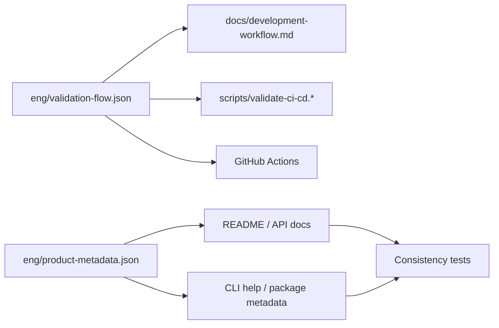

[中文版](../development-workflow.md) | English

# DotNetAnalyzer Development Workflow

This document defines the single recommended local validation workflow for this repository. Scripts, CI workflows, and contributor instructions must all stay consistent with what is described here.



## Authoritative Validation Pipeline

The authoritative validation parameters currently maintained by the repository are as follows:

- Solution: `DotNetAnalyzer.slnx`
- Configuration: `Release`
- Test target framework: `net10.0`
- CI / local default test filter: `Category!=Performance`
- Local package output directory: `Bin/nupkg`

### Linux / macOS

```bash
bash scripts/validate-ci-cd.sh
```

### Windows PowerShell

```powershell
pwsh -File scripts/validate-ci-cd.ps1
```

### Windows CMD

```cmd
scripts\validate-ci-cd.bat
```

## Underlying Command Sequence

If you need to troubleshoot issues manually, keep the exact same order and parameters as the authoritative scripts:

```bash
dotnet restore DotNetAnalyzer.slnx -p:Configuration=Release --verbosity minimal
dotnet build DotNetAnalyzer.slnx -c Release --no-restore --verbosity minimal
dotnet test DotNetAnalyzer.slnx -c Release --framework net10.0 --no-build --verbosity normal --filter "Category!=Performance"
dotnet pack src/DotNetAnalyzer.Cli/DotNetAnalyzer.Cli.csproj -c Release --no-build --output ./Bin/nupkg
```

## MCP Connection Smoke Test

When you have modified the CLI entry point, MCP configuration, or packaging logic, additionally run an MCP connection validation:

### Linux / macOS

```bash
bash scripts/verify-mcp.sh
```

### Windows PowerShell

```powershell
pwsh -File scripts/verify-mcp.ps1
```

## Contributor Daily Workflow

1. Modify code and documentation.
2. Run `scripts/validate-ci-cd.*` to complete local validation.
3. If the changes involve CLI/MCP connectivity, also run `scripts/verify-mcp.*`.
4. Commit the changes and open a Pull Request.

## Frequently Asked Questions

### Why must restore explicitly pass `Configuration=Release`?

The repository uses centralized output and intermediate artifact directories, and the `obj` path depends on `Configuration`. If you first restore with the default configuration and then run `--no-restore` build/test with the `Release` configuration, it will directly read restore artifacts from the wrong location.

### Why are tests fixed to run on `net10.0`?

The current CI primary validation pipeline uses `net10.0` as the unified test target framework. This reduces the drift risk caused by combining multi-target frameworks with centralized output directories, while ensuring consistent behavior between local and CI environments.

### Where is metadata drift validated?

Version numbers, command entry points, repository links, and tool counts are jointly constrained by `eng/product-metadata.json` and source code scanning. Related consistency checks have been incorporated into the test project and are executed together with `dotnet test`.
