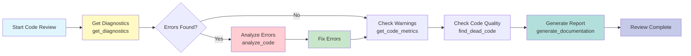
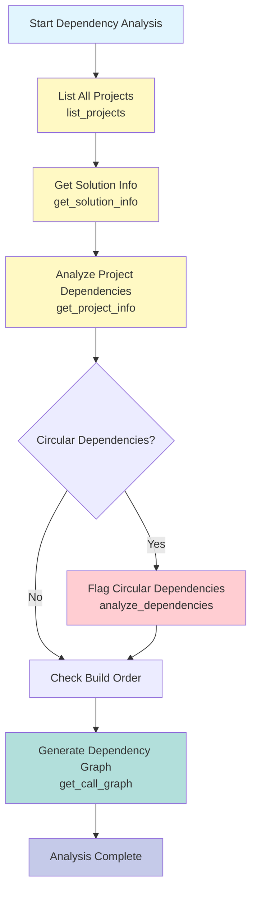
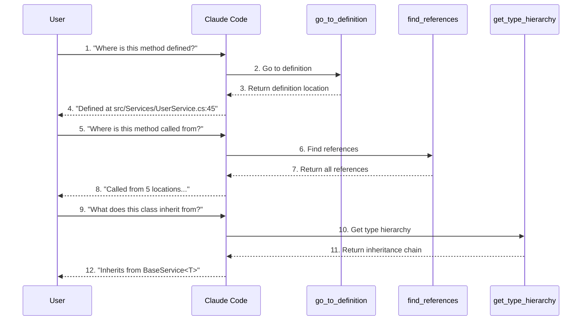
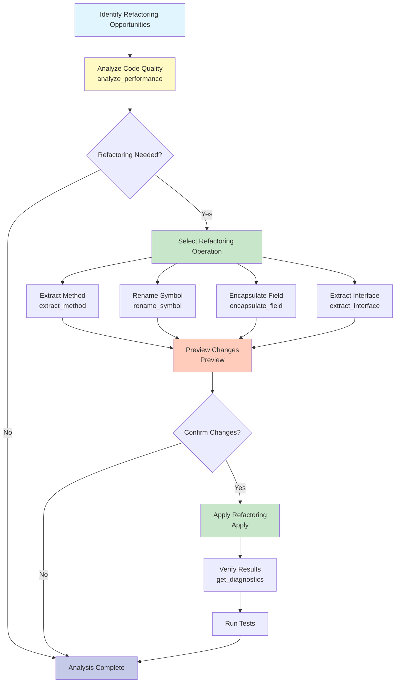

[中文版](../examples.md) | English

# DotNetAnalyzer Usage Examples

This document provides practical usage examples for DotNetAnalyzer, demonstrating how to interact with MCP tools through Claude Code.

## Typical Usage Scenarios

### Scenario 1: Code Review Workflow



### Scenario 2: Dependency Analysis Workflow



### Scenario 3: Symbol Query Workflow



### Scenario 4: Code Refactoring Workflow



## Table of Contents

- [Basic Examples](#basic-examples)
- [Code Analysis Examples](#code-analysis-examples)
- [Symbol Query Examples](#symbol-query-examples)
- [Code Diagnostics Examples](#code-diagnostics-examples)
- [Dependency Analysis Examples](#dependency-analysis-examples)
- [Comprehensive Workflows](#comprehensive-workflows)
- [Common Scenarios](#common-scenarios)

---

## Basic Examples

### Example 1: First-Time Use - Checking Diagnostics

Suppose you have just cloned a .NET project and want to understand its current state:

```
You: "Check all errors and warnings in the current project"
```

**Claude's Actions**:
1. Calls the `get_diagnostics` tool
2. Analyzes the returned diagnostic information
3. Provides a summary and recommendations

**Possible Output**:
```
Found 3 errors and 15 warnings:

Errors:
1. src/Services/UserService.cs:25 - The name 'UserRepository' does not exist in the current context
2. src/Controllers/UserController.cs:15 - The type or namespace name 'IUserService' could not be found
3. src/Models/User.cs:30 - Missing partial modifier

Warnings (major):
1. src/Program.cs:10 - Variable 'config' is assigned but its value is never used
2. src/Data/AppDbContext.cs:45 - Method 'Initialize' is obsolete
...

It is recommended to fix these 3 errors first, as they will prevent the project from compiling successfully.
```

---

### Example 2: Understanding the Solution Structure

```
You: "Show the current solution structure"
```

**Claude's Actions**:
1. Calls the `list_projects` tool
2. Organizes project information
3. Provides a structured view

**Possible Output**:
```
Solution MySolution.sln contains 5 projects:

1. MyApp.Core (Class Library)
   - Path: src/MyApp.Core/MyApp.Core.csproj
   - No project dependencies
   - 3 package dependencies

2. MyApp.Data (Class Library)
   - Path: src/MyApp.Data/MyApp.Data.csproj
   - Dependencies: MyApp.Core
   - 5 package dependencies

3. MyApp.Services (Class Library)
   - Path: src/MyApp.Services/MyApp.Services.csproj
   - Dependencies: MyApp.Core, MyApp.Data
   - 8 package dependencies

4. MyApp.Api (Web API)
   - Path: src/MyApp.Api/MyApp.Api.csproj
   - Dependencies: MyApp.Core, MyApp.Services
   - 12 package dependencies
   - Startup project

5. MyApp.Tests (Test Project)
   - Path: tests/MyApp.Tests/MyApp.Tests.csproj
   - Dependencies: MyApp.Core, MyApp.Services
   - 2 package dependencies

Recommended build order: Core -> Data -> Services -> Api, Tests
```

---

## Code Analysis Examples

### Example 3: Analyzing Code Structure

```
You: "Analyze the code structure of UserService.cs"
```

**Claude's Actions**:
1. Calls the `analyze_code` tool
2. Parses the returned syntax tree information
3. Provides a structured summary

**Possible Output**:
```
Code Structure Analysis for UserService.cs:

File Information:
- Total lines: 150
- Size: 4.5 KB

Code Organization:
- Namespaces: 1 (MyApp.Services)
- Types: 1 class (UserService)
- Methods: 8 public methods
- Using directives: 6

Class Details:
- UserService
  - Accessibility: Public
  - Base class: object
  - Implemented interfaces: IUserService
  - Member count: 8 methods

Method List:
1. GetUserAsync(int userId) : Task<User>
   - Line: 20-25
   - Async method
   - Access level: Public

2. CreateUserAsync(User user) : Task<bool>
   - Line: 27-35
   - Async method
   - Access level: Public

3. ValidateUser(User user) : bool
   - Line: 37-45
   - Access level: Private

... (8 methods total)

Dependencies:
- System
- System.Threading.Tasks
- MyApp.Models
- MyApp.Data
- MyApp.Interfaces

Suggestions:
- Code structure is clear and follows the Single Responsibility Principle
- Uses async methods to avoid blocking
- Consider extracting the ValidateUser method into a validator class
```

---

### Example 4: Understanding Complex Class Hierarchies

```
You: "Analyze the inheritance hierarchy of BaseController.cs"
```

**Possible Output**:
```
Analysis Results for BaseController.cs:

Type Hierarchy:
- BaseController (abstract)
  |- ControllerBase (Microsoft.AspNetCore.Mvc)
  |- Implemented interfaces: IDisposable

Members:
- Public properties: 3
  - Logger (ILogger)
  - Configuration (IConfiguration)
  - CurrentUser (UserPrincipal)

- Protected methods: 5
  - HandleException(Exception)
  - ValidateRequest(ModelState)
  - ReturnSuccess(object data)
  - ReturnError(string message)
  - ReturnNotFound(string message)

- Private fields: 2

Key Patterns:
- Uses dependency injection (constructor injection)
- Unified exception handling
- Standardized API response format

Subclass Usage:
This class is inherited by 3 controllers:
- UserController
- ProductController
- OrderController
```

---

## Symbol Query Examples

### Example 5: Finding All References to a Method

```
You: "Find all references to the GetUserAsync method"
```

**Claude's Actions**:
1. First locates the method definition (possibly via `get_symbol_info`)
2. Calls the `find_references` tool
3. Analyzes reference locations and context

**Possible Output**:
```
Reference Information for GetUserAsync:

Definition Location:
- File: src/Services/UserService.cs
- Line: 20
- Signature: public async Task<User> GetUserAsync(int userId)

Found 5 reference locations:

1. Definition location
   File: src/Services/UserService.cs:20
   Context: public async Task<User> GetUserAsync(int userId)

2. Method call
   File: src/Controllers/UserController.cs:15
   Context: var user = await _userService.GetUserAsync(userId);

3. Method call
   File: src/Controllers/UserController.cs:28
   Context: var existingUser = await _userService.GetUserAsync(id);

4. Unit test
   File: tests/UserServiceTests.cs:45
   Context: var result = await service.GetUserAsync(1);

5. Interface implementation
   File: src/Services/UserService.cs:20
   Context: Implements IUserService.GetUserAsync

Usage Analysis:
- Called by controllers 2 times
- Called by unit tests 1 time
- Interface implementation 1 occurrence
- Definition location 1 occurrence

Suggestions:
- The method is well-used
- Has unit test coverage
```

---

### Example 6: Understanding Detailed Symbol Information

```
You: "Tell me everything about the method on line 25"
```

**Claude's Actions**:
1. Calls the `get_symbol_info` tool
2. Provides complete symbol metadata

**Possible Output**:
```
Detailed Information for the Method on Line 25:

Basic Information:
- Name: GetUserAsync
- Type: Method
- Access level: Public
- Containing class: UserService
- Namespace: MyApp.Services

Modifiers:
- Static: No
- Virtual: No
- Abstract: No
- Override: No
- Sealed: No
- Async: Yes
- Extension method: No

Method Signature:
- Return type: Task<User>
- Type parameters: None

Parameters:
1. userId (int)
   - Required parameter
   - No default value

Documentation Comments:
Summary: Retrieves user information by user ID

Parameters:
  - userId: User ID

Returns: User object

Definition Location:
- File: src/Services/UserService.cs
- Line: 25
- Column: 8

This is an async public method used to query a single user from the database.
```

---

### Example 7: Tracing Method Definitions

```
You: "Where is this method inherited from? Does it implement an interface?"
```

**Claude's Actions**:
1. Calls the `find_declarations` tool
2. Analyzes the inheritance chain and interface implementations

**Possible Output**:
```
Declaration Chain for ExecuteAsync:

Current Implementation:
- File: src/Tasks/DataImportTask.cs:35
- Class: DataImportTask
- Namespace: MyApp.Tasks
- Relationship: current

Interface Implementation:
- File: src/Interfaces/IJob.cs:10
- Interface: IJob
- Namespace: MyApp.Interfaces
- Relationship: implements

Base Class Method:
- No overridden method

Extension Method Information:
- Not an extension method

Summary:
- This method implements the IJob interface
- It is an interface implementation, not an override
- The interface is defined in src/Interfaces/IJob.cs
```

---

## Code Diagnostics Examples

### Example 8: Finding Errors in a Specific File

```
You: "Check for errors in UserService.cs"
```

**Claude's Actions**:
1. Calls the `get_diagnostics` tool with the file path specified
2. Filters and analyzes diagnostic information

**Possible Output**:
```
Diagnostic Results for UserService.cs:

Found 2 errors and 3 warnings:

Errors (must fix):
1. CS0103 - Line 45
   Location: src/Services/UserService.cs:45:20
   Message: The name 'UserRepository' does not exist in the current context
   Code: var user = await _UserRepository.FindByIdAsync(userId);

   Suggestion: Check the field name spelling; it should be _userRepository

2. CS1061 - Line 60
   Location: src/Services/UserService.cs:60:15
   Message: 'User' does not contain a definition for 'EmailAddress'
   Code: return user.EmailAddress;

   Suggestion: Use the correct property name 'Email'

Warnings (recommended to fix):
1. CS0219 - Line 30
   Variable 'tempCache' is assigned but its value is never used

2. CS1998 - Line 45
   This async method lacks 'await' operators

3. CS0618 - Line 75
   'DbContext.Database' is obsolete

Fix Suggestions:
1. Change _UserRepository to _userRepository
2. Change EmailAddress to Email
3. Remove the unused tempCache variable
4. Remove the unnecessary async keyword or add await
```

---

### Example 9: Analyzing Diagnostics Across the Entire Solution

```
You: "Analyze all diagnostics across the solution"
```

**Possible Output**:
```
Solution-Level Diagnostic Analysis:

Totals:
- Errors: 8
- Warnings: 42
- Informational: 15

By Project:
1. MyApp.Core
   - Errors: 0
   - Warnings: 3

2. MyApp.Data
   - Errors: 2
   - Warnings: 8
   Critical error: Missing required package reference

3. MyApp.Services
   - Errors: 4
   - Warnings: 15
   Critical error: Incomplete interface implementation

4. MyApp.Api
   - Errors: 2
   - Warnings: 12
   Critical error: Configuration class missing

5. MyApp.Tests
   - Errors: 0
   - Warnings: 4

Common Error Types:
1. CS0246 (type or namespace not found): 4 occurrences
2. CS1061 (does not contain a definition): 3 occurrences
3. CS0103 (name does not exist): 1 occurrence

Priority Fix Recommendations:
1. Fix all 8 errors (blocking compilation)
2. Address the package reference issue in MyApp.Data
3. Complete the interface implementation in MyApp.Services
4. Fix the configuration issue in MyApp.Api
```

---

## Dependency Analysis Examples

### Example 10: Analyzing Project Dependencies

```
You: "Show me the dependency graph for MyApp.Api"
```

**Claude's Actions**:
1. Calls the `analyze_dependencies` tool
2. Visualizes dependency relationships

**Possible Output**:
```
Dependency Analysis for MyApp.Api:

Target Framework: .NET 8.0

Direct Project References (2):
|- MyApp.Core
|  Assembly: MyApp.Core
|
\- MyApp.Services
   Assembly: MyApp.Services
      Dependencies: MyApp.Core, MyApp.Data

Direct Package References (12):
|- Microsoft.AspNetCore.OpenApi (8.0.0)
|- Swashbuckle.AspNetCore (6.5.0)
|- Serilog.AspNetCore (8.0.0)
|- Microsoft.Extensions.Hosting (8.0.0)
... (12 total)

Transitive Dependencies (indirectly introduced via project references):
|- Newtonsoft.Json (from MyApp.Core)
|- Dapper (from MyApp.Data)
|- System.Text.Json (from MyApp.Services)
|- Microsoft.Extensions.DependencyInjection (from multiple projects)
... (25 total)

Circular Dependency Check: No circular dependencies detected

Dependency Hierarchy Graph:
        MyApp.Api
           /  \
          /    \
  MyApp.Core  MyApp.Services
                 /     \
                /       \
         MyApp.Core  MyApp.Data
             |
         (shared)

Dependency Health:
- No circular dependencies
- Dependency structure is clear
- MyApp.Services depends on both MyApp.Core and MyApp.Data; consider refactoring
```

---

### Example 11: Finding the Build Order

```
You: "What is the correct build order for this solution?"
```

**Claude's Actions**:
1. Calls the `get_solution_info` tool
2. Analyzes the build order

**Possible Output**:
```
Recommended Build Order:

Batch 1 (no dependencies):
1. MyApp.Core
   - Reason: Base class library with no other project dependencies

Batch 2 (depends on batch 1):
2. MyApp.Data
   - Dependencies: MyApp.Core

Batch 3 (depends on batches 1-2):
3. MyApp.Services
   - Dependencies: MyApp.Core, MyApp.Data

Batch 4 (depends on batches 1-3):
4. MyApp.Api
   - Dependencies: MyApp.Core, MyApp.Services
5. MyApp.Tests
   - Dependencies: MyApp.Core, MyApp.Services

Startup Projects:
- MyApp.Api (Web API)
- Executable: bin/Release/net8.0/MyApp.Api.exe

Verification Commands:
```bash
# Build in order
dotnet build src/MyApp.Core/MyApp.Core.csproj
dotnet build src/MyApp.Data/MyApp.Data.csproj
dotnet build src/MyApp.Services/MyApp.Services.csproj
dotnet build src/MyApp.Api/MyApp.Api.csproj

# Or use the solution file
dotnet build MySolution.sln
```
```

---

## Comprehensive Workflows

### Example 12: Complete Code Review Workflow

```
You: "Perform a code review on the UserService class"
```

**Claude's Complete Workflow**:

**Step 1: Analyze Code Structure**
```
Call: analyze_code
Result: UserService class has 8 methods, 150 lines of code, implements IUserService interface
```

**Step 2: Check Diagnostics**
```
Call: get_diagnostics (with file specified)
Result: Found 2 errors and 3 warnings
```

**Step 3: Analyze Key Methods**
```
Call: get_symbol_info (for each public method)
Result: Obtained signature, parameters, and documentation comments for each method
```

**Step 4: Check Method Usage**
```
Call: find_references (for important methods)
Result: GetUserAsync is called 5 times, CreateUserAsync is called 3 times
```

**Step 5: Analyze Dependencies**
```
Call: analyze_dependencies
Result: Depends on MyApp.Core, MyApp.Data; uses 8 NuGet packages
```

**Final Output**:
```
Code Review Report: UserService Class

Overview:
- Lines of code: 150
- Method count: 8 (6 public, 2 private)
- Interface implementation: IUserService
- Dependency complexity: Moderate

Strengths:
- Clear separation of responsibilities
- Uses async methods to avoid blocking
- Good error handling
- Clear method naming

Areas for Improvement:
- Fix 2 compilation errors
  - _UserRepository -> _userRepository
  - EmailAddress -> Email

- Code quality issues
  - Missing parameter validation
  - Missing unit test coverage
  - Some methods are too long (consider refactoring)

- Performance considerations
  - GetUserAsync method could benefit from caching
  - Consider batch query optimization

Recommended Actions:
1. Prioritize fixing compilation errors
2. Add input validation
3. Write unit tests
4. Consider refactoring long methods
5. Add performance optimizations

Overall Rating: B+
```

---

### Example 13: Debugging Unused Code

```
You: "Find all unused private methods in the project"
```

**Claude's Actions**:
1. Analyzes code structure to find all private methods
2. Finds references for each method
3. Identifies methods that are never called

**Possible Output**:
```
Unused Private Method Analysis:

Scanned the MyApp.Core project and found 15 private methods.

Unused Private Methods (3):

1. ValidateEmail(string email)
   File: src/Services/ValidationHelper.cs:45
   Reference count: 0
   Suggestion: Can be safely deleted

2. CalculateHashLegacy(string input)
   File: src/Utils/HashHelper.cs:78
   Reference count: 0
   Note: Method name contains "Legacy"; this may be old code
   Suggestion: Delete this method if no longer needed

3. LogDebugInfo()
   File: src/Services/UserService.cs:120
   Reference count: 0
   Note: This may be debug code
   Suggestion: Delete or use conditional compilation

Private Methods in Use (12):
- FormatUserName: 5 references
- SanitizeInput: 8 references
- ... (12 total)

Cleanup Suggestions:
You can safely delete 3 unused methods, reducing approximately 20 lines of code.
Before deleting:
1. Confirm they are not used via reflection calls
2. Check version history to see if they are planned features
3. Run all tests to ensure nothing is broken
```

---

## Common Scenarios

### Scenario 1: Onboarding to a New Project

```
You: "I'm new to this project. Give me an overview."
```

Claude will:
1. Call `list_projects` - understand the project structure
2. Call `get_solution_info` - understand the build order and startup projects
3. Call `get_diagnostics` - check project health status
4. Summarize the project architecture and suggest next steps

### Scenario 2: Preparing for Release

```
You: "Is the solution ready for release?"
```

Claude will:
1. Call `get_diagnostics` - check all errors and warnings
2. Call `analyze_dependencies` - check dependency consistency
3. Call `list_projects` - confirm all projects are configured correctly
4. Provide a pre-release checklist

### Scenario 3: Refactoring Code

```
You: "I want to refactor the UserService class"
```

Claude will:
1. Call `analyze_code` - understand the current structure
2. Call `find_references` - check method usage
3. Call `get_symbol_info` - get detailed method information
4. Provide refactoring suggestions and steps

### Scenario 4: Debugging Compilation Errors

```
You: "Why is the project not building?"
```

Claude will:
1. Call `get_diagnostics` - get all errors
2. Analyze error types and locations
3. Provide fix suggestions
4. Check dependencies if necessary

### Scenario 5: Adding New Features

```
You: "I need to add a new endpoint. Where should I put it?"
```

Claude will:
1. Call `list_projects` - understand the project structure
2. Call `analyze_code` - examine existing controllers
3. Call `find_references` - check related services
4. Recommend the best location and implementation approach

---

## Tips and Tricks

### 1. Use Natural Language

No need to memorize complex parameters; just describe your needs in natural language:

```
Good ways to ask:
"Show me the structure of this file"
"Where is this method used?"
"What errors does this project have?"

Avoid technical details:
"Call find_references with filePath='x', line=10, column=5"
```

### 2. Drill Down Gradually

Start with broad questions, then progressively drill into details:

```
1. "What's in this solution?" -> Understand the structure
2. "Tell me about the UserService class" -> Dive into a specific class
3. "Where is GetUserAsync called?" -> Find a specific method
4. "Show me the details of this method" -> Get symbol information
```

### 3. Combine Multiple Tools

Don't rely on a single tool; combine them for a complete picture:

```
"Analyze the UserService class and find potential issues"
-> analyze_code + get_diagnostics + find_references
```

### 4. Ask for Suggestions

Beyond information, you can ask for suggestions and opinions:

```
"What would you improve in this code?"
"Are there any code smells?"
"Is this following best practices?"
```

---

## More Resources

- [API Guide](api-guide.md) - Complete API reference
- [Configuration Guide](../CONFIGURATION.md) - Configuration option details
- [Troubleshooting](MCP_TROUBLESHOOTING.md) - Common problem resolution
- [Main README](../README.md) - Project overview

---

**Version**: v0.5.0
**Last Updated**: 2026-02-09
